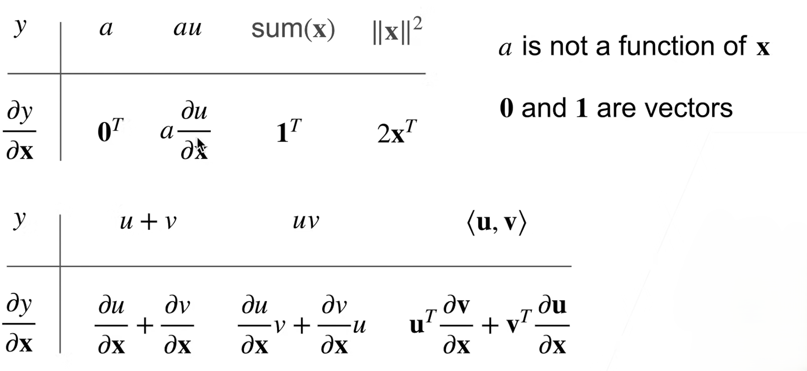
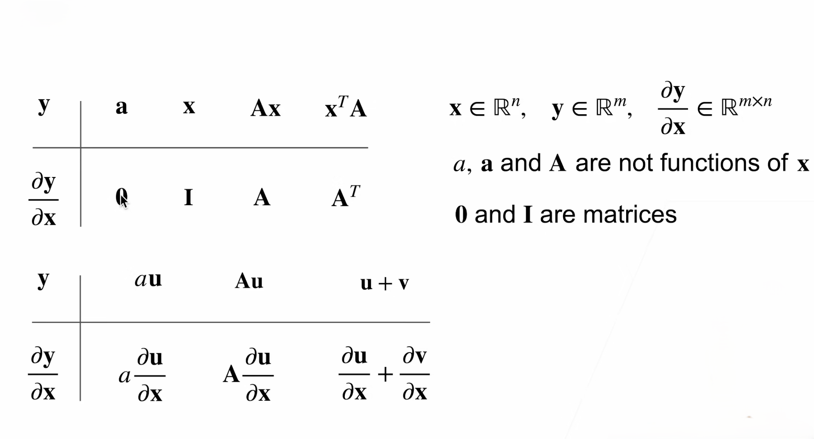

## 一、数据操作及预处理
### （一）、拷贝
1. Python 常有浅拷贝，一定注意
   1. 后面也可以深入学一下浅拷贝、深拷贝
2. 这是真拷贝
    ```python
    B.clone()
    ```

## 二、矩阵计算（梯度 & 求导相关）
### （一）、梯度：尤其是标量对向量的梯度
[为什么标量对列向量的求导会变成行向量？](https://www.doubao.com/chat/36506742838422530)
1. `标量` 对 `向量` 的梯度对应到微积分中，就是 `多元函数` 对 `各个自变量的偏导` 组成的向量
   1. 梯度仍然是：多元函数值变化最大的方向！
   2. 需要注意：梯度是向量
2. 区分方向导数和梯度
   1. 上面`多元函数` 对 `各个自变量的偏导` 其实是方向导数
   2. 但是，方向导数组成的向量不是梯度，它和**梯度**之间还差一个**单位化**
   3. 只要完成了单位化，那么这个向量就是梯度了！
3. 为什么分母是列向量而不是行向量？
   1. 也许是为了和二次型统一吧
   2. 因为二次型是 $X^T A X$。 一行 ⨉ 方阵 ⨉ 一列 = 实数。
4. **发现好像经常用到链式法则！**
   1. 找中间变量
   2. 一点一点用链式法则
   3. 其实计算图也是一步一步封装中间变量

- **标量对行向量求导是列向量**
- **向量对向量求导是矩阵**




```python
# PyTorch 会自动累加梯度
# 因此，计算新的梯度时，


# 另外，一般只是标量对对标量求导。也就是说：仅对实数求导
# 不涉及向量和矩阵的求导
# 因为如果对向量求导，那么计算量就太大了！
```

- **原来计算梯度是相当昂贵的啊！**


