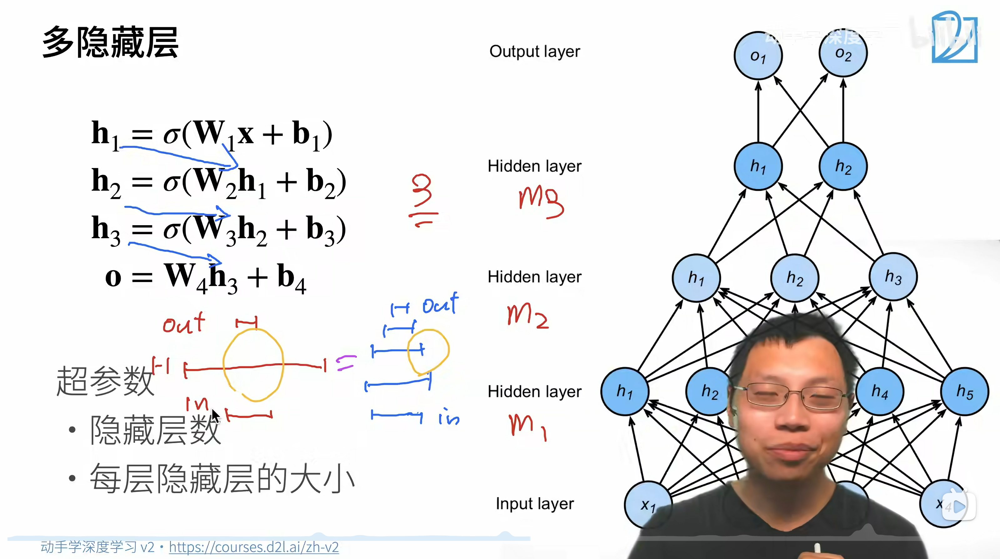
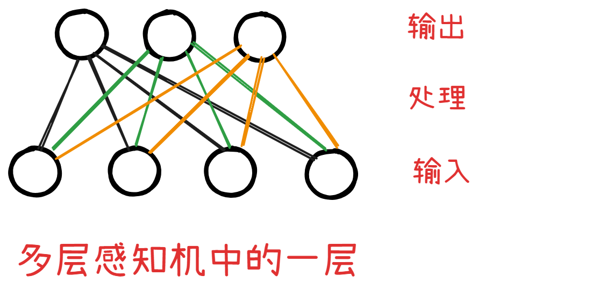

## 一、数学上的理解
- 至于历史上最开始的感知机的算法，不理解就不理解吧，也无所谓
  - 只要能体会到 **隐藏层** + **非线性激活函数** 的威力就好！
  - 如果没有 **隐藏层** + **非线性激活函数** ⇒ 那么感知机就只能拟合**线性分割面**（也就是说，有很大的局限性）
    - 分割面当然只存在于分类问题中
    - 这里只是用来举例而已！
- 神经网络深度 VS 神经元个数
    
    1. 神经网络深度 就是 神经网络层数
    2. 神经元个数 对应 $\sigma (Y = XW + b)$ 方程的个数，又因为 $W$ 的维度 $(\text{num\underline{ }inputs}, ~ ~ \text{num\underline{ }hiddens})$ 和 `num_hiddens` 有关，因此可以认为 神经元个数 就对应 隐藏层维数

### 1、非线性激活函数
1. 非线性激活函数是为了防止层数坍塌
   1. ⇒ 中间层（隐藏层）必须使用非线性激活函数
   2. 最终层（输出层）不需要使用非线性激活函数
2. 常用非线性激活函数
   1. sigmoid
   2. tanh
   3. ReLU
3. 利用 MLP 实现 softmax 就是在之前 softmax 的基础上添加了 **隐藏层**
4. 多层感知机可用于**多分类**问题


<br><br><br><br>

## 二、从零实现 `MLP`（本代码是两层感知机）
```python
import torch
from torch import nn
from tools.ch3 import load_data_fashion_mnist # 导入数据集加载函数
from tools.ch3 import train_ch3 # 导入训练函数
from tools.ch3 import predict_ch3 # 导入验证函数
import matplotlib.pyplot as plt # 用于画图

'''加载数据集、数据迭代器'''
batch_size = 256
train_iter, test_iter = load_data_fashion_mnist(batch_size)

'''设置超参数 (隐藏层的层数就是超参数) & 可训练参数'''
num_inputs, num_outputs, num_hiddens = 784, 10, 256

# 乘以 0.01 就是对所有数值缩放 0.01
# nn.Parameter 实际上是一个类！
W1 = nn.Parameter(torch.randn(
    num_inputs, num_hiddens, requires_grad=True) * 0.01)
b1 = nn.Parameter(torch.zeros(num_hiddens, requires_grad=True))
W2 = nn.Parameter(torch.randn(
    num_hiddens, num_outputs, requires_grad=True) * 0.01)
b2 = nn.Parameter(torch.zeros(num_outputs, requires_grad=True))

# params = [W1, b1, W2, b2] 的核心是整合所有可训练参数到一个列表，避免逐个操作的繁琐。
# 用于批量更新参数。和高层 API model.parameters() 一样。下面是例子：
# for param in params:
#   param.data -= lr * param.grad  遍历列表，更新每个参数
#   param.grad.data.zero_()  批量清零
params = [W1, b1, W2, b2]

'''定义非激活函数 & 模型'''
def relu(X):
    a = torch.zeros_like(X)
    return torch.max(X, a)

def net(X):
    X = X.reshape((-1, num_inputs))
    H = relu(X @ W1 + b1)  # 这里“@”代表矩阵乘法
    return (H @ W2 + b2)

'''定义损失函数'''
loss = nn.CrossEntropyLoss(reduction='none')

'''开始训练'''
num_epochs, lr = 10, 0.1
updater = torch.optim.SGD(params, lr=lr)
train_ch3(net, train_iter, test_iter, loss, num_epochs, updater)

predict_ch3(net, test_iter)
plt.show()
```

### 1、理解代码
#### (1)、直观理解：`MLP` 和 `softmax` 的关系
1. 和 softmax 相比, 代码没多大改动
   1. 李沐老师说过: MLP 和 softmax 本质上没什么不同 (只是在 softmax 的基础上添加了隐藏层)
   2. ⇒ 所以在代码实现上需要改动的内容也比较少。
2. 还讲了 为什么 MLP 比 SVM（支持向量机） 发展更快？
   1. 因为如果我采用 MLP, 效果不好
   2. 那我的代码简单改一改, 就能成为 卷积神经网络 / RNN / Transformer
   3. 而 SVM 改动就比较大, 改动难度也比较大

#### (2)、线性变换的形式
```python
def net(X):
    X = X.reshape((-1, num_inputs))
    H = relu(X @ W1 + b1)  # 这里“@”代表矩阵乘法
    return (H @ W2 + b2)
```

1. 从代码来看，这里的线性变换是 $$H = XW_{1} + b, ~ ~ o = HW_{2} + b$$
2. 和之前**线性变换的形式依然一样**！

#### (3)、张量形状
1. $W1 = (\text{num\underline{ }inputs}, ~ ~ \text{num\underline{ }hiddens}), ~ ~ ~ ~ b1 = (\text{num\underline{ }hiddens})$
2. $W2 = (\text{num\underline{ }hiddens}, ~ ~ \text{num\underline{ }outputs}), ~ ~ ~ ~ b2 = (\text{num\underline{ }outputs})$
3. $X = (\text{batch\underline{ }size}, ~ ~ \text{num\underline{ }hiddens})$

- **直观理解张量形状的来源**
1. 首先关注多层感知机中的每一层
    - 先看图片
    
    1. **明确：** 上图是**单个样本**的变化情况，**批量数**在整个训练过程中一直**保持不变**！
    2. 输入张量 $X = (\text{batch\underline{ }size}, ~ ~ \text{num\underline{ }hiddens})$
    3. 处理张量 $W1 = (\text{num\underline{ }inputs}, ~ ~ \text{num\underline{ }hiddens}), ~ ~ ~ ~ b1 = (\text{num\underline{ }hiddens})$
    4. 输出张量 $Y = (\text{batch\underline{ }size}, ~ ~ \text{num\underline{ }outputs})$
    5. 处理过程 $Y = XW + b$
       1. 右乘列变换 ⇒ 对感知机中的一层而言，**输出层的每一个数据** 都是综合了 **输入层的所有数据** 产生的！
       2. 理解到这里就行了，更高深的内容就不是我能理解的了！

<br><br><br><br>

## 三、简洁实现 `MLP`
```python
import torch
from torch import nn
from tools.ch3 import load_data_fashion_mnist # 导入数据集加载函数
from tools.ch3 import train_ch3 # 导入训练函数
import matplotlib.pyplot as plt # 用于画图

net = nn.Sequential(nn.Flatten(),
                    nn.Linear(784, 256),
                    nn.ReLU(),
                    nn.Linear(256, 10))

def init_weights(m):
    if type(m) == nn.Linear:
        nn.init.normal_(m.weight, std=0.01)

net.apply(init_weights);


batch_size, lr, num_epochs = 256, 0.1, 10
loss = nn.CrossEntropyLoss(reduction='none')
trainer = torch.optim.SGD(net.parameters(), lr=lr)

train_iter, test_iter = load_data_fashion_mnist(batch_size)
train_ch3(net, train_iter, test_iter, loss, num_epochs, trainer)

plt.show()
```
