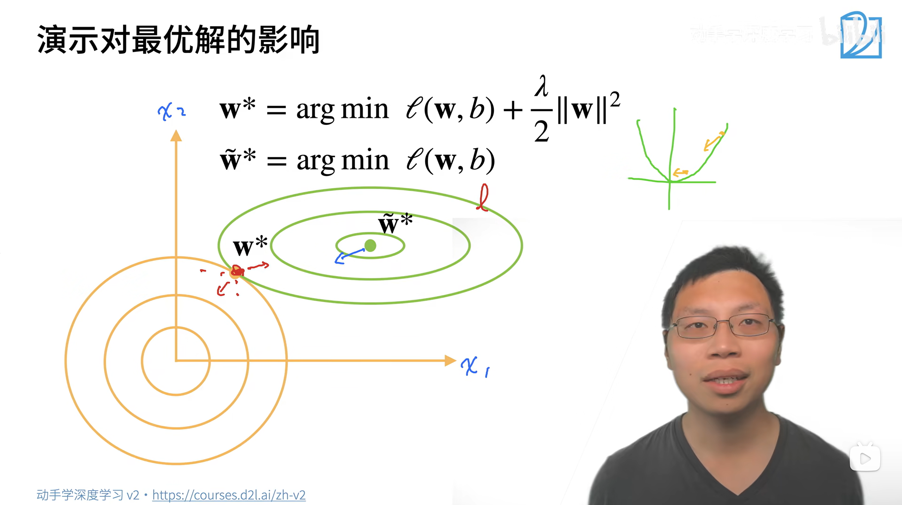

# Weight Decay（权重衰退）
## 一、概念理解
### （一）、使用均方范数作为 `硬性限制条件`

通过限制参数值的选择范围来控制模型容量。

$$\min l({\bf w},b)\ \ \ \ subject\ to\ ||{\bf w}||^2\le\theta$$

- 公式含义
  - 在「 权重 w 的 L2 范数平方不超过阈值 θ 」的前提下，
  - 求解能让模型经验损失 $l(w,b)$ 最小的权重 w 和偏置 b
- 解释
  - 意思就是每一个 $w_i$ 的值都不能太大。
  - 通常不限制偏移 $b$ ，效果也不显著。
  - 小的 $\theta$ 相当于更强的正则项。
- 但一般不采用，因为该定义不好做优化（已有的优化算法无法处理这一硬性条件）

### （二）、使用均方范数作为 `柔性限制`

为解决上个方法不好优化的问题，可将硬性条件形式化到损失函数中。对于上面的每个 $\theta$ ，都可以找到 $\lambda$ 使得 **之前的目标函数（之前的目标函数就是：第一个方法中，加入硬性限制后的损失函数）** 等价于 **下式（加入柔性限制后的损失函数）**：

$$\min\ \{~ l({\bf w},b)+{\lambda\over2}||{\bf w}||^2 ~\}$$

- 最后一项称之为**惩罚项（Penalty）**，可以通过拉格朗日乘子证明与上式等价。
- 公式含义
  - 此时要得到的参数就是 $\arg \{ ~ min [~ l({\bf w}, b) + \frac{\lambda}{2} ||\bf w ||^2 ~] ~ \}$
  - 加入柔性限制后的损失函数是 $l({\bf w}, b) + \frac{\lambda}{2}||{\bf w}||^2$
  - 参数 ${\bf w}, b$ 使得该损失函数取得最小值
- $\lambda$ 越大，对参数的限制就越大
  - 意思是，$\lambda$ 越大的时候，参数就只能在很小的范围内取值
  - 极端情况下，$\lambda = \infty$ 时，参数就只能取 $0$ （意思是：参数已经没有可以选择的余地了）
- $\lambda = 0$ 时，对参数就没有限制了！

#### 1、演示柔性限制对最优解的影响
1. 视频中的讲解
    
2. 对图片做一些注释
   1. 公式其实是 ${\bf w}^{*} = \arg \{ ~ min [~ l({\bf w}, b) + \frac{\lambda}{2} ||{\bf w} ||^2 ~] ~ \}$
   2. 理论上 $\bf w$ 其实是一个张量。针对这个具体问题 $\bf w$ 是一个维度为 $(2)$ 的向量。
      1. ${\bf w} = (x_1, x_2)$
      2. 这样就能理解坐标轴上 $(x_1, x_2)$ 的来源了！
   3. ⇒ 然后，就能借助微积分中多元函数的思想，把 **未加入限制的损失函数** $\tilde{\bf w} = l({\bf w}, b)$ 和 **惩罚系数** $\frac{\lambda}{2}||{\bf w}||^2$ 都看作关于 $(x_1, x_2)$ 的多元函数
      1. 黄线是 $\frac{\lambda}{2}||{\bf w}||^2$ 关于 $(x_1, x_2)$ 的多元函数 
         1. 注意：由于 $\frac{\lambda}{2}||{\bf w}||^2$ 的等高线是圆，因此，黄线的圆心就是此坐标轴上唯一的原点
      2. 绿线是 $\tilde{\bf w} = l({\bf w}, b)$ 关于 $(x_1, x_2)$ 的多元函数
      3. **加入柔性限制后的损失函数** 就是上面 2 个多元函数之和

#### 2、参数更新

1. 计算梯度  $${\partial\over\partial{\bf w}}(l({\bf w},b)+{\lambda\over2}||{\bf w}||^2)={\partial{l({\bf w},b)}\over\partial{\bf w}}+\lambda{\bf w}$$

2. 时间 $t$ 更新参数

$$
\begin{aligned}
    {\bf w_{t+1}}& = \bf w_t-\eta {\partial \it{l}\over\partial{\bf w_t}} \\
    &= (1-\eta\lambda){\bf w_t}-\eta{\partial{l({\bf w_t},b_t)}\over\partial{\bf w_t}}
\end{aligned}
$$

- 另外，通常情况下， $\eta \lambda < 1$

3. 注意：当损失函数不加入惩罚项，那么原本的损失函数就是 $$l({\bf w}, b)$$
   1. 原本时间 $t$ 更新参数时就是 $${\bf w_{t+1}} = {\bf w_t} - \eta \frac{\partial l({\bf w_t}, b_t)}{\partial {\bf w_t}}$$
   2. 也就是说：加入惩罚项后，依据时间 $t$ 更新参数时，仅仅是将原来的权重 ${\bf w_t}$ 进行缩放而已！其他均未改变！
      1. 也正因为如此，所以才叫权重衰退！

### （三）、有意思的问题
#### 1、加入惩罚项后，模型简化的原因？
1. 如果你不加入惩罚项，那么模型参数就可以在任意范围内产生 ⇒ 那么完全就可以拟合出一个很复杂的模型
2. 加入惩罚项后，模型的参数就只能在一个比较小的范围内产生 ⇒ 那么无论如何，这个模型都不会很复杂！

### 2、如果最优解的参数本身是比较大的话，那你加入惩罚项减小参数的话，会不会起到反作用？
1. 首先明确使用惩罚项的原因：因为实际数据中一定有噪音，如果不加入惩罚项，那么模型会尝试记住噪音，因此惩罚项一定是必须的！
2. 但是反过来讲，如果真实数据没有噪音，那确实不需要惩罚项（当然，这种情况实际上也不存在）

### 3、关于噪音，一个可以证明的东西
1. 噪音越大，学习到的权重值就越大

<br><br><br><br>

## 二、从零实现 `weight decay`
```python
import torch
from d2l import torch as d2l
import matplotlib.pyplot as plt # 用于画图
from tools import Animator


'''生成数据集, 遵从下面的表达式'''
# y = 0.05 + \\sum_{i=1}^{d} 0.01 x_i + 正态噪音 N(0, 0.01^2)
# 训练集大小、测试集大小、输入大小、批次大小
n_train, n_test, num_inputs, batch_size = 20, 100, 200, 5
true_w, true_b = torch.ones((num_inputs, 1)) * 0.01, 0.05
# 张量 train_data 的维度是 (n_train, 1), train_data 其实就是矩阵！
train_data = d2l.synthetic_data(true_w, true_b, n_train)
train_iter = d2l.load_array(train_data, batch_size)
test_data = d2l.synthetic_data(true_w, true_b, n_test)
test_iter = d2l.load_array(test_data, batch_size, is_train=False)

def init_params():
    w = torch.normal(0, 1, size=(num_inputs, 1), requires_grad=True)
    b = torch.zeros(1, requires_grad=True)
    return [w, b]

def l2_penalty(w):
    # \lambda 在这里不体现, 在 train() 函数那里体现
    return torch.sum(w.pow(2)) / 2

def train(lambd):
    w, b = init_params()
    # lambda 是 Python 中的匿名函数（没有正式函数名的函数），
    # 专门用来快速定义逻辑简单、只用一次的小型函数
    # net是 “新建了一个函数” （匿名）。
    # loss是 “给已有函数起了个新名字” （原函数有正式名称，不是匿名）
    net, loss = lambda X: d2l.linreg(X, w, b), d2l.squared_loss
    num_epochs, lr = 100, 0.003
    animator = Animator(xlabel='epochs', ylabel='loss', yscale='log',
                            xlim=[5, num_epochs], legend=['train', 'test'])
    for epoch in range(num_epochs):
        # 遍历一遍训练集, 先训练一遍
        for X, y in train_iter:
            # 增加了 L2 范数惩罚项，
            # 广播机制使 l2_penalty(w) 成为一个长度为 batch_size 的向量
            l = loss(net(X), y) + lambd * l2_penalty(w)
            l.sum().backward()
            d2l.sgd([w, b], lr, batch_size)
        if (epoch + 1) % 5 == 0: # 每 5 轮训练才绘图一次，让图表更简洁
            # 评估的时候不能用 加入惩罚项后的损失函数！
            animator.add(epoch + 1, (d2l.evaluate_loss(net, train_iter, loss),
                                     d2l.evaluate_loss(net, test_iter, loss)))
    print('w 的 L2 范数是: ', torch.norm(w).item())

'''
train(lambd=0)
'''

train(lambd=3)

plt.show()
```
### （一）、理解代码
#### 1、评估模型的时候不能使用加入正则项后的损失函数
1. 从 **功能** 上来讲，加入惩罚项是为了约束参数
   1. 而评估模型的时候，不需要更新参数，
   2. 所以不能使用加入正则项后的损失函数
2. 从 **评估的失真性** 上来讲
   1. 评估阶段的目标是**客观地衡量**训练好的模型在未曾见过的数据（测试集）上的表现，以判断其**泛化能力**。
   2. 此时，我们需要一个 “纯净” 的指标来反映纯粹的预测准确度。
   3. 如果在这里也加入惩罚项，相当于用一把本身就有偏见的尺子去测量，无法得到**模型真实的预测误差**
3. **类比：**
   1. 训练过程：你在打包苹果（优化参数），为了让包装盒更轻便（抑制过拟合），你规定 “包装盒重量超过 100g 就扣钱” （惩罚项），目的是让工人把包装盒做轻（权重 w 变小）。
   2. 评估过程：你需要称苹果的纯重量（真实预测误差），判断苹果的品质（模型泛化能力）。
   3. 如果评估时也把包装盒重量（惩罚项）算进去，你永远不知道苹果本身有多重（模型真实预测效果），只能知道 “苹果 + 包装盒” 的总重量（失真的损失值），这对判断苹果品质没有任何帮助。
4. **总结** ：训练和评估分离
   1. 训练时，损失函数加入惩罚项
   2. 评估时，损失函数不加入惩罚项

### （二）、`torch.norm(w).item()`
- [官网 doc - torch.norm](https://docs.pytorch.org/docs/stable/generated/torch.norm.html)

```python
torch.norm(input, p='fro', dim=None, keepdim=False, out=None, dtype=None)
```

1. Returns the matrix norm or vector norm of a given tensor. （返回给定张量的矩阵范数或向量范数）
2. 参数 `p` ( int, float, inf, -inf, 'fro', 'nuc', optional )
   1. the order of norm.（范数的阶数） Default: `'fro'` The following norms can be calculated:（下面就不抄了）
   2. Frobenius norm produces the same result as `p = 2` in all cases except when dim is a list of three or more dims, in which case Frobenius norm throws an error.

### （三）、`torch.Tensor.item()`
[官网 doc - torch.Tensor.item()](https://docs.pytorch.org/docs/stable/generated/torch.Tensor.item.html#torch.Tensor.item)
1. Returns the value of this tensor as a standard Python number. 
2. This only works for tensors with one element

<br><br><br><br>

## 三、简洁实现 `weight decay`
```python
import torch
from torch import nn
from d2l import torch as d2l
import matplotlib.pyplot as plt # 用于画图
from tools import Animator

n_train, n_test, num_inputs, batch_size = 20, 100, 200, 5
true_w, true_b = torch.ones((num_inputs, 1)) * 0.01, 0.05
train_data = d2l.synthetic_data(true_w, true_b, n_train)
train_iter = d2l.load_array(train_data, batch_size)
test_data = d2l.synthetic_data(true_w, true_b, n_test)
test_iter = d2l.load_array(test_data, batch_size, is_train=False)


def train_concise(wd):
    net = nn.Sequential(nn.Linear(num_inputs, 1))
    for param in net.parameters():
        param.data.normal_()
    loss = nn.MSELoss(reduction='none')
    num_epochs, lr = 100, 0.003
    # 偏置参数没有衰减
    trainer = torch.optim.SGD([
        {"params":net[0].weight,'weight_decay': wd},
        {"params":net[0].bias}], lr=lr)
    animator = Animator(xlabel='epochs', ylabel='loss', yscale='log',
                            xlim=[5, num_epochs], legend=['train', 'test'])
    for epoch in range(num_epochs):
        for X, y in train_iter:
            trainer.zero_grad()
            l = loss(net(X), y)
            l.mean().backward()
            trainer.step()
        if (epoch + 1) % 5 == 0:
            animator.add(epoch + 1,
                         (d2l.evaluate_loss(net, train_iter, loss),
                          d2l.evaluate_loss(net, test_iter, loss)))
    print('w 的 L2 范数: ', net[0].weight.norm().item())

'''
train_concise(0)
'''

train_concise(3)

plt.show()
```
### （一）、理解代码
<br>

### （二）、`torch.optim.SGD()`
```python
class torch.optim.sgd.SGD(
    params, lr=0.001, momentum=0, dampening=0, 
    weight_decay=0, nesterov=False, *, maximize=False, foreach=None, 
    differentiable=False, fused=None)
```

[官网 doc - torch.optim.SGD](https://docs.pytorch.org/docs/stable/generated/torch.optim.sgd.SGD_class.html#sgd)

#### 1、结合案例讲解
```python
trainer = torch.optim.SGD(
    [ {"params":net[0].weight,'weight_decay': wd},
    {"params":net[0].bias} ], 
    lr=lr
)
```
1. 这里传入的不是简单的 `net.parameters()`（模型所有参数），
   1. 而是一个包含两个字典的列表，
   2. 每个字典对应一组参数及其专属的优化配置，字典的核心键值对说明如下
2. 字典接口依然符合 `class torch.optim.SGD` 的原型

