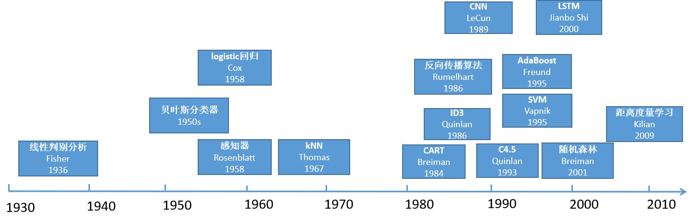

# CNN - AlexNet （卷积神经网络 - AlexNet）
## 一、概念理解
- 树立一个观念：**模型**能够 overfit 到**数据集**
 
### （一）、机器学习 + 深度学习的发展历程
#### 1、机器学习理论的发展



- 2000 年前后：**核方法**，有一套完整的数学模型，如 SVM
- 2000 年前后：**几何学**，把计算机视觉的问题描述成几何问题，如经典 CV 算法
- 2010 前后： **特征工程**：如何抽取图片的特征，如 SIFT、视觉词袋

#### 2、计算机硬件的快速发展
摩尔定律展示了半导体技术进步带来的计算能力的突飞猛进。

#### 3、互联网的发展带来数据量的增长
- ImageNet(2010)
  - 自然物体的彩色图: 469X387;
  - 样本数：1.2M
  - 类数：1000

<br><br>

### （二）、从 LeNet 到 AlexNet 的观念转变
- 赢了 2012 年的 ImageNet 竞赛；
- 更深更大的 LeNet；
- 主要改进：
  - 丢弃法
  - ReLU（减缓梯度消失）
  - MaxPooling（增大输出值，带来更大的梯度）
  - 使用了**数据增强**（Data Arguments）
- **计算机视觉方法论的改变**：
  - 从 `人工提取特征 + SVM` 到通过 `CNN 学习获得特征 + MLP`，
  - 端到端学习；
  - 并且构造 CNN 简单高效 —— 从原始数据（字符串、像素）到最终学习结果。
#### 1、AlexNet与LeNet架构对比


- ***复杂度***

| |参数个数| |FLOP| |
|--|--|--|--|--|
|  |**AlexNet**|**LeNet**|**AlexNet**|**LeNet**|
|Cov1|35K|150|101M|1.2M|
|Cov2|614K|2.4K|415M|2.4M|
|Cov3-5|3M||445M||
|Dense1|26M|0.48M|26M|0.48M|
|Dense2|16M|0.1M|16M|0.1M|
|**Total**|**46M**|**0.6M**|**1G**|**4M**|
|**Increase**|**76x**|1x(baseline)|**250x**|1x(baseline)|

<br><br>

### （三）、总结
- AlexNet 是更大更深的 LeNet，10x 参数个数，260x 计算复杂度；
- 新加入了丢弃法、LeRU、最大池化层和数据增强；
- AlexNet 赢下了 2012 ImageNet 竞赛后，标志着新的一轮神经网络热潮的开始。

<br><br>

### （四）、有意思的问题
1. **Q：使用 GPU 训练 AlexNet 时，报错 `CUDA error: CUBLAS_STATUS_NOT_INITIALIZED when calling cublasCreate(handle)` 是什么原因？**
   1. **🙋‍♂️**：一般是显卡显存不够了，可以尝试将 `batch_size` 调小一些试试。
2. **Q：一般CNN要求输入图像是固定尺寸，实际应用中，数据尺寸不一，会怎样处理？强行 `resize` 吗？**
   1. **🙋‍♂️**：一般不会强行 resize，否则会改变图像特征，而是保持长宽比不变的 resize，在其中 crop 出符合要求的尺寸来（抠出来符合要求的尺寸）。

<br><br><br><br>

## 二、代码
### （一）、理解代码
#### 1、张量形状
```python
# 第一层卷积层（ LeNet 也有 ）
Conv2d output shape:     torch.Size([1, 96, 54, 54])
ReLU output shape:       torch.Size([1, 96, 54, 54])
MaxPool2d output shape:  torch.Size([1, 96, 26, 26])

# 第二层卷积层（ LeNet 也有 ）
Conv2d output shape:     torch.Size([1, 256, 26, 26])
ReLU output shape:       torch.Size([1, 256, 26, 26])
MaxPool2d output shape:  torch.Size([1, 256, 12, 12])

# 下面是三层卷积层（ LeNet 没有，这是 AlexNet 新增的 ）
# 一种解释：由于处理的图片信息多（尺寸大、通道多，批次不算图片信息！），
# 因此多来几个卷积层提取特征
Conv2d output shape:     torch.Size([1, 384, 12, 12])
ReLU output shape:       torch.Size([1, 384, 12, 12])
Conv2d output shape:     torch.Size([1, 384, 12, 12])
ReLU output shape:       torch.Size([1, 384, 12, 12])
Conv2d output shape:     torch.Size([1, 256, 12, 12])
ReLU output shape:       torch.Size([1, 256, 12, 12])

MaxPool2d output shape:  torch.Size([1, 256, 5, 5])
Flatten output shape:    torch.Size([1, 6400])

# 第一层 MLP（ LeNet 也有 ）
Linear output shape:     torch.Size([1, 4096])
ReLU output shape:       torch.Size([1, 4096])
Dropout output shape:    torch.Size([1, 4096])
# Dropout 丢弃法其实是一种正则手段！

# 第二层 MLP（LeNet 也有）
Linear output shape:     torch.Size([1, 4096])
ReLU output shape:       torch.Size([1, 4096])
Dropout output shape:    torch.Size([1, 4096])

# 第三层 MLP（LeNet 也有）
# 由于这里数据集是 FashionMNIST，因此最后一层全连接层输出为 10
# 如果采用 ImageNet 数据集（共有 1000 种 label）,
# 那么最后一层全连接层输出必须为 1000
Linear output shape:     torch.Size([1, 10])
```
<br><br>


### （二）、跑代码的环境
#### 1、多线程
1. 在 windows 环境下运行本书中的很多例子，如果出现 Runtime error： DataLoader worker exited unexpectedly. ，这主要是由于 `d2l torch.py` 中的 get_dataloader_workers() 返回 4。
2. windows 下多进程执行 DataLoader 容易出错。
3. 解决方法是 get_dataloader_workers() 返回 0，如下：
def get_dataloader_workers():
```python
'''
Use 4 processes to read the data. 0 process for windows.
Defined in :numref:`sec_fashion_mnist`
'''
return 0 if sys.platform.startswith('win') else 4
```
<br><br>

#### 2、用 GPU 而非 CPU 训练
1. [笔记本 4060 跑了 8 分钟，gpu 占用率大部分很低，时不时上升到 100](https://www.bilibili.com/video/BV1h54y1L7oe?comment_on=1&comment_root_id=191335777904&share_tag=s_i#reply191335777904)
   1. 正常的，你可以看看 `d2l.train_ch6` 的实现，它是每个 epoch 才把数据搬到 GPU 上的，搬数据的过程 GPU 占用就会低。
   2. 用 linux 4060 6 分 10 秒
2. [关于内存和 Windows 多线程的问题](https://www.bilibili.com/video/BV1h54y1L7oe?comment_on=1&comment_root_id=130870845152&share_tag=s_i#reply130870845152)

- 我自己的情况还不太一样：
  - 刚开始的时候，GPU 在那一瞬间占用率为 100% ，
  - 但是以后 GPU 占用率一直为 0

```powershell
# batch_size = 128 的情况下跑代码
2026-02-02 16:41:52.994707
training on cuda:0
loss 0.329, train acc 0.880, test acc 0.877
1413.1 examples/sec on cuda:0
2026-02-02 16:54:28.631917
0:12:35.637210
```

```powershell
# batch_size = 32 的情况下跑代码
2026-02-02 17:06:30.931702
training on cuda:0
loss 0.227, train acc 0.917, test acc 0.899
1232.8 examples/sec on cuda:0
2026-02-02 17:20:29.179842
0:13:58.248140
```