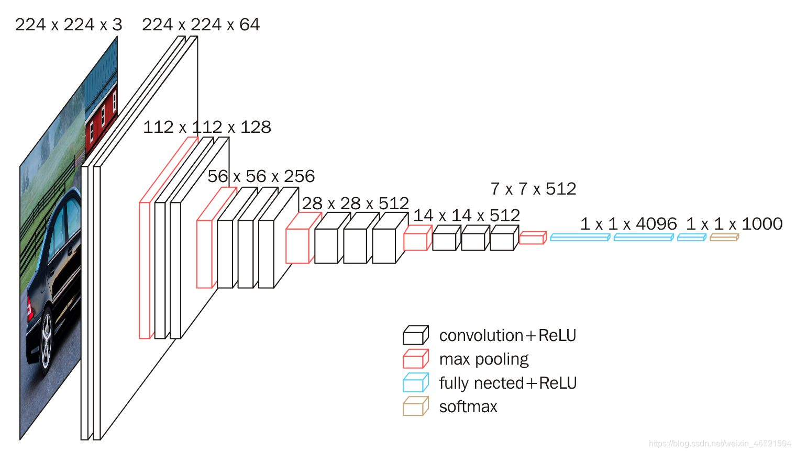
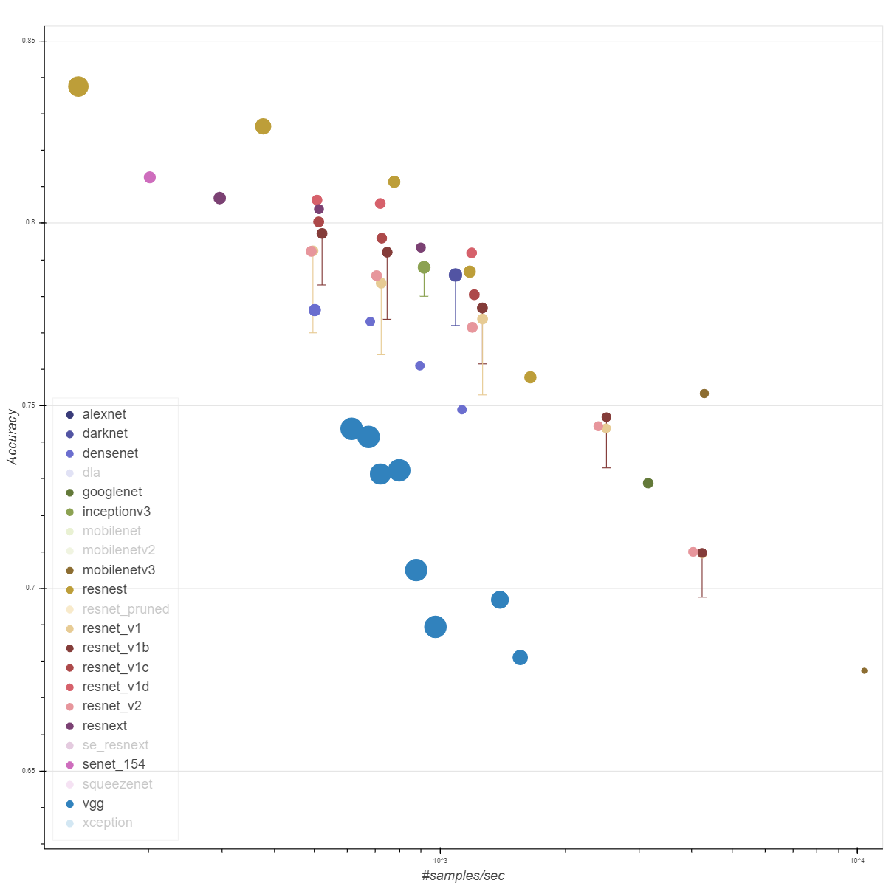

# CNN - VGG（卷积 - VGG 块）
## 一、概念理解
### （一）、构想缘由 —— 模块化思想
1. 因为 AlexNet 比 LeNet 更深更大而获得更好的精度，那么能不能更深更大？有以下几种途径：
   1. 更多的全连接层（占存储空间，成本高）
   2. 更多的卷积层（不好标准化）
   3. 将卷积层组合成快 √
2. 虽然 AlexNet 证明深层神经网络卓有成效，但它没有提供一个通用的模板来指导后续的研究人员设计新的网络。
3. 与新能源汽车模块化生产、芯片设计中工程师从放置晶体管到逻辑元件再到逻辑块的过程类似，神经网络架构的设计也逐渐变得更加抽象。（ **因为硬件中经常用到层层抽象的思考方式** ）
   1. 研究人员开始从**单个神经元**的角度思考问题，
   2. 发展到**整个层**，
   3. 现在又转向 **块（重复层）** 的模式。
<br><br>

### （二）、论文中的 VGG
1. 使用块的想法首先出现在牛津大学的[视觉几何组（Visual Geometry Group，VGG）](http://www.robots.ox.ac.uk/~vgg/)的 VGG 网络中。
   1. 通过使用循环和子程序，可以很容易地在任何现代深度学习框架的代码中实现这些重复的架构。
   2. 
2. 每个 VGG 块由以下组件组成：
   1. n 个 3x3 卷积层，填充 padding=1（可重复 n 层，m 通道，输入通道等于输出通道）
   2. 2x2 最大池化层（步幅 stride=2）
3. 作者实验证明，
   1. **更深的 3x3** 效果好于**浅的 5x5**；
   2. 由于有步幅的存在，每个块的输出尺寸减半，
   3. 一般使用时每个块设定使**通道数翻倍**，空间**尺寸减半**。
<br><br>

### （三）、使用中的 VGG 架构
1. 将多个 VGG 块串连后接全连接层，不同次数的重复块得到不同的架构，如：VGG-16，VGG-19 ……
   1. 这里的 VGG-16 是指 `卷积层数 + 全连接层数 = 16`
   2. 

<br><br>

### （四）、总结


1. 上图展示不同神经网络架构的 Benchmark[1]，横轴代表模型预测速度，纵轴代表准确率，圆圈大小代表模型存储空间大小
   1. VGG 使用可重复使用的卷积块来构建深度卷积神经网络（模块化）
   2. 不同的卷积块和超参数可以得到不同复杂度的变种以适应不同需求（类似车辆高低配）

<br><br><br><br>

## 二、代码
```python
# 通过【重复】卷积层的方式构建 VGG 块
# VGG 块的参数：卷积层数 + 输入通道数 + 输出通道数
def vgg_block(num_convs, in_channels, out_channels):
    layers = []
    for _ in range(num_convs):
        # 一个 VGG 块的第一个卷积层就已经把通道数变好了
        # 一个 VGG 块的其他卷积层保持通道数和图片尺寸
        layers.append(nn.Conv2d(in_channels, out_channels,
                                kernel_size=3, padding=1))
        layers.append(nn.ReLU())
        in_channels = out_channels
    layers.append(nn.MaxPool2d(kernel_size=2,stride=2))
    return nn.Sequential(*layers)

conv_arch = ((1, 64), (1, 128), (2, 256), (2, 512), (2, 512))

# 通过【堆叠】VGG 块的方式构建【VGG + 全连接层】的模型
# 其实 VGG 就只是针对卷积层的
def vgg(conv_arch):
    conv_blks = []
    in_channels = 1
    # 卷积层部分
    for (num_convs, out_channels) in conv_arch:
        conv_blks.append(vgg_block(num_convs, in_channels, out_channels))
        # 本【块】的输出通道数就是下一【块】的输入通道数
        in_channels = out_channels

    return nn.Sequential(
        *conv_blks, nn.Flatten(),
        # 全连接层部分
        nn.Linear(out_channels * 7 * 7, 4096), nn.ReLU(), nn.Dropout(0.5),
        nn.Linear(4096, 4096), nn.ReLU(), nn.Dropout(0.5),
        nn.Linear(4096, 10))

net = vgg(conv_arch)
```

### （一）、理解代码
#### 1、张量形状
```python
# 张量形状 (batch_size, channels, h, w)
X = torch.randn(size=(1, 1, 224, 224), dtype=torch.float32)

# 本 VGG 块的输出通道数就是下一个 VGG 块的输入通道数
# 卷积中的 VGG 块：尺寸减半、通道数加倍
Sequential output shape:         torch.Size([1, 64, 112, 112])
Sequential output shape:         torch.Size([1, 128, 56, 56])
Sequential output shape:         torch.Size([1, 256, 28, 28])
Sequential output shape:         torch.Size([1, 512, 14, 14])
Sequential output shape:         torch.Size([1, 512, 7, 7])
Flatten output shape:    torch.Size([1, 25088])

# 下面是全连接层 MLP
Linear output shape:     torch.Size([1, 4096])
ReLU output shape:       torch.Size([1, 4096])
Dropout output shape:    torch.Size([1, 4096])
Linear output shape:     torch.Size([1, 4096])
ReLU output shape:       torch.Size([1, 4096])
Dropout output shape:    torch.Size([1, 4096])
Linear output shape:     torch.Size([1, 10])
```

<br><br>

### （二）、还是关于 GPU 和运算速度的问题
```python
# batch_size = 128 的情况下跑代码
2026-02-02 18:58:04.335146
training on cuda:0
loss 0.173, train acc 0.936, test acc 0.918
1046.2 examples/sec on cuda:0
2026-02-02 19:13:06.110842
0:15:01.775696
```

```python
# batch_size = 32 的情况下跑代码
2026-02-02 19:17:16.629766
training on cuda:0
loss 0.104, train acc 0.962, test acc 0.928
1003.9 examples/sec on cuda:0
2026-02-02 19:32:44.316234
0:15:27.686468
```

