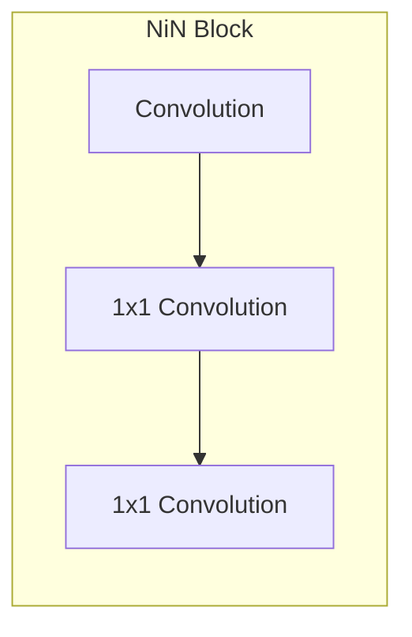

# CNN - NiN ( Network in Network ) | 卷积 - 网络中的网络
## 一、概念理解
- 以后的神经网络基本都会有自己局部的卷积结构
- NiN 其实也是**基于 AlexNet** 构造的
- **非常极端的一点**
  - `NiN` 全程**没有**用到**全连接层**
  - **只有卷积层**！

### （一）、全连接层的问题
1. LeNet、AlexNet 和 VGG 都有一个共同的设计模式：
   1. 通过一系列的卷积层与池化层来提取空间结构特征；
   2. 然后通过全连接层对特征的表征进行处理。 
   3. AlexNet 和 VGG 对 LeNet 的改进主要在于如何扩大和加深这两个模块。
2. 而全连接层存在以下问题：
   1. 相比卷积层，全连接层**参数存储空间大得多**，同时占用很大的计算带宽
   2. 卷积层需要较少的参数：$c_i\times c_o\times k^2$
      1. $c_i$表示输入通道数，$c_o$表示输出通道数，$k$表示卷积核尺寸，
   3. 以卷积层后的第一个全连接层的参数大小为例
     - LeNet：$16\times5\times5\times120=48k$
     - AlexNet：$256\times5\times5\times4096=26M$
     - VGG：$512\times7\times7\times4096=102M$
3. 大尺寸的全连接层很容易引起**过拟合**问题
4. 使用了全连接层，相当于放弃特征的**空间结构**

<br><br>

### （二）、介绍 `NiN`
**网络中的网络（NiN）** 提供了一个非常简单的解决方案：在**每个像素的通道上**分别使用多层感知机来取代全连接层
#### 1、`NiN block`


一个卷积层后跟两个全连接层（即 $(1 \times 1)$ 卷积层，用于混合通道，每个 $(1 \times 1)$ 卷积层：

- 步幅 stride=1，无填充，通道数等于卷积层通道数，输出形状跟卷积层输出一样，不改变输出尺寸与通道数
- 起到全连接层的作用
- **对每个像素增加了非线性性**


上图为 $(1 \times 1)$ 卷积层老示例图仅供参考。对应 NiN 块，输入三通道时，则卷积层也需要输出 3 通道而不是上图的的 2 通道

<br><br>

#### 2、`NiN` 架构


- 无全连接层
- 交替使用 **NiN 块**和步幅为 2 的**最大池化层**
  - 逐步减小高宽和增大通道数
- 最后使用**全局平均池化层**得到输出替代 AlexNet、VGG 的全连接层
  - 其输入通道数是类别数
  - 从每个通道拿出一个值，作为对其类比的预测，再求 softmax
  - 减小全连接层过拟合问题，减少参数个数，降低存储空间使用
<br><br>

### （三）、有意思的问题
1. 之前讲过，**局部池化层**一般已经不怎么用了
   1. 但是这里还是会用 **全局池化层**。好处是：可以增强模型泛化性；坏处就是收敛速度会变慢。
   2. 话又说回来，全局池化层代码是怎么写的啊？没啥印象！

<br><br><br><br>

## 二、代码讲解
```python
def nin_block(in_channels, out_channels, kernel_size, strides, padding):
    return nn.Sequential(
        # NiN 块在第一层卷积层就完成对通道数的修改
        nn.Conv2d(in_channels, out_channels, kernel_size, strides, padding),
        nn.ReLU(),
        # 后面的两个 1x1 卷积层当作全连接层用；并且它们不改变通道数
        nn.Conv2d(out_channels, out_channels, kernel_size=1), nn.ReLU(),
        nn.Conv2d(out_channels, out_channels, kernel_size=1), nn.ReLU())

net = nn.Sequential(
    nin_block(1, 96, kernel_size=11, strides=4, padding=0),
    nn.MaxPool2d(3, stride=2),
    nin_block(96, 256, kernel_size=5, strides=1, padding=2),
    nn.MaxPool2d(3, stride=2),
    nin_block(256, 384, kernel_size=3, strides=1, padding=1),
    nn.MaxPool2d(3, stride=2),
    nn.Dropout(0.5),
    # 标签类别数是 10
    nin_block(384, 10, kernel_size=3, strides=1, padding=1),
    # 明确别怵：池化层的参数确定池化窗口的大小
    nn.AdaptiveAvgPool2d((1, 1)),
    # 将四维的输出转成二维的输出，其形状为(批量大小，10)
    nn.Flatten())
```

### （一）、理解代码
#### 1、张量形状
```python
# 张量形状 (batch_size, channels, h, w)

'''输入张量'''
X = torch.rand(size=(1, 1, 224, 224), dtype=torch.float32)

'''经过 NiN 网络后的张量'''
# 第一个 NiN 块减小尺寸，为后面减小计算量
Sequential output shape:         torch.Size([1, 96, 54, 54])
# 池化窗口步长为 2 ⇒ 因此尺寸又减半
MaxPool2d output shape:  torch.Size([1, 96, 26, 26])

Sequential output shape:         torch.Size([1, 256, 26, 26])
MaxPool2d output shape:  torch.Size([1, 256, 12, 12])

Sequential output shape:         torch.Size([1, 384, 12, 12])
MaxPool2d output shape:  torch.Size([1, 384, 5, 5])

# 丢弃法看作一种正则手段
Dropout output shape:    torch.Size([1, 384, 5, 5])
Sequential output shape:         torch.Size([1, 10, 5, 5])

# 池化窗口尺寸为 1 ？等一下，池化窗口步长为 5 吗？⇒ 5x5 变成 1x1 
# 最大池化确实是 kernel_size
# 但平均池化是 output_size
AdaptiveAvgPool2d output shape:  torch.Size([1, 10, 1, 1])

# 保留批次维度，其余维度展平
Flatten output shape:    torch.Size([1, 10])
```
<br><br>

### （二）、每层模型要怎么写代码？
#### 1、最大池化窗口 `torch.nn.MaxPool2d`
[官网 doc - torch.nn.MaxPool2d](https://docs.pytorch.org/docs/stable/generated/torch.nn.MaxPool2d.html#torch.nn.MaxPool2d)
```python
class torch.nn.MaxPool2d(
    kernel_size, stride=None, padding=0, dilation=1, 
    return_indices=False, ceil_mode=False
)
```

#### 2、平均池化窗口 `torch.nn.AdaptiveAvgPool2d`
[官网 doc - torch.nn.AdaptiveAvgPool2d](https://docs.pytorch.org/docs/stable/generated/torch.nn.AdaptiveAvgPool2d.html#torch.nn.AdaptiveAvgPool2d)
```python
class torch.nn.AdaptiveAvgPool2d(output_size)
```
- 果然和最大池化窗口不一样的！

```python
'''例子代码'''
# target output size of 5x7
m = nn.AdaptiveAvgPool2d((5, 7))
# target output size of 7x7 (square)
m = nn.AdaptiveAvgPool2d(7)
```

<br><br>

### （三）、还是关于 GPU 和运算速度的问题
```python
# batch_size = 128
2026-02-03 08:54:44.561948
training on cuda:0
loss 0.598, train acc 0.766, test acc 0.764
1294.1 examples/sec on cuda:0
2026-02-03 09:07:47.123159
0:13:02.561211
```

```python
# batch_size = 32
# 一个原因应该是 FashionMNIST 数据集太小？
2026-02-03 09:16:10.427364
training on cuda:0
loss 0.267, train acc 0.903, test acc 0.898
1305.0 examples/sec on cuda:0
2026-02-03 09:28:51.985303
0:12:41.557939
```
- 为什么我的 `batch_size` 对训练结果影响这么大？
- 你想知道为什么调整 `batch_size`（从 128 降至 32 ）后，模型的训练损失大幅降低、训练 / 测试准确率也明显提升，两者的训练结果会呈现这么显著的差异。
  - 这是深度学习训练中非常常见的现象，核心原因和 `batch_size` 对**梯度更新质量**、**模型收敛过程**的影响直接相关，结合你的实验结果，具体可以从以下 3 点通俗解释：
  1. 梯度估计的准确性与 “局部最优解” 问题（核心原因）
      1. 首先要明确：模型训练时，参数更新的依据是 “梯度”，而 `batch_size` 决定了**每次计算梯度时使用的样本数量**。
      2. 大 `batch_size`（128）：每次更新用的样本多，计算出的是 “批量平均梯度”，这种梯度的**方差小、更新稳定**，但缺点是容易让模型**陷入较差的局部最优解**（可以理解为 “模型找到了一个还不错的优化终点，但这个终点不是最好的，且无法跳出来”）。
      3. 你的实验中，batch = 128 时 loss 停在 0.598、acc 停在 76% 左右，就是模型卡在了一个较差的局部最优，后续无法继续优化，所以效果上不去。
      4. 小 `batch_size`（32）：每次更新用的样本少，梯度带有更多 “噪声”（方差大），看起来更新不稳定，但这种**梯度噪声反而能成为“推力”，帮助模型跳出较差的局部最优解**，朝着更好的全局最优（或更优的局部最优）前进。
      5. 你的实验中，batch = 32 时 loss 降到 0.267、acc 升到 90% 左右，就是模型通过带噪声的梯度更新，找到了更优的优化终点，这也是小batch在中等规模数据集、普通任务上常表现更好的原因。
      6. 补充：你的两个实验中样本处理速度（examples/sec）几乎持平（1294 vs 1305），说明 GPU 并行计算没有因 batch 减小而大幅低效，小 batch 的梯度优势得以充分体现，没有被速度瓶颈掩盖。
   2. 小batch的 “隐式正则化” 效应（泛化能力保障）
      1. 小 `batch_size` 带来的梯度噪声，还相当于给模型加了一种**隐式正则化**（可以理解为 “防止模型过度死记硬背训练数据的细节，强迫模型学习更通用的规律” ），这有助于提升模型的泛化能力（即训练准确率和测试准确率的差距不会过大）。
      2. 看你的实验数据：
         - batch = 128：train acc 0.766，test acc 0.764（差距0.002），差距小但整体效果差，无实际意义；
         - batch = 32：train acc 0.903，test acc 0.898（差距0.005），差距略有增大但仍处于合理范围，说明模型既提升了训练效果，又保持了良好的泛化能力，没有出现过拟合，这正是小 batch 隐式正则化的价值。
      3. 反之，若 `batch_size` 过大（甚至接近整个数据集），梯度噪声几乎消失，模型容易过度拟合训练数据的细节，泛化能力会下降（不过你这里 batch = 128 是陷入局部最优，而非过拟合）。
   3. 学习率的适配性（容易被忽略的关键）
      1. `batch_size` 和 **学习率** 是强相关的一对参数，深度学习中有个经典经验法则：**当 batch_size 扩大 n 倍时，学习率也应同步扩大 n 倍（或 n 的平方根倍）**，才能保证模型的训练节奏稳定。
      2. 你的实验中，大概率是**保持了学习率不变**（从 128 降至 32 未调整学习率）：
         - 对于 batch = 128 来说，原本的学习率可能**偏小**，导致参数更新的步长太小，模型收敛速度慢，甚至卡在局部最优解无法前进（对应你 128 的结果，效果停滞不前）；
         - 对于 batch = 32 来说，原本的学习率恰好**适配**，步长大小合适，能够有效推动参数更新，让模型快速收敛到更优的结果（对应你 32 的优异表现）。
      3. 如果后续你想提升 batch_size（比如追求更快的训练速度），可以尝试同步调高学习率，大概率能改善大 batch 下的训练效果。
   4. 补充：不是小 batch 一定更好（适用场景说明）
      1. 避免你产生“batch越小越好”的误解，两者各有适用场景：
         1. 小 batch（32、64）优势场景：数据集规模中等、任务有一定复杂度、追求更高的模型精度（如你的场景）；
         2. 大 batch（128、256+）优势场景：数据集极大（如 ImageNet 大规模训练）、需要最大化 GPU 并行效率提升训练速度、追求训练过程的稳定性（而非极致精度）。

