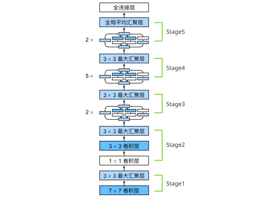
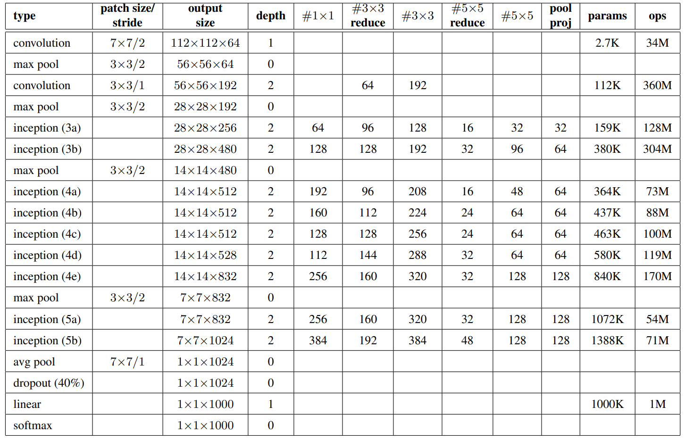

# CNN - GoogLeNet | 卷积 - Google Net（含并行连接的网络）
## 一、概念理解
- **GoogLeNet 和 AlexNet、VGG 很像**
- 现在一般用 **GoogLeNet v3**

### （一）、问题的引出
1. 在 2014 年的 ImageNet 图像识别挑战赛中，一个名叫 GoogLeNet [[Szegedy et al., 2015]](https://www.cv-foundation.org/openaccess/content_cvpr_2015/papers/Szegedy_Going_Deeper_With_2015_CVPR_paper.pdf)的网络架构大放异彩。 
   1. GoogLeNet 吸收了 NiN 中**串联网络**的思想，并在此基础上做了改进。 
   2. 这篇论文的一个重点是**解决了什么样大小的卷积核最合适的问题**。 
   3. 毕竟，以前流行的网络使用小到 1×1 ，大到 11×11 的卷积核。 
   4. 该文的一个观点是，有时使用不同大小的卷积核组合是有利的。
<br><br>

### （二）、Inception 块
1. 在 GoogLeNet 中，基本的卷积块被称为**Inception 块**（Inception block）。这很可能得名于电影《盗梦空间》（Inception），因为电影中的一句话 “我们需要走得更深” （“We need to go deeper”）。
2. Inception 块使用用 4 个路径从不同层面抽取信息，然后在输出通道维合并。
    
   1. 输出和输入等高宽，将 4 条路径的结果**按通道合并**（并不是 **按图片尺寸**！）
   2. 1x1 卷积层：进行通道融合，降低通道数来控制模型复杂度
      1. **只提取通道特征**
      2. **不提取空间特征**
   3. 非 1x1 的卷积层、MaxPooling：提取空间特性，增加鲁棒性
      1. **既提取通道特征**
      2. **又提取空间特征**
   4. 每条路径的通道数可能不一样

<br><br>

### （三）、Inception 的优势
1. 跟单 3x3 或 5x5 卷积层相比，输出相同通道数，Inception 块只需要更少的参数个数和计算复杂度.
2. 因为大量 1x1 卷积层 ⇒ 参数减少，
3. 同时参数减少 ⇒ 计算减小

|           | #parameters | FLOPS |
| --------- | ----------- | ----- |
| Inception | 0.16M       | 128M  |
| 3x3 Conv  | 0.44M       | 346M  |
| 5x5 Conv  | 1.22M       | 963M  |

- FLOPS: Floating-point Operations Per Second

<br><br>

### （四）、GoogLeNet
包含 5 Stages, 9 Inception 块

- 架构图 

- 各层信息 

#### 1、Inception 变种
- Inception-BN(V2)：使用了 batch normalization
- Inception-V3：修改了 Inception (包含诡异的 1x3、3x1、1x7、7x1Conv)
- Inception-V4：使用残差连接

<br><br>

### （五）、总结

- Inception 块使用 4 条有不同超参数的卷积层和池化层的通路来抽取不同的信息
  - 一个主要优点是模型参数小，计算复杂度低
- GooLeNet 用了 9 个 Inception 块，是第一个达到上百层的网络
  - 后续有一系列改进变种

<br><br><br><br>

## 二、代码讲解
```python
import torch
from torch import nn
from torch.nn import functional as F
from d2l import torch as d2l
from tools.ch6 import train_ch6
import matplotlib.pyplot as plt # 用于画图
from datetime import datetime

class Inception(nn.Module):
    # 一个 Inception block 有 4 路卷积层 
    # c1--c4是每条路径的输出通道数
    def __init__(self, in_channels, c1, c2, c3, c4, **kwargs):
        super(Inception, self).__init__(**kwargs)
        # 线路1，单1x1卷积层
        self.p1_1 = nn.Conv2d(in_channels, c1, kernel_size=1)
        # 线路2，1x1卷积层后接3x3卷积层
        self.p2_1 = nn.Conv2d(in_channels, c2[0], kernel_size=1)
        self.p2_2 = nn.Conv2d(c2[0], c2[1], kernel_size=3, padding=1)
        # 线路3，1x1卷积层后接5x5卷积层
        self.p3_1 = nn.Conv2d(in_channels, c3[0], kernel_size=1)
        self.p3_2 = nn.Conv2d(c3[0], c3[1], kernel_size=5, padding=2)
        # 线路4，3x3最大池化层后接1x1卷积层
        # 这里把池化层放在卷积层之前，其实并不少见，让它对位置不那么敏感
        self.p4_1 = nn.MaxPool2d(kernel_size=3, stride=1, padding=1)
        self.p4_2 = nn.Conv2d(in_channels, c4, kernel_size=1)

    '''原来不用刻意地写并联, 只需要把结果在那里放着就行了！'''
    def forward(self, x):
        p1 = F.relu(self.p1_1(x))
        p2 = F.relu(self.p2_2(F.relu(self.p2_1(x))))
        p3 = F.relu(self.p3_2(F.relu(self.p3_1(x))))
        p4 = F.relu(self.p4_2(self.p4_1(x)))
        # 在通道维度上连结输出
        # 张量形状 (batch_size, channels, h, w)
        return torch.cat((p1, p2, p3, p4), dim=1)
    
'''下面是 5 个 stage'''
b1 = nn.Sequential(nn.Conv2d(1, 64, kernel_size=7, stride=2, padding=3),
                   nn.ReLU(),
                   nn.MaxPool2d(kernel_size=3, stride=2, padding=1))

b2 = nn.Sequential(nn.Conv2d(64, 64, kernel_size=1),
                   nn.ReLU(),
                   nn.Conv2d(64, 192, kernel_size=3, padding=1),
                   nn.ReLU(),
                   nn.MaxPool2d(kernel_size=3, stride=2, padding=1))

'''
从这里可以看出来: Inception block 本身不改变图片尺寸，只改变通道数。
是后面的池化层 ( stride ) 改变图片尺寸！
'''
b3 = nn.Sequential(Inception(192, 64, (96, 128), (16, 32), 32),
                   Inception(256, 128, (128, 192), (32, 96), 64),
                   nn.MaxPool2d(kernel_size=3, stride=2, padding=1))

b4 = nn.Sequential(Inception(480, 192, (96, 208), (16, 48), 64),
                   Inception(512, 160, (112, 224), (24, 64), 64),
                   Inception(512, 128, (128, 256), (24, 64), 64),
                   Inception(512, 112, (144, 288), (32, 64), 64),
                   Inception(528, 256, (160, 320), (32, 128), 128),
                   nn.MaxPool2d(kernel_size=3, stride=2, padding=1))

b5 = nn.Sequential(Inception(832, 256, (160, 320), (32, 128), 128),
                   Inception(832, 384, (192, 384), (48, 128), 128),
                   nn.AdaptiveAvgPool2d((1,1)),
                   nn.Flatten())

net = nn.Sequential(b1, b2, b3, b4, b5, nn.Linear(1024, 10))

X = torch.rand(size=(1, 1, 96, 96))
for layer in net:
    X = layer(X)
    print(layer.__class__.__name__,'output shape:\t', X.shape)

lr, num_epochs, batch_size = 0.1, 10, 128
train_iter, test_iter = d2l.load_data_fashion_mnist(batch_size, resize=96)

starttime = datetime.now() 
print(starttime) # 打印当前时间

train_ch6(net, train_iter, test_iter, num_epochs, lr, d2l.try_gpu())

endtime = datetime.now()
print(endtime)
print(endtime-starttime)

plt.show()
```

### （一）、理解代码
#### 1、张量形状
```python
# 张量形状 (batch_szie, channels, h, w)

'''输入张量'''
X = torch.rand(size=(1, 1, 96, 96))
 
Sequential output shape:         torch.Size([1, 64, 24, 24]) # 卷积 + 池化
Sequential output shape:         torch.Size([1, 192, 12, 12]) # 卷积 + 卷积 + 池化
Sequential output shape:         torch.Size([1, 480, 6, 6]) # Inception
Sequential output shape:         torch.Size([1, 832, 3, 3]) # Inception
Sequential output shape:         torch.Size([1, 1024]) # Inception
Linear output shape:     torch.Size([1, 10]) # 全连接层
```

<br><br>

### （二）、关于 GPU 训练和运算速度的问题
```powershell
2026-02-03 13:24:22.481991
training on cuda:0
loss 0.255, train acc 0.903, test acc 0.884
2223.8 examples/sec on cuda:0
2026-02-03 13:31:24.328444
0:07:01.846453
```
- **比 AlexNet 快了整整一倍！**

1. 经过观察，是 **`资源管理器`** 中的 GPU 利用率没有更新而已
   1. 实际上就是利用的 GPU，只是资源管理器没显示而已。
   2. 想要看真正的 GPU 利用率，还是用 **`nvidia-smi` 命令查看**！