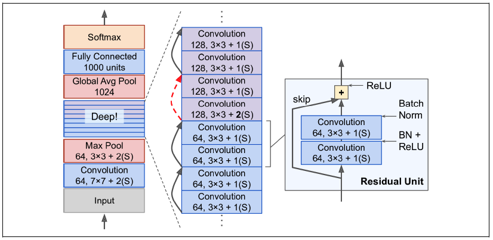
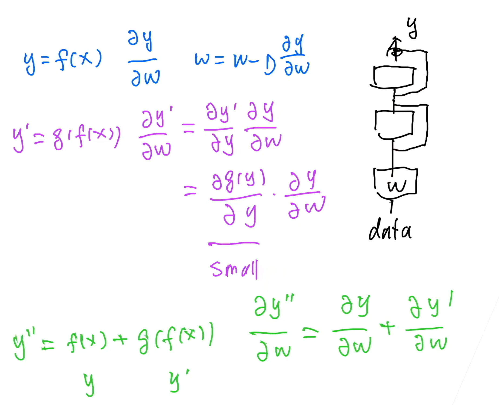
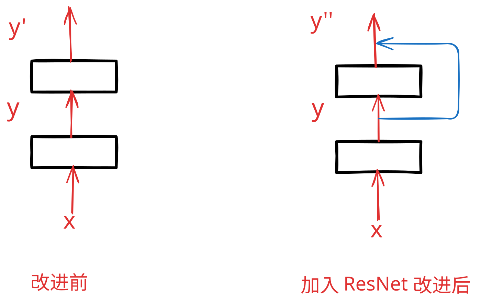

# ResNet | 残差网络
## 一、概念理解
- **ResNet 是从 VGG 那里过来的**
  - VGG 使用的是 3x3 卷积
  - 并且，通常是：高宽减半的同时，通道数加倍

### （一）、问题引出：加更多的层总是改善精度吗？（从 `函数` 的角度分析）
1. 以下图示例来说，对于非嵌套函数（non-nested function）类，较复杂的函数类并不总是向 “真” 函数 $f^∗$ 靠拢
   1. 区域大小代表模型复杂度，复杂度由 $\mathcal{F1}$ 向 $\mathcal{F6}$ 递增。 
   2. 在下图左边，虽然 $\mathcal{F3}$ 比 $\mathcal{F1}$ 更接近 $f^∗$ ，但 $\mathcal{F6}$ 却离的更远了。 
   3. 相反对于下图右侧的嵌套函数（nested function）类 $\mathcal{F1}\subseteq…\subseteq \mathcal{F6}$ ，我们可以避免上述问题。


### （二）、残差块（Residual blocks）
1. 假设我们的原始输入为 $x$ ，而希望学出的理想映射为 $f(x)$ （作为下图上方激活函数的输入）。 
   1. 下图虚线框中的部分需要直接拟合出该映射 $f(x)$ ，而右图虚线框中的部分则需要拟合出残差映射 $f(x)−x$ 。 残差映射在现实中往往更容易优化。 
   2. 以本节开头提到的恒等映射作为我们希望学出的理想映射 $f(x)$ ，我们只需将下图右侧虚线框内上方的加权运算（如仿射）的权重和偏置参数设成 $0$，那么 $f(x)$ 即为恒等映射。 
   3. 实际中，当理想映射 $f(x)$ 极接近于恒等映射时，残差映射也易于**捕捉恒等映射的细微波动**。 
   4. 右图是 ResNet 的基础架构–残差块（residual block）。 在残差块中，输入可通过跨层数据线路更快地向前传播。


- 串联一个层改变函数类，我们希望能扩大函数类。
- 残差块加入快速通道（右边）来得到 $f(x)=x+g(x)$
  - 相当于在后面复杂网络**嵌入了前面的简单网络**。
  - 即便你 **虚线中新加的网络层** 没有学到东西，也就是 $g(x)$ **无效**的时候，也能保证该模型具备之前小模型的性能。
  - **但是有个问题**：可是如果 $g(x)$ 有干扰的话，如何保证 $f(x)$ 不会受到干扰呢？
    - 看看代码具体是怎么干的吧！
    - 代码还真就是直接加上的（看来算了，别钻牛角尖了！）
    - 不过**一般情况**下，新加的网络不会造成干扰：
      - 新加的网络要么没用
      - 要么更有利
      - 一般不会造成负影响
        ```python
        def forward(self, X):
            Y = F.relu(self.bn1(self.conv1(X)))
            Y = self.bn2(self.conv2(Y))
            if self.conv3:
                X = self.conv3(X)
            # 如果有 1x1 改变通道数，那就加上改变通道数之后的
            # 如果没有 1x1 改变通道数，那就直接加上原本的输入
            Y += X
            return F.relu(Y)
        ```

### （三）、残差块细节
1. 注意：**ResNet** 是从 VGG 过来的，因此使用 $3\times3$ 卷积核
2. 残差块有两种实现方式，
   1. 一种是当 `use_1x1conv=False` 时，应用 ReLU 非线性函数之前，将输入添加到输出。
   2. 另一种是当 `use_1x1conv=True` 时，添加通过 $1×1$ 卷积调整通道。
      1. 因为经过 **虚线中新增的网络层** 后，通道数可能会改变
      2. 为了能够让 `x` 和 新增网络层的输出 适配，所以必须通过 $1\times1$ 卷积层改变通道数
      3. 但是 $1\times1$ 卷积层也只是改变通道数，并不改变图片尺寸！


### （四）、ResNet 网络结构
1. ResNet 的前两层跟之前介绍的 GoogLeNet 中的一样： 在输出通道数为 64、步幅为 2 的 $7×7$ 卷积层后，接步幅为 2 的 $3×3$ 的最大汇聚层。 不同之处在于 ResNet 每个卷积层后增加了批量规范化层。 
2. 每个模块有 4 个卷积层（不包括恒等映射的 $1×1$ 卷积层）。 
   1. 加上第一个 $7×7$ 卷积层和最后一个全连接层，共有 18 层。 
   2. 因此，这种模型通常被称为 **`ResNet-18`**。
   3. 通过配置不同的通道数和模块里的残差块数可以得到不同的 ResNet 模型，例如更深的含 152 层的 ResNet-152。


- 高宽减半 ResNet 块 (stride=2)
- 后接多个高宽不变的 ResNet
  - 用 1x1Conv skip 可以改变输出通道匹配 ResNet
- 类似于 VGG 和 GooleNet 的总体架构
  - 一般是 5 个 Stage
  - $7×7$ Conv + BN + $3×3$ MaxPooling
  - 每一个 Stage 的具体框架很灵活
- 但替换成了 **ResNet 块**

### （五）、总结
- 残差块使得很深的网络更加容易训练
  - 甚至可以训练一千层的网络
- 残差网络对随后的深层神经网络设计产生了深远影响，无论是卷积累网络还是全连接类网络

### （六）、有意思的问题
1. **Q：为什么 $f(x)=x+g(x)$ 就能保证结果至少不会变差？假如 $g(x)$ 变得更差呢？**
   1. 🙋‍♂️：在神经网络训练中，如果反向传播时算法发现 $g(x)$ 对模型 `loss` 损失函数没有贡献（或者有负贡献），就会逐渐将 $g(x)$ 的梯度置零（或者反方向降低 $g(x)$ 的影响直到权重为零），最后 $g(x)$ 就得不到梯度更新，网络最终结果 $f(x)$ 也会忽略 $g(x)$ 而向 $x$ 靠近。
   2. 从**梯度的角度**去理解，真的在某方面抓到了**数学本质**！
2. 进一步理解 $f(x) = x + g(x)$ 残差 Residual Net 的由来
   1. 先去拟合简单的 $x$
   2. 然后再拟合比较复杂的 $g(x)$
   3. 同时保证了新的模型兼具小模型的性能！
3. **Q：是不是训练精度总是会比测试精度高？**
   1. 🙋‍♂️：也不一定，在许多有 Data Argument（数据增强）的任务中，比如图片识别，测试精度是可能高于训练精度（因为训练图片有添加噪声等干扰，而测试图片没有）。
4. 为什么 ResNet 可以训练**很深**的神经网络？ 
   1. 首先明确：**梯度** 其实是 **反向** 传播的
   2. ⇒ 所以靠近数据的输入端梯度可能会**爆炸**，也可能会**消失**，这里只考虑梯度消失的情况
   3. 靠近数据的输入端梯度消失，就会导致靠近数据的输入端参数更新变慢，训练变慢
   4. 有了 ResNet 以后，靠近输出端的梯度就能直接传递到输入端，使得输入端的梯度不至于消失！
   5. 其实上面本来应该是 $\partial \text{loss} \over \partial {\bf w}$，但是数值上 ${\partial{\text{loss}} \over \partial{\bf w} } = { \partial{(\hat{y}-y)} \over \partial{\bf w}} = {\partial {\hat{y}} \over \partial{\bf w}}$
      1. 这只是最最普通的损失函数
      2. 交叉熵损失函数的形式还不是这样的！
      3. 只是用这个来做演示！
   6. 上面的公式其实对应下面的图片 
      1. 在计算 ${\partial y'' \over \partial {\bf w}} = {\partial y' \over \partial {\bf w}} + {\partial y \over \partial {\bf w}}$ 的时候，如果 ${\partial y' \over \partial {\bf w}}$ 梯度消失的话，还有 ${\partial y \over \partial {\bf w}}$ 不至于让梯度真的消失。
      2. **这数学思维还得培养**！
      3. 关于这个图的注释：方框里面是 **参数**，箭头是 **输入输出**！


<br><br><br><br>

## 二、代码讲解
```python
'''定义 Res 层: 2 个普通卷积层 + 1 个 1x1 卷积层。'''
class Residual(nn.Module):  #@save
    '''ResNet 块会改变图片尺寸和通道数！(因为有 stride)'''
    def __init__(self, input_channels, num_channels,
                 use_1x1conv=False, strides=1):
        super().__init__()
        self.conv1 = nn.Conv2d(input_channels, num_channels,
                               kernel_size=3, padding=1, stride=strides)
        self.conv2 = nn.Conv2d(num_channels, num_channels,
                               kernel_size=3, padding=1)
        if use_1x1conv:
            self.conv3 = nn.Conv2d(input_channels, num_channels,
                                   kernel_size=1, stride=strides)
        else:
            self.conv3 = None
        self.bn1 = nn.BatchNorm2d(num_channels)
        self.bn2 = nn.BatchNorm2d(num_channels)

    def forward(self, X):
        Y = F.relu(self.bn1(self.conv1(X)))
        Y = self.bn2(self.conv2(Y))
        if self.conv3:
            X = self.conv3(X)
        # 如果有 1x1 改变通道数，那就加上改变通道数之后的
        # 如果没有 1x1 改变通道数，那就直接加上原本的输入
        Y += X
        return F.relu(Y)


'''定义 Res 块: 一个 Res 块由 Res 层组成 (只不过是对 class Res 加了限制而已)'''
def resnet_block(input_channels, num_channels, num_residuals,
                 first_block=False):
    blk = []
    for i in range(num_residuals):
        '''
        1. 只有第一个 Res 块的第一个 Res 层(的第一个卷积层)尺寸不变 
        (因为已经经过前面卷积层缩小了, 尺寸已经很小了)
        2. 其余 Res 块的第一个 Res 层(的第一个卷积层)尺寸都减半！
        3. 所有 Res 块的其余 Res 层都保持尺寸不变
        4. 另外，从 class Resdual 的代码来看：所有 Res 层的第二个卷积层都保持图片尺寸不变！
        '''
        if i == 0 and not first_block:
            blk.append(Residual(input_channels, num_channels,
                                use_1x1conv=True, strides=2))
        else:
            blk.append(Residual(num_channels, num_channels))
    return blk

b1 = nn.Sequential(nn.Conv2d(1, 64, kernel_size=7, stride=2, padding=3),
                   nn.BatchNorm2d(64), nn.ReLU(),
                   nn.MaxPool2d(kernel_size=3, stride=2, padding=1))

b2 = nn.Sequential(*resnet_block(64, 64, 2, first_block=True))
b3 = nn.Sequential(*resnet_block(64, 128, 2))
b4 = nn.Sequential(*resnet_block(128, 256, 2))
b5 = nn.Sequential(*resnet_block(256, 512, 2))

net = nn.Sequential(b1, b2, b3, b4, b5,
                    nn.AdaptiveAvgPool2d((1,1)),
                    nn.Flatten(), nn.Linear(512, 10))
```

### （一）、理解代码
#### 1、张量形状
```python
# 张量形状 (batch_size, channels, h, w)

# 输入张量
X = torch.rand(size=(1, 1, 224, 224))

# 其实思路和之前一样：卷积减小尺寸、增多通道；全连接输出特征。
Sequential output shape:         torch.Size([1, 64, 56, 56])
Sequential output shape:         torch.Size([1, 64, 56, 56])
Sequential output shape:         torch.Size([1, 128, 28, 28])
Sequential output shape:         torch.Size([1, 256, 14, 14])
Sequential output shape:         torch.Size([1, 512, 7, 7])
AdaptiveAvgPool2d output shape:  torch.Size([1, 512, 1, 1])
Flatten output shape:    torch.Size([1, 512])
Linear output shape:     torch.Size([1, 10])
```

### （二）、实验结果
```powershell
2026-02-04 10:57:17.277314
training on cuda:0
loss 0.010, train acc 0.998, test acc 0.909
2862.8 examples/sec on cuda:0
2026-02-04 11:02:23.920718
0:05:06.643404
```