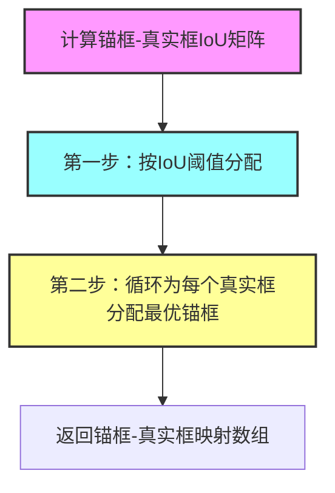

# Anchor Box | 锚框
- 这里讲的仅仅是 **画锚框** 相关的东西
- 还没有讲具体算法！

## 〇、有意思的问题
1. 置信度指的是**分类**的置信度，不是**锚框预测**的置信度
   1. **锚框预测**是没有置信度的
   2. **锚框预测**是回归问题
   3. 不理解这些话！
   4. 对上面这些话的解释
      1. 锚框（Anchor） → 只负责定位
      2. 分类头 → 才负责置信度

## 一、概念理解
- [知乎博客 - 讲解锚框](https://zhuanlan.zhihu.com/p/455807888)
- 理解 **广播机制**：
  - 只要它们 **维度相容**，那么就有可能 **广播**

### （一）、首先，按像素生成锚框
```python
def multibox_prior(data, sizes, ratios):
    # data 是一张图片，符合图片张量 (batch_size, channels, h, w) 的形状
    # sizes 是一个一维张量（缩放比）
    # ratios 也是一个一维张量（宽高比）
    return output.unsqueeze(0)
    # 返回张量上所有像素的所有锚框；
    # 返回的张量形状是 (1, boxes_per_pixel * num_pixels, 4)；
    # 这个张量形状也可解读为 (目标总数, 锚框总数, 一个锚框的形状)。
```
- `Pytorch` 标准图片张量形状 `(batch_size, channels, h, w)`

1. 定义像素的锚框
   1. 假设输入图像的**高度**为 $h$，**宽度**为 $w$。 
   2. 我们以图像的每个像素为中心生成不同形状的锚框：
      1. 锚框占图像的**缩放比**为 $s\in (0,1]$ ，
      2. 锚框**宽高比**为 $r>0$ 。
      3. 则锚框的宽度和高度分别是 $ws\sqrt r$ 和 $hs/\sqrt r$
2. 对于 $(h,w)$ 的图片，有 $h\times w$ 个像素，
   1. 在乘以所有 $s,r$ 的组合 $s\times r$，就有 $h\times w\times s\times r$ 个锚框
   2. 只考虑组合： $$(s_1,r_1),(s_1,r_2),...,(s_1,r_m),(s_2,r_1),(s_3,r_1),...,(s_n,r_1)$$
      1. 也就是 $s,r$ 各自**最合理的一个取值**与**其他的**做匹配
   3. ⇒ 锚框个数共有 `num_sizes + num_ratios - 1` 个（ **减去的那个 1 是重复的！** ）
<br>

### （二）、计算交并比 → 然后通过交并比用 `真实框` 标记 `锚框`（也就是给锚框打标签）
```python
def box_iou(boxes1, boxes2):
    # boxes1 和 boxes2 都是二维张量 (num_boxes, 4)
    # 该张量可以解读为 (框的索引, 框的值)
    return inter_areas / union_areas
    # 返回一个二维张量，该二维张量的行索引是 boxes1 的索引，列索引是 boxes2 的索引；
    # 该二维张量的值是【boxes1 中的一个框】和【boxes2 中一个框】之间的 IoU 值。
↓

计算完交并比之后，用【真实框】标记【锚框】；
但是刚开始的时候，并不是直接做好所有的标记，只是先为每一个【真实框】匹配上一个【锚框】；
后面再给【锚框】打上 label.

def assign_anchor_to_bbox(ground_truth, anchors, device, iou_threshold=0.5):
    '''本函数不打标签，只是为所有【真实框】匹配【锚框】'''
    # ground_truth 真实框张量 (num_gt_boxes, 4)
    # anchors 锚框张量 (num_anchors, 4)
    # 在训练集中标注锚框【两步分配原则】
    # 在目标检测中，锚框（anchors）数量远多于真实边界框（ground_truth），分配的核心诉求是：
    # 1. 高质量匹配的锚框要优先分配到对应真实框（保证正样本质量）；
    # 2. 每个真实框必须有至少一个锚框对应（避免真实框无锚框学习，导致训练漏检）。
    return anchors_bbox_map
    # 也就是：返回【锚框】与【真实框】之间的对应关系图；
    # anchors_bbox_map 这个变量名取得也是真直观！
    # anchors_bbox_map 是一维张量 (num_anchors)；索引是【锚框】序号；值是【真实框】序号 ✓ ；
    # 如果【锚框】没有对应上【真实框】，那么 anchors_bbox_map[锚框序号] = -1
    # 疑惑的是：为什么不返回 bbox_anchors_map，让索引是【真实框】序号，这样不是更省空间吗？

def offset_boxes(anchors, assigned_bb, eps=1e-6):
    '''对锚框偏移量的转换（还没仔细看！）
    如果【锚框】还没有被分配【真实框】，那该怎么计算偏移？'''
    # anchors 张量形状 (num_anchors, 4) 【锚框】
    # assigned_bb 张量形状 (num_anchors, 4) 【分配的真实框】
    return offset 
    # 张量形状：offset 是二维张量 (num_anchors, 4)；
    # 这里所有张量形状中没有 batch_size ⇒ 代表这是在一个样本内计算偏移

def multibox_target(anchors, labels):
    '''在【真实框】和【锚框】之间建立匹配关系后，为【锚框】打上标签'''
    # anchors 张量形状是 (1, num_anchors, 4)
    # labels 张量形状 (batch_size, num_labels, 5)
    # 这里 5 = 1 + 4，其中 1 是【真实框】的标签，4 是【真实框】的坐标
    return (bbox_offset, bbox_mask, class_labels)
    # 返回一个张量元组；
    # 张量形状：bbox_offset (batch_size, num_anchors * 4)
    # 张量形状：bbox_mask (batch_size, num_anchors * 4)
    # 张量形状：class_labels (batch_size, num_gt_boxes)
```

<br>

### （三）、求出偏移，然后用 `NMS` 去掉多余的锚框
```python
def offset_inverse(anchors, offset_preds):
    '''利用【锚框】和【预测的偏移】来预测（还原）【真实框】'''
    # 张量形状 anchors 和 offset_preds 都是 (num_anchors, 4)
    return predicted_bbox
    # 返回【真实框】张量形状 (num_anchors, 4)
    # 可以看出：这只是针对一个样本内的数据！

def nms(boxes, scores, iou_threshold):
    '''对预测边界框的置信度进行排序（综合 offset_inverse 和 nms）。
    然后一个目标只选一个最好的框，把其他框给抑制掉！
    注意：这个函数是在单个样本内计算的！
    另外，应该存在一种设计思想：定义函数的时候，都是在单个样本内定义；
    只有在最后的时候才遍历【一个批次内的所有样本】'''
    # 张量形状 boxes 其实是【预测边界框】(num_anchors, 4)
    # 张量形状 scores 是一维张量 (num_anchors)
    # 另外，从函数内容可以看出，所有的 num_anchors 个锚框中并不是只有一个目标。当然，
    # 从锚框的生成过程中，也可以看出来这一点
    # 总结下来就是：把所有的类的【锚框】放在一起进行 NMS，来筛掉重复的【锚框】
    return torch.tensor(keep, device=boxes.device)
    # 返回一维张量（也就是【经过 NMS 后的锚框】的索引）
    # 如果理想的话，张量维度就是 (目标数)

def multibox_detection(cls_probs, offset_preds, anchors, nms_threshold=0.5,
                       pos_threshold=0.009999999):
    # cls_probs (classes probability，类别概率)：
    # cls_probs 张量形状 (batch_size, num_classes, num_anchors) 
    # 其中每个样本的第一个类别是背景，即 [0, :] 对应的是背景类别的东西
    # offset_preds 张量形状 (batch_size, num_anchors * 4)
    # anchors 张量形状 (batch_size, num_anchors, 4)
    return torch.stack(out)
    # out 是一个带有 batch_size 个元素的列表（一个元素是一个二维张量 (num_anchors, 1+1+4) ）
    # ⇒ 该函数最终返回一个三维张量 (batch_size, num_anchors, 6)
```

- 总结（关键点回顾）
1. 核心分工：`offset_inverse` 负责**偏移量**还原**边界框**，`nms` 负责去除冗余框，`multibox_detection` 是全流程整合；
2. 核心转换逻辑：预测偏移量→还原中心 / 宽高→转回边角坐标，是目标检测中从**锚框**到**预测框**的标准逆运算；
3. NMS 核心思想：按置信度排序，保留最高分框，剔除过度重叠的框，解决同一目标多框预测的问题；
4. 背景标记规则：非 NMS 保留的框、置信度低于阈值的框，均标记为class_id=-1，是检测结果的标准化处理方式。

<br><br><br><br>

## 二、代码
```powershell
# 这是运行结果
h, w: 561, 728
Y.shape: torch.Size([1, 2042040, 4]) # (目标数, 锚框数, 坐标表示)
# ⇒ 高宽几百的图片，识别一个目标就需要百万个锚框
# ⇒ 内存要求很高，所以图像识别一般一次只传一张图片（图像分类一次传一批图片）
boxes[250, 250, 0, :]: tensor([0.06, 0.07, 0.63, 0.82])
# 访问像素点 (250, 250) 处的其中一个锚框坐标表示

labels[2]: tensor([[0, 1, 2, 0, 2]])
labels[1]: tensor([[0., 0., 0., 0., 
         1., 1., 1., 1., 1., 1., 1., 1., 
         0., 0., 0., 0., 
         1., 1., 1., 1.]])
labels[0]: tensor([[-0.00e+00, -0.00e+00, -0.00e+00, -0.00e+00,  1.40e+00,  1.00e+01,
          2.59e+00,  7.18e+00, -1.20e+00,  2.69e-01,  1.68e+00, -1.57e+00,
         -0.00e+00, -0.00e+00, -0.00e+00, -0.00e+00, -5.71e-01, -1.00e+00,
          4.17e-06,  6.26e-01]])
output: tensor([[[ 0.00,  0.90,  0.10,  0.08,  0.52,  0.92],
         [ 1.00,  0.90,  0.55,  0.20,  0.90,  0.88],
         [-1.00,  0.80,  0.08,  0.20,  0.56,  0.95],
         [-1.00,  0.70,  0.15,  0.30,  0.62,  0.91]]])
```

### （一）、理解代码

#### 1、关键的三步
1. 基于像素生成锚框
2. 把生成的锚框和真实的边缘框进行对比，给锚框定义分类，并求出 `offset`
3. 用 `NMS` 去掉同一个物体重复预测框
<br>

#### 2、`assign_anchor_to_bbox()` 函数（在训练集中标注锚框）

<br>


<br><br>

### （二）、`torch` 包
#### 1、`torch.meshgrid` 函数（已知行、列坐标，生成完整的二维网络）
- [官网 doc - torch.meshgrid 函数](https://docs.pytorch.org/docs/stable/generated/torch.meshgrid.html#torch-meshgrid)

```python
torch.meshgrid(*tensors, indexing=None)
```

1. 给定 `N` 个一维张量 `T₀ …… Tₙ₋₁` 作为输入，其相应的大小为`S₀ …… Sₙ₋₁`，这会创建 N 个 N 维张量 `G₀ …… Gₙ₋₁`，每个张量的形状为 `(S₀，……，Sₙ₋₁)`，其中输出 `Gᵢ` 是通过将 `Tᵢ` 扩展到结果形状而构造的。
   1. 可视化绘图的时候很有用！
2. 参数
   1. `tensors` (list of Tensor) – list of scalars or 1 dimensional tensors. （ 标量列表 / 一维张量 ）
      1. Scalars will be treated as tensors of size `(1,)` automatically
   2. `indexing` (str | None) – (str, optional): 
      1. the indexing mode, either `"xy"` or `"ij"`, defaults to `"ij"`. 
      2. If `"xy"` is selected, the first dimension corresponds to the cardinality of the second input and the second dimension corresponds to the cardinality of the first input.
         1. 如果选择 `"xy"`，则第一个维度对应第二个输入的基数，第二个维度对应第一个输入的基数。
      3. If `"ij"` is selected, the dimensions are in the same order as the cardinality of the inputs.
         1. 如果选择 `"ij"`，则 **维度的顺序** 与 **输入的基数顺序** 相同。
3. 直观理解
   1. 你有 “行坐标列表” 和 “列坐标列表”，`meshgrid` 会帮你生成一个完整的二维网格，每个网格点对应一个 `(行, 列)` 坐标对
   2. 行优先（矩阵索引） `indexing="ij"`：**第一个输入对应行维度**，第二个输入对应列维度
   3. 列优先（笛卡尔坐标） `indexing="xy"`：**第一个输入对应 x 轴（列）**，第二个输入对应 y 轴（行）
4. 例子代码（很关键！）
    ```python
    >>> x = torch.tensor([1, 2, 3])
    >>> y = torch.tensor([4, 5, 6])

    >>> grid_x, grid_y = torch.meshgrid(x, y, indexing='ij')
    >>> grid_x
    tensor([[1, 1, 1],
            [2, 2, 2],
            [3, 3, 3]])
    >>> grid_y
    tensor([[4, 5, 6],
            [4, 5, 6],
            [4, 5, 6]])
    ```
<br>

#### 2、`torch.Tensor.repeat()` VS `torch.Tensor.repeat_interleave`
- **`torch.Tensor.repeat()`** [官网 doc - torch.Tensor.repeat](https://docs.pytorch.org/docs/stable/generated/torch.Tensor.repeat.html#torch.Tensor.repeat)

```python
Tensor.repeat(*repeats)
```

```python
# 下面是 repeat 的结果
>>> x = torch.tensor([1, 2, 3])
>>> x.size()
torch.Size([3])

>>> x.repeat(4, 2)
tensor([[ 1,  2,  3,  1,  2,  3],
        [ 1,  2,  3,  1,  2,  3],
        [ 1,  2,  3,  1,  2,  3],
        [ 1,  2,  3,  1,  2,  3]])
# ⇒ 如果要新增维度，那就要从最里面开始复制
# 最里面的维度复制为 2 倍；往外走一层，复制为 4 倍

>>> x.repeat(4, 2, 1).size()
torch.Size([4, 2, 3])
# 最里面的维度复制为 1 倍；往外走，复制为 2 倍；再往外走，复制为 4 倍
```
<br><br>

- **`torch.Tensor.repeat_interleave`** [官网 doc - torch.Tensor.repeat_interleave]()

##### (1)、第一种形式（指定维度的复制）
```python
torch.repeat_interleave(input, repeats, dim=None, *, output_size=None)
```
1. Warning
   1. This is different from `torch.Tensor.repeat()` but similar to `numpy.repeat`
2. Returns
   1. Repeated tensor which has the same shape as input, except along the given axis.
3. 参数
   1. `repeats` (Tensor or int) – 
      1. The number of repetitions for each element. `repeats` is broadcasted to fit the shape of the given axis.
      2. 重复次数（张量 或 整数（int））—— 每个元素的重复次数。重复次数会被广播以适配给定轴的形状。
   2. `dim` (int, optional) – 
      1. The dimension along which to repeat values. By default, use the flattened input array, and return a flat output array.
      2. 沿着其重复值的维度。默认情况下，使用扁平化的输入数组，并返回一个扁平化的输出数组。
   3. `output_size` (int, optional) – 
      1. Total output size for the given axis ( e.g. sum of repeats). 
      2. If given, it will avoid stream synchronization needed to calculate output shape of the tensor.
      3. 给定轴的总输出大小（例如重复次数的总和）。如果提供该参数，将避免计算张量输出形状所需的流同步。
4. 例子代码
    ```python
    >>> x = torch.tensor([1, 2, 3])
    >>> x.repeat_interleave(2)
    tensor([1, 1, 2, 2, 3, 3])

    >>> y = torch.tensor([[1, 2], [3, 4]])
    >>> torch.repeat_interleave(y, 2)
    tensor([1, 1, 2, 2, 3, 3, 4, 4])

    >>> torch.repeat_interleave(y, 3, dim=1)
    tensor([[1, 1, 1, 2, 2, 2],
            [3, 3, 3, 4, 4, 4]])

    >>> torch.repeat_interleave(y, torch.tensor([1, 2]), dim=0)
    tensor([[1, 2],
            [3, 4],
            [3, 4]])

    >>> torch.repeat_interleave(y, torch.tensor([1, 2]), dim=0, output_size=3)
    tensor([[1, 2],
            [3, 4],
            [3, 4]])
    ```

<br>

##### (2)、第二种形式（这个就非常简单了！不过也许用不到？）
```python
torch.repeat_interleave(repeats, *)
```
1. Repeats 
   1. `0` `repeats[0]` times, 
   2. `1` `repeats[1]` times, 
   3. `2` `repeats[2]` times, etc.
2. 例子代码
    ```python
    >>> torch.repeat_interleave(torch.tensor([1, 2, 3]))
    tensor([0, 1, 1, 2, 2, 2])
    ```
<br>

#### 3、`torch.clamp` （限制数据在 `[min, max]` 范围中）
[官网 doc - torch.clamp](https://docs.pytorch.org/docs/stable/generated/torch.clamp.html#torch.clamp)
```python
torch.clamp(input, min=None, max=None, *, out=None)
```

- **功能概述**
  - Clamps all elements in `input` into the range $[ \text{ min, max }]$. （ 将 `input` 中的所有元素限制在 $[\text{ min, max }]$ 的范围内 ）
<br>

#### 4、`torch.full` 函数（可以用于初始化）
- [官网 doc - torch.full 函数](https://docs.pytorch.org/docs/stable/generated/torch.full.html#torch.full)

```python
torch.full(
    size, fill_value, *, out=None, dtype=None, 
    layout=torch.strided, device=None, 
    requires_grad=False)
```
1. 参数
   1. `size` (int...) – a list, tuple, or torch.Size of integers defining the shape of the output tensor.
   2. `fill_value` (Scalar) – the value to fill the output tensor with. （ 必须是标量值 ）
2. **Creates** a tensor of size `size` filled with `fill_value`. The tensor’s dtype is inferred from `fill_value`
3. 例子代码
    ```python
    >>> torch.full((2, 3), 3.141592)
    tensor([[ 3.1416,  3.1416,  3.1416],
            [ 3.1416,  3.1416,  3.1416]])
    ```

    ```python
    >>> import torch
    >>> a = torch.full((5,), -1)
    >>> a
    tensor([-1, -1, -1, -1, -1])
    >>> a = torch.full(5, -1)
    Traceback (most recent call last):
    File "<pyshell#3>", line 1, in <module>
        a = torch.full(5, -1)
    TypeError: full(): argument 'size' (position 1) must be tuple of ints, not int
    ```
    1. 想用 `torch.full()` 函数的话，`size` 必须用 **逗号**，因为 **逗号** 是 **元组** 的标志！
    2. **一维形状的元组** 必须带逗号

<br>

#### 5、`torch.max` 函数（3 种形式）
- [官网 doc - torch.max 函数](https://docs.pytorch.org/docs/stable/generated/torch.max.html#torch-max)

##### (1)、第一种形式（最直观的一种形式：直接返回最大值。而且不指定维度，一律展平！）
```python
torch.max(input, *, out=None) → Tensor
```

```python
>>> a = torch.randn(1, 3)
>>> a
tensor([[ 0.6763,  0.7445, -2.2369]])
>>> torch.max(a)
tensor(0.7445)
>>> b = torch.tensor(range(1, 17)).reshape(4, 4)
>>> b
tensor([[ 1,  2,  3,  4],
        [ 5,  6,  7,  8],
        [ 9, 10, 11, 12],
        [13, 14, 15, 16]])
>>> torch.argmax(b)
tensor(15)
>>> torch.max(b)
tensor(16)
```

<br>

##### (2)、第二种形式（返回 `(最大值, 索引)` 元组；指定维度，返回索引！）
```python
torch.max(input, dim, keepdim=False, *, out=None)
```
1. Returns a **namedtuple** `(values, indices)` 
   1. where `values` is the maximum value of each row of the input tensor in the given dimension `dim`. 
   2. And `indices` is the index location of each maximum value found (**argmax**).
2. 关于 `keepdim` 参数的解释
   1. If `keepdim` is `True`, the output tensors are of the same size as input except in the dimension `dim` where they are of size `1`. 
   2. Otherwise, `dim` is squeezed ( see `torch.squeeze()` ), resulting in the output tensors having 1 fewer dimension than input
3. 例子代码
    ```python
    >>> a = torch.randn(4, 4)
    >>> a
    tensor([[-1.2360, -0.2942, -0.1222,  0.8475],
            [ 1.1949, -1.1127, -2.2379, -0.6702],
            [ 1.5717, -0.9207,  0.1297, -1.8768],
            [-0.6172,  1.0036, -0.6060, -0.2432]])

    >>> torch.max(a, 1)
    torch.return_types.max(
        values=tensor([0.8475, 1.1949, 1.5717, 1.0036]), 
        indices=tensor([3, 0, 0, 1]))

    >>> a = torch.tensor([[1.0, 2.0], [3.0, 4.0]])
    >>> a.max(dim=1, keepdim=True)
    torch.return_types.max(
        values=tensor([[2.], [4.]]),
        indices=tensor([[1], [1]]))

    >>> a.max(dim=1, keepdim=False)
    torch.return_types.max(
        values=tensor([2., 4.]),
        indices=tensor([1, 1]))
    ```

<br>

##### (3)、第三种形式（逐个元素比较，应该比较少用）
```python
torch.max(input, other, *, out=None) → Tensor
```
- 见 [官网 doc - torch.maximum 函数](https://docs.pytorch.org/docs/stable/generated/torch.maximum.html#torch.maximum)
  - 下面是函数原型
    ```python
    torch.maximum(input, other, *, out=None) → Tensor
    ```

1. **功能**：Computes the **element-wise** maximum of input and other
2. 例子代码
    ```python
    >>> a = torch.tensor((1, 2, -1))
    >>> b = torch.tensor((3, 0, 4))
    >>> torch.maximum(a, b)
    tensor([3, 2, 4])
    ```

<br>

#### 6、`torch.nonzero` 函数（返回非零元素的索引）
- [官网 doc - torch.nonzero 函数](https://docs.pytorch.org/docs/stable/generated/torch.nonzero.html#torch-nonzero)
```python
torch.nonzero(input, *, out=None, as_tuple=False) → LongTensor or tuple of LongTensors
```

1. 关于 `as_tuple` 的 3 种情况
   1. When `as_tuple` is `False` (**default**):
      1. Returns a tensor containing the indices of all non-zero elements of input. Each row in the result contains the indices of a non-zero element in input. The result is sorted lexicographically, with the last index changing the fastest (C-style).
      2. If input has $n$ dimensions, then the resulting indices tensor out is of size $(z×n)$ , where $z$ is the **total number** of **non-zero elements** in the input tensor.
      3. **直观理解**：就是返回 **$z$ 个索引元组**，但是由于输入张量是 $n$ 维，所以索引必须是 $n$ 维
   2. When `as_tuple` is `True`:
      1. Returns a tuple of 1-D tensors, one for each dimension in input, each containing the indices (in that dimension) of all non-zero elements of input .
      2. If input has $n$ dimensions, then the resulting tuple contains **$n$ tensors** of **size $z$**, where $z$ is the total number of non-zero elements in the input tensor.
      3. **直观理解**：返回 **$n$ 个坐标张量**，由于非零元素有 $z$ 个，所以每个张量有 $z$ 个坐标！
   3. As a special case, when `input` has zero dimensions and a nonzero scalar value, it is treated as a one-dimensional tensor with one element.
2. 例子代码
    ```python
    # 返回 4 个索引元组
    >>> torch.nonzero(torch.tensor([1, 1, 1, 0, 1]))
    tensor([[ 0],
            [ 1],
            [ 2],
            [ 4]])

    # 返回 4 个索引元组
    >>> torch.nonzero(torch.tensor([[0.6, 0.0, 0.0, 0.0],
                                [0.0, 0.4, 0.0, 0.0],
                                [0.0, 0.0, 1.2, 0.0],
                                [0.0, 0.0, 0.0,-0.4]]))
    tensor([[ 0,  0],
            [ 1,  1],
            [ 2,  2],
            [ 3,  3]])

    # 返回 1 个坐标张量，每个张量 4 个元素
    >>> torch.nonzero(torch.tensor([1, 1, 1, 0, 1]), as_tuple=True)
    (tensor([0, 1, 2, 4]),)

    # 返回 2 个坐标张量，每个张量 4 个元素
    >>> torch.nonzero(torch.tensor([[0.6, 0.0, 0.0, 0.0],
                                [0.0, 0.4, 0.0, 0.0],
                                [0.0, 0.0, 1.2, 0.0],
                                [0.0, 0.0, 0.0,-0.4]]), as_tuple=True)
    (tensor([0, 1, 2, 3]), tensor([0, 1, 2, 3]))

    # 返回 1 个坐标张量，每个张量 1 个元素
    >>> torch.nonzero(torch.tensor(5), as_tuple=True)
    (tensor([0]),)
    ```
<br>

#### 7、`torch.argmax` 函数（有 3 种形式，返回最大值的索引）
- [官网 doc - torch.argmax 函数](https://docs.pytorch.org/docs/stable/generated/torch.argmax.html#torch-argmax)

##### (1)、第一种形式（不指定维度，一律展平）
```python
torch.argmax(input) → LongTensor
```

1. Note
   1. If there are multiple maximal values then the indices of the **first maximal value** are returned.
2. 例子代码
    ```python
    >>> a = torch.randn(4, 4)
    >>> a
    tensor([[ 1.3398,  0.2663, -0.2686,  0.2450],
            [-0.7401, -0.8805, -0.3402, -1.1936],
            [ 0.4907, -1.3948, -1.0691, -0.3132],
            [-1.6092,  0.5419, -0.2993,  0.3195]])
    >>> torch.argmax(a)
    tensor(0)

    >>> b = torch.tensor(range(1, 17)).reshape(4, 4)
    >>> b
    tensor([[ 1,  2,  3,  4],
            [ 5,  6,  7,  8],
            [ 9, 10, 11, 12],
            [13, 14, 15, 16]])
    >>> torch.argmax(b)
    tensor(15)

    # ⇒ 也就是说：把所有维度都展品，然后求最大值的索引！
    ```
<br>

##### (2)、第二种形式（指定维度，不展平！）
```python
torch.argmax(input, dim, keepdim=False) → LongTensor
```

- 返回 **第二种形式的 `torch.max()` 函数** 的 **第二个值**
1. 例子代码
    ```python
    >>> a = torch.randn(4, 4)
    >>> a
    tensor([[ 1.3398,  0.2663, -0.2686,  0.2450],
            [-0.7401, -0.8805, -0.3402, -1.1936],
            [ 0.4907, -1.3948, -1.0691, -0.3132],
            [-1.6092,  0.5419, -0.2993,  0.3195]])
    >>> torch.argmax(a, dim=1)
    tensor([ 0,  2,  0,  1])
    ```
<br>

#### 8、`torch.squeeze()` 函数（压缩函数，减少维度；`unsqueeze` 是解缩函数，增加维度！）
- [官网 doc - torch.Tensor.squeeze() 函数](https://docs.pytorch.org/docs/stable/generated/torch.Tensor.squeeze.html#torch.Tensor.squeeze)

```python
torch.squeeze(input: Tensor, dim: int | List[int] | None) → Tensor
```

1. Returns a tensor with **all specified dimensions** of input of size `1` **removed**.
   1. 把 **指定维度** 的 **大小为 `1`** 的维度删掉！
2. 例子代码
    ```python
    >>> x = torch.zeros(2, 1, 2, 1, 2)
    >>> x.size()
    torch.Size([2, 1, 2, 1, 2])

    # By default，把所有大小为 1 的张量删掉
    >>> y = torch.squeeze(x)
    >>> y.size()
    torch.Size([2, 2, 2])

    >>> y = torch.squeeze(x, 0)
    >>> y.size()
    torch.Size([2, 1, 2, 1, 2])

    >>> y = torch.squeeze(x, 1)
    >>> y.size()
    torch.Size([2, 2, 1, 2])

    >>> y = torch.squeeze(x, (1, 2, 3))
    torch.Size([2, 2, 2])
    ```
<br>

#### 9、`torch.argsort()` 函数
- [官网 doc - torch.argsort() 函数](https://docs.pytorch.org/docs/stable/generated/torch.argsort.html#torch-argsort)

```python
torch.argsort(input, dim=-1, descending=False, *, stable=False) → Tensor
```

1. Returns the **indices** that sort a tensor along a given dimension in ascending order by value.（返回**索引**）
2. Parameters:
   1. `input` (Tensor) – the input tensor.
   2. `dim` (int, optional) – the dimension to sort along
   3. `descending` (bool, optional) – controls the sorting order (ascending or descending)
3. Keyword Arguments:
   1. `stable` (bool, optional) – controls the relative order of equivalent elements
4. 例子代码
```python
>>> a = torch.randn(4, 4)
>>> a
tensor([[ 0.0785,  1.5267, -0.8521,  0.4065],
        [ 0.1598,  0.0788, -0.0745, -1.2700],
        [ 1.2208,  1.0722, -0.7064,  1.2564],
        [ 0.0669, -0.2318, -0.8229, -0.9280]])


>>> torch.argsort(a, dim=1)
tensor([[2, 0, 3, 1],
        [3, 2, 1, 0],
        [2, 1, 0, 3],
        [3, 2, 1, 0]])
```
<br>

#### 10、具体理解 `torch.Tensor.reshape` 方法
```python
>>> import torch
>>> x = torch.ones(16)
>>> x
tensor([1., 1., 1., 1., 1., 1., 1., 1., 1., 1., 1., 1., 1., 1., 1., 1.])

>>> x = x.reshape(-1, 4)
>>> x
tensor([[1., 1., 1., 1.],
        [1., 1., 1., 1.],
        [1., 1., 1., 1.],
        [1., 1., 1., 1.]])
```
<br>

#### 11、`torch.unique` 函数
- [官网 doc - torch.unique 函数](https://docs.pytorch.org/docs/stable/generated/torch.unique.html#torch-unique)

```python
torch.unique(input, sorted=True, return_inverse=False, return_counts=False, dim=None) 
→ tuple[Tensor, Tensor, Tensor]
```

1. **功能**：Returns the unique elements of the input tensor.
2. `Returns`: A tensor or a tuple of tensors containing
   1. `output` (Tensor): the output list of unique scalar elements.
   2. `inverse_indices` (Tensor): (optional) 
      1. **if** `return_inverse` is `True`, there will be an additional returned tensor (same shape as `input`) representing the indices for where elements in the original input map to in the output; 
      2. **otherwise**, this function will only return a single tensor.
   3. `counts` (Tensor): (optional) 
      1. **if** `return_counts` is `True`, there will be an additional returned tensor (same shape as `output` or `output.size(dim)`, if `dim` was specified) representing the number of occurrences for each unique value or tensor.
3. 例子代码
    ```python
    # 本案例中第三部分 multibox_detection 函数的用法
    >>> uniques, counts = torch.unique(torch.tensor([1,2,3,1]), return_counts=True)
    >>> uniques
    tensor([1, 2, 3])
    >>> counts
    tensor([2, 1, 1])
    >>> uniques[counts == 1]
    tensor([2, 3])
    '''
    补充布尔张量索引的知识：
    只保留被索引张量中，布尔掩码为 True 的位置对应的元素，过滤掉 False 位置的元素。
    '''
    ```

    ```python
    >>> output = torch.unique(torch.tensor([1, 3, 2, 3], dtype=torch.long))
    >>> output
    tensor([1, 2, 3])

    >>> output, inverse_indices = torch.unique(
        torch.tensor([1, 3, 2, 3], dtype=torch.long), 
        sorted=True, return_inverse=True)
    >>> output
    tensor([1, 2, 3])
    >>> inverse_indices
    tensor([0, 2, 1, 2])

    >>> output, inverse_indices = torch.unique(
        torch.tensor([[1, 3], [2, 3]], dtype=torch.long), 
        sorted=True, return_inverse=True)
    >>> output
    tensor([1, 2, 3])
    >>> inverse_indices
    tensor([[0, 2],
            [1, 2]])
    ```
<br>

