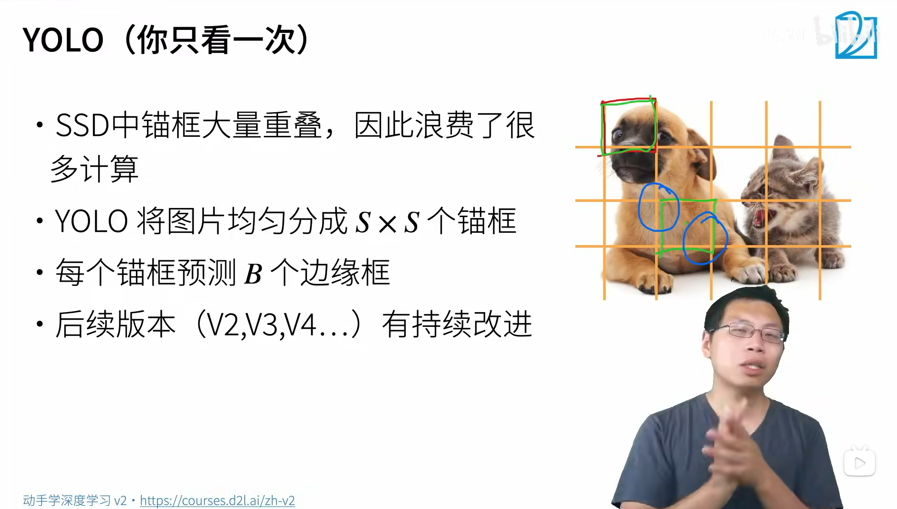

# Object Detection Algorithm | 物体检测算法
- 准确说本课程是**基于锚框**的目标检测算法
- RNN, SSD, YOLO
- **数据集** 为王
  - 根据数据集的特点选择不同的处理方式和算法！
- 目标检测算法主要分为两个类型
  - two-stage 方法，如 R-CNN 系算法（region-based CNN），其主要思路是先通过启发式方法（selective search）或者 CNN 网络（RPN）产生一系列稀疏的候选框，然后对这些**候选锚框**进行分类与回归，two-stage 方法的优势是准确度高
  - one-stage 方法，如 Yolo 和 SSD，其主要思路是均匀地在图片的不同位置进行**密集抽样**，抽样时可以采用不同尺度和长宽比，然后利用 CNN 提取特征后直接进行分类与回归，整个过程只需要一步，所以其优势是速度快，但是均匀的密集采样的一个重要缺点是训练比较困难，这主要是因为正样本与负样本（背景）极其不均衡，导致模型准确度稍低 

## 一、概念理解
### （一）、R-CNN (Region based CNN)
- 使用启发式搜索算法来选择锚框
- 使用预训练模型来对**每个锚框提取特征**
- 做两个预测
  - 训练一个 SVM 来对类别分类预测
  - 训练一个线性回归模型来预测边缘框偏移
- 为了使大小不一的锚框可以成为统一规格，需要借助**兴趣区域池化层(RoI Pooling)**。
  - 给定一个锚框，均匀分割成 $n \times m$ 块，输出每块里最大的值
  - 不管锚框多大，总是输出 $nm$ 个值。

#### 1、Fast RCNN
—— 如果一张图片要抽取上千张锚框提取特征，速度太慢了

- 使用 CNN 对图片本身抽取特征
  - 用选择性搜索把锚框按比例映射到特征上
- 使用 Rol 池化层对每个锚框生成固定长度特征
  - 对映射后的锚框进一步放缩特征
  - 最终输出的锚框高度概括化
- 把锚框的特征传入全连接层进行类别和偏移预测
- 速度进步的本质是把 **CNN 的对象** 从 **大批量锚框** 到该 **图片本身**

#### 2、Faster R-CNN
- 使用一个区域提议网络（Regional Proposal Network，本质还是一个神经网络）来替代启发式搜索来获得更好的锚框。
  - 预测锚框是否识别物体，或者能否能偏移到边界框，经过 NMS 进一步优化锚框。
  - 相当于一个简要的分类器
  - 对精度特别关心的项目

#### 3、Mask R-CNN
- 如果有像素级别的标号，使用 FCN(Fully convolutional network) 来利用这些信息。
  - 对于每个像素预测他的标号
  - RoI 是按照像素切（重组的时候会出现边界错位的误差），Mask可以把像素分割，用加权算法获得值

#### 4、总结
- R-CNN 是最早、也是最有名的一类基于锚框和 CNN 的目标检测算法
- Fast/Faster R-CNN 持续提升性能
- Faster R-CNN 和 Mask R-CNN 是在追求高精度场景下的常用算法

  

### （二）、单发多框检测（SSD, Single Shot Detection）

#### 1、生成锚框（和 `33-CV-AnchorBox.md` 中生成锚框一样）
- 对每个像素，生成多个以他为中心的锚框
- 给定 $n$ 个大小 $s_1,...,s_n$ 和 $m$ 个高宽比，那么生成 $n+m-1$ 个锚框，其大小和高宽比分别为 $(s_1,r_1),(s_2,r_1),...,(s_n,r_1),(s_1,r_2)(s_1,r_3),...,(s_1,r_m)$

#### 2、SSD模型
- 一个基础网络来抽取特征，然后多个卷积层块来减半高宽
- 在每段都生成锚框
  - 底部段来拟合小物体，顶部段来拟合大物体
- 对每个锚框预测类别和边缘框

#### 3、总结
- SSD 通过单神经网络来检测模型
- 以每个像素为中心产生多个锚框
- 在多个段的输出上进行多尺度的检测
  - 层层检测

  

## （三）、YOLO
—— 你只看一次

- SSD 中锚框大量重叠，因此浪费了很多计算
- YOLO 将图片均匀分成 $S \times S$个锚框
- 每个锚框预测 $B$ 个边缘框
- 后续版本（V2, V3, V4 ... ）有持续改进

