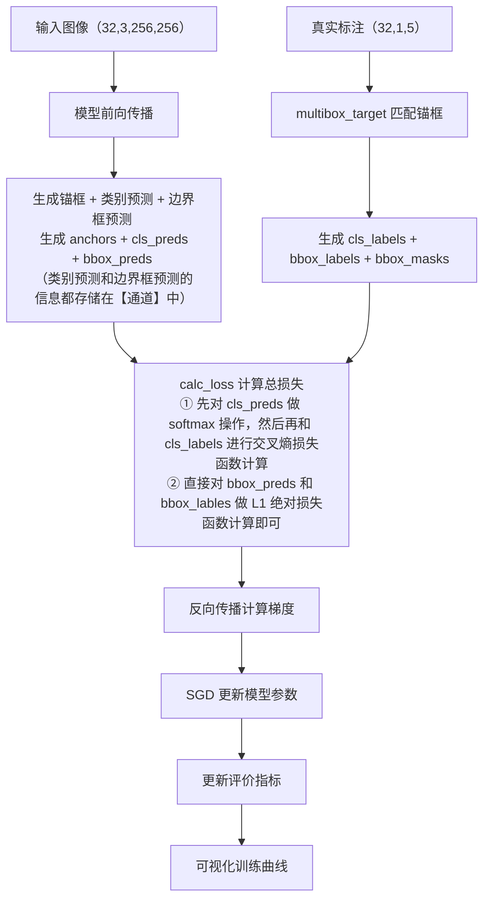

# SSD | 单发多框检测（Single Shot Detection）
## 一、概念理解
### （一）、多尺度锚框
- 直观地解释一下：怎么选**特征图**的**尺寸**和**宽高**
- 运行 `35-CV-mult-scale-anchor.py` 可以发现以下经验
1. 特征图尺寸可以理解为 **分辨率**
2. 代码执行流程
    ```python
    multibox_prior(fmap, sizes=s, ratios=[1, 2, 0.5])
    # ⇒ 输入特征图、锚框的尺寸和宽高比

    show_bboxes(d2l.plt.imshow(img).axes,
                anchors[0] * bbox_scale)
    # 其中 img = d2l.plt.imread('data/img/catdog.jpg')
    # ⇒ 所以，该函数是在原始图片 (561, 728) 上展示锚框；
    # 但是由于 multibox_prior 函数输出的锚框坐标是归一化的，
    # 所以，这里必须把锚框坐标再还原回来！
    ```
<br><br>

### （二）、SSD


- [知乎专栏 - SSD 大致思路](https://zhuanlan.zhihu.com/p/33544892)
- SSD 网络结构如下（虽然没有太看懂......主要是这种图没见过！）
    

<br><br><br><br>

## 二、代码实现
```python
'''下面是代码运行结果'''
# 在组装成为 SSD 之前，测试 SSD 的小组件的功能
Y1.shape, Y2.shape: (torch.Size([2, 55, 20, 20]), torch.Size([2, 33, 10, 10]))
concat_preds([Y1, Y2]).shape: torch.Size([2, 25300])
forward(torch.zeros((2, 3, 20, 20)), down_sample_blk(3, 10)).shape: torch.Size([2, 10, 10, 10])
forward(torch.zeros((2, 3, 256, 256)), base_net()).shape: torch.Size([2, 64, 32, 32])

# X = torch.zeros((32, 3, 256, 256))，经过 TinySSD 网络前向计算后的结果
output anchors: torch.Size([1, 5444, 4])
output class preds: torch.Size([32, 5444, 2])
output bbox preds: torch.Size([32, 21776])

read 1000 training examples
read 100 validation examples
class err 3.26e-03, bbox mae 3.16e-03
6691.3 examples/sec on cuda:0
```
### （一）、理解代码

- 如何理解 `（类别预测和边界框预测的信息都存储在【通道】中）`？
  - 因为你 **卷积层的输出通道数** 决定的！
    - `cls_predictor` 卷积层输出的 `cls_preds` 张量形状是 `(batch_size, num_anchors_per_pixel * (num_classes+1), h, w`
    - `bbox_predictor` 卷积层输出的 `bbox_preds` 张量形状是 `(batch_size, num_anchors_per_pixel * 4, h, w)`
    - **这 2 个张量** 又在 `TinySSD` 网络的 `forward` 函数中经过 `reshape`，变为 `cls_preds (batch_size, num_anchors_per_pixel * h * w, num_class+1)` 和 `bbox_preds (batch_size, num_anchors_per_pixel * 4 * h * w)`
  - ⇒ 那么从 **张量形状** 来看，`bbox_preds` 存的一定就是 **锚框预测坐标本身**，`cls_preds` 存的一定就是 **类别预测信息本身**！
    - 另外，多提一句：【`cls_preds` 存的是类别信息本身】其实比较容易理解。
    - 因为之前【普通 CNN 网络】都是【图片分类模型】，这些网络的【类别信息】就是存储在 **通道** 中的！通过 **类比** 就很容易理解了！
  - 该结论正确性的验证：**训练代码**中，`cal_loss()` 函数中，传入的是 `bbox_preds` 和 `bbox_labels`，说明 `bbox_preds` **就是被看作是【锚框坐标本身】**
    - 突然又有一个想法，`channel` 维度具体是什么含义 **并不取决于** 一个死板的定义，**而是取决于** 你想让它是什么。
    - 你想让它是什么，你的模型就会让 `channel` 维度去拟合什么！（具体就是通过【自定义 `channel` 通道维数】和【跟谁做损失函数】来 **改变 `channel` 通道的含义**）
    - 在**图片分类模型**中，`channel` 维度被拟合成为 **类别信息**
    - 在**目标检测模型**中，
      - `cls_predictor` 网络的 `channel` 维度被拟合成 **类别信息**
      - `bbox_predictor` 网络的的 `channel` 维度被拟合成 **锚框预测坐标本身**
    - 有了以上这些思考以后，再来 **梳理这个 `TinySSD` 网络的思路**
      - 一个 `TinySSD` 模型一共有 **5 层**（可以说是 **5 个 stage**）
      - 每个 stage 有 **3 个卷积网络**：
        - `blk` 卷积网络负责产出多尺度的特征图，进而产生**多尺度的锚框**；
        - `cls_predictor` 卷积网络负责 **类别预测**，其中 **类别信息** 存储在 输入 + 输出 张量的 `channel` 维度中
        - `bbox_predictor` 卷积网络负责 **锚框预测**，其中 **锚框预测的坐标本身** 存储在 输入 + 输出 张量的 `channel` 维度中
  - **通道用处** 果然很多
    - **图片分类模型** 中，**通道** 用于存储【类别信息】
    - **基于锚框的目标检测模型** 中，**通道** 用于存储【类别预测信息】和【锚框预测坐标】
  - **总结**：通过张量形状，确实可以**反推**出来上面的结论。但是直观上，我并不太理解。也许这根本就不是我能**直观理解**的问题！

1. 这里训练的参数实际上是 **卷积层中的参数** 和 **`BN` 层中的参数**
2. PyTorch 中标准的张量形状就是 `(batch_size, channels, h, w)`
   1. 因此，PyTorch 中的 **批量** 指的就是 **图片数量**！

<br><br>

### （二）、`torch API` 内容
#### 1、`nn.Conv2d` | 卷积层 API
```python
class torch.nn.Conv2d(in_channels, out_channels, kernel_size, padding)
```
<br>

#### 2、`torch.Tensor.permute` | 重新排序函数
- 照抄 [32-CV-ObjectDetect.md](32-CV-ObjectDetect.md) 中的内容。

[官网 doc - torch.Tensor.permute](https://docs.pytorch.org/docs/stable/generated/torch.Tensor.permute.html#torch.Tensor.permute)

```python
torch.permute(input, dims)
```
1. Returns a view of the original tensor input with its dimensions permuted. （对维度重新排序）
2. 例子代码
    ```python
    >>> x = torch.randn(2, 3, 5)
    >>> x.size()
    torch.Size([2, 3, 5])
    >>> torch.permute(x, (2, 0, 1)).size()
    torch.Size([5, 2, 3])
    ```
<br>

#### 3、`torch.nn.Flatten()` | 展平层
- 照抄 [09-softmax.md](09-softmax.md) 中的内容。

[官网 doc - torch.nn.modules.flatten.Flatten](https://docs.pytorch.org/docs/stable/generated/torch.nn.modules.flatten.Flatten.html#flatten)
[官网 doc - torch.flatten (used with Sequential)](https://docs.pytorch.org/docs/stable/generated/torch.flatten.html#torch.flatten)
- 所以，**本代码**用的到底是哪个 `flatten()` 啊？有点不太明白！
  - 经过 `go to definition` 选项查看：是 `class torch.nn.modules.flatten.Flatten`
  - 该 class 的用法抄录如下
  1. 参数讲解
     1. `start_dim (int)` – first dim to flatten (default = 1).
     2. `end_dim (int)` – last dim to flatten (default = -1).
  2. 例子代码
        ```python
        '''class Flatten 原型'''
        class torch.nn.modules.flatten.Flatten(start_dim=1, end_dim=-1)


        '''用法实例'''
        # 发现用的时候也没那么麻烦，直接 torch.nn.Flatten() 就好！
        input = torch.randn(32, 1, 5, 5)

        # With default parameters
        m = nn.Flatten()
        output = m(input)
        output.size()

        # With non-default parameters
        m = nn.Flatten(0, 2)
        output = m(input)
        output.size()
        ```
<br>

#### 4、池化窗口
##### (1)、`torch.nn.MaXPool2d` | 最大池化层
- 照抄 [20-CNN-pooling.md](20-CNN-pooling.md) 中的内容。

[官网 doc - torch.nn.MaxPool2d](https://docs.pytorch.org/docs/stable/generated/torch.nn.MaxPool2d.html#torch.nn.MaxPool2d)

```python
class torch.nn.MaxPool2d(
    kernel_size, stride=None, padding=0, dilation=1, 
    return_indices=False, ceil_mode=False
)
```
1. 从 class 原型来看，看不出来 **步幅** 和 **池化窗口** 的关系
2. 另外，Python 中 **class name** `MaxPool2d` 会直接调用 `MaxPool2d.forward()` 前向计算函数
<br>

##### (2)、`torch.nn.AdaptiveAvgPool2d` | 平均池化窗口
- 照抄 [24-CNN-NiN.md](24-CNN-NiN.md) 中的内容。

[官网 doc - torch.nn.AdaptiveAvgPool2d](https://docs.pytorch.org/docs/stable/generated/torch.nn.AdaptiveAvgPool2d.html#torch.nn.AdaptiveAvgPool2d)
```python
class torch.nn.AdaptiveAvgPool2d(output_size)
```
- 果然和最大池化窗口不一样的！

```python
'''例子代码'''
# target output size of 5x7
m = nn.AdaptiveAvgPool2d((5, 7))
# target output size of 7x7 (square)
m = nn.AdaptiveAvgPool2d(7)
```
<br>

##### (3)、`torch.nn.AdaptiveMaxPool2d` | 自适应最大池化层
[官网 doc - class torch.nn.AdaptiveMaxPool2d](https://docs.pytorch.org/docs/stable/generated/torch.nn.AdaptiveMaxPool2d.html#torch.nn.AdaptiveMaxPool2d)

```python
class torch.nn.AdaptiveMaxPool2d(output_size, return_indices=False)
```

```python
# 例子代码
# target output size of 5x7
m = nn.AdaptiveMaxPool2d((5, 7))
input = torch.randn(1, 64, 8, 9)
output = m(input)

# target output size of 7x7 (square)
m = nn.AdaptiveMaxPool2d(7)
input = torch.randn(1, 64, 10, 9)
output = m(input)

# target output size of 10x7
m = nn.AdaptiveMaxPool2d((None, 7))
input = torch.randn(1, 64, 10, 9)
output = m(input)
```
1. `torch.nn.AdaptiveMaxPool2d` 实现 2D 自适应最大池化，
   1. 无论输入信号尺寸如何，都能输出指定大小的结果，
   2. 且输出特征数量与输入平面数相同，
   3. 在图像数据处理中能灵活调整数据尺寸。
2. 和普通的最大池化 **效果** 差不多，以后再研究 **自适应最大池化** 到底有什么特点吧！

<br>

#### 5、`setattr` and `getattr` | 设置属性 & 获取属性
- [官网 doc - python.builtin.tensor_setattr](https://docs.pytorch.org/docs/stable/generated/exportdb/python.builtin.html#tensor-setattr)
- [官网 doc - python.builtin.tensor_getattr]()

<br>

#### 6、`torch.nn.L1Loss` | `L1Loss` 绝对误差损失函数
- [官网 doc - torch.nn.L1Loss 损失函数](https://docs.pytorch.org/docs/stable/generated/torch.nn.L1Loss.html#l1loss)

```python
class torch.nn.L1Loss(size_average=None, reduce=None, reduction='mean')
```

- 为什么 `bbox_loss` 使用 `L1Loss`，而 `cls_loss` 使用 `CrossEntropyLoss`？
   1. 目前已知：`CrossEntropyLoss` 其实内置了 `softmax` 操作
   2. 且 `CrossEntropyLoss` 交叉熵损失函数 还常用于 **多分类问题**
   3. 那 `L1Loss` 又是什么呢？有什么用途呢？
- The **unreduced** (i.e. with `reduction` set to `'none'`) loss can be described as: $ℓ(x,y) = L = \{ l_1, \cdots, l_N \}^T, ~ l_n = |x_n − y_n|$
  - where `N` is the `batch_size`
  - **unreduced** `L1Loss` 损失函数仍然是 **`N` 维张量**
  - 和 **unreduced** 交叉熵损失函数 `CrossEntropyLoss` 类比即可！
  - **还发现一个东西**：那就是，计算 **损失函数** 的时候，
    - **标签** 都是一维张量 `(样本数)`
    - **交叉熵损失函数**（用于多分类问题）中，`X` 是二维张量 `(样本数, 类别数【因为每个类别都有对应的概率】)`，`Y` 是一维张量。（就是在 **真正计算损失函数之前**，对 `X` 进行 softmax 操作！）
    - **绝对误差损失函数**（用于回归？）中，`X` 和 `Y` 都是一维张量！
- 如果 `reduction='mean'` 或者 `reduction='sum'`，那么 `L1Loss` **损失函数**就退化为**标量**！ 

<br>

1. **`L1Loss` 功能概述**：`torch.nn.L1Loss` 主要用于计算输入和目标之间的平均绝对误差（`MAE`），能衡量两者在数值上的差异程度，这种度量方式在许多机器学习和深度学习任务中对于评估模型预测结果与真实标签的接近程度非常有用，比如回归问题中**直观**地反映预测值偏离真实值的平均幅度。
2. **未归约损失计算**：未归约的损失通过对输入和目标每个对应元素差值取绝对值得到一个损失向量，这清晰地展示了每个数据点上模型预测与真实值的误差情况，为进一步分析模型在不同样本上的表现提供了基础。
3. **归约操作说明**：`reduction` 参数决定对损失的归约方式，`'none'` 不进行归约，保留每个元素的损失；`'mean'` 将损失总和除以元素个数得到平均值；`'sum'` 直接对损失求和。这种灵活的归约设置能适应不同场景需求，如计算整体损失总和用于某些特定优化目标，或求平均损失以更稳定地反映模型整体性能。
4. **参数详解**：`size_average` 和 `reduce` 已被弃用，但在弃用过渡期间会覆盖 `reduction` 设置。`size_average` 默认 `True`，决定损失在批次内是平均还是求和；`reduce` 默认`True`，配合 `size_average` 决定损失是按批平均 / 求和还是返回每个批次元素损失。`reduction` 默认 `'mean'`，明确指定了输出的归约形式。 

<br>

#### 7、`torch.nn.CrossEntropyLoss(reduction='none')` 多分类问题中的交叉熵损失函数
- 直接抄 [29-CV-Data-Augment.md](29-CV-Data-Augment.md) 中的内容
- [官网 doc - torch.nn.CrossEntropyLoss](https://docs.pytorch.org/docs/stable/generated/torch.nn.CrossEntropyLoss.html)

```python
'''
这段例子代码又刷新了我对梯度计算的认识！
原来 sum() 也是独立的 x1**2 + x2**2 + x3**2
⇒ 那看来，以后可以广泛地应用 l.sum().backward() 了！
'''
>>> import torch
>>> x=torch.tensor([1.0, 2.0, 3.0], requires_grad=True)
>>> y = x**2
>>> y.sum().backward(retain_graph=True)
# 如果不指定 retain_graph 参数的话，
# 那么调用一次 backward()，计算图就会自动销毁
>>> x.grad
tensor([2., 4., 6.])
>>> y.mean().backward(retain_graph=True)
>>> x.grad
tensor([0.6667, 1.3333, 2.0000])
```

```python
'''class CrossEntropyLoss 原型'''
class torch.nn.CrossEntropyLoss(
    weight=None, size_average=None, ignore_index=-100, 
    reduce=None, reduction='mean', 
    label_smoothing=0.0
)
```

##### (1)、功能详解
1. This criterion computes the cross entropy loss between input logits and target. （用于计算对数输入和目标之间的交叉熵损失）
2. It is useful when training a classification problem with **C classes**. （**交叉熵损失函数** 在 **C 分类** 问题中很有用）
   1. If provided, the optional argument **`weight`** should be a **1D Tensor** assigning weight to **each of the classes**.
   2. This is particularly useful when you have an unbalanced training set.（什么叫不平衡的训练集，起码现在还没接触到，以后再说）
3. 对于输入的两个要求
   1. 数据要求
      1. The input is expected to contain the unnormalized logits for each class (which do not need to be positive or sum to 1, in general). 
   2. 张量形状
      1. **非批量输入（单样本）** : Input has to be a Tensor of $size (C)$ for unbatched input, 
      2. **批量输入（多样本，但样本本身无空间维度）** : $(minibatch, C)$ 
      3. **高维批量输入（样本本身含空间维度）** : or $(minibatch, C, d_1, d_2 , ..., d_K)$ with $K ≥ 1$ for the K-dimensional case. 
      4. The last being useful for higher dimension inputs, such as computing cross entropy loss per-pixel for 2D images
4. 这段话核心是明确 PyTorch 中 `CrossEntropyLoss` 对 **输入（input）** 的两点关键要求：**数据含义** 与 **张量形状**，具体解析如下：
   1. **输入数据含义：未归一化的 logits**  
      - 输入需是每个类别的“logits”（即模型最后一层未经过softmax等归一化操作的原始输出），其无需满足“值为正”或“所有类别之和为1”——因为 `CrossEntropyLoss` 内部会自动对logits做softmax，将其转化为概率分布后再计算损失。**输入张量形状：适配不同场景**  
   2. 输入需符合特定维度要求，具体分三类场景：
      - **非批量输入（单样本）** : 形状为 `(C)`，其中 `C` 是类别数量（如3分类任务，输入为1个长度为3的张量）；
      - **批量输入（多样本，无空间维度）** : 形状为 `(minibatch, C)`，`minibatch` 是批量大小（如一次输入 10 个 3 分类样本，输入形状为 $(10, 3)$ ）；
      - **高维批量输入（含空间维度）** : 形状为 `(minibatch, C, d₁, d₂, ..., d_K)`（`K≥1`，`d₁, d₂, …, d_K` 等是空间维度尺寸），
        - 典型场景是 **图像逐像素分类** （如输入 10 张 3 通道、224 × 224 的图像做语义分割，输入形状为(10, C, 224, 224)，`C` 是分割类别数，损失会逐像素计算）。
        - 这个例子是 AI 生成的，不一定对。存疑！（因为我感觉不对）

##### (2)、参数详解
1. **`reduction`** (`str`, optional) – Specifies the reduction to apply to the output: 'none' | 'mean' | 'sum'. 
   1. 三种参数讲解
      1. `'none'`: no reduction will be applied, 
      2. `'mean'`: the weighted mean of the output is taken, 
      3. `'sum'`: the output will be summed. 
   2. Note: 
      1. `size_average` and `reduce` are in the process of being deprecated, and in the meantime, specifying either of those two args will override `reduction`.
      2. 指定 `size_average` 和 `reduce` 种任何一个参数，那么都会覆盖 `reduction`
   3. Default: `'mean'`
2. **`reduction`** 方式一共有 3 种
   1. `none`：就是原始的 交叉熵损失函数（ **不做 reduction** ）
      1. 返回的还是 `n` 维张量
   2. `mean`：直接对损失函数做 **平均**
      1. 返回的是标量（直接压缩为 `标量` ）
   3. `sum`：对损失函数做 **加和**
      1. 返回的是标量（直接压缩为 `标量` ）
3. **`C` 分类问题中的 `CrossEntropyLoss` 交叉熵损失函数** （ **根据 Pytorch 官网来的**！ ）
   - Class indices in the range $[0,C)$ where $C$ is the number of classes; 
   - if `ignore_index` is specified, this loss also accepts this class index (this index may not necessarily be in the class range).
   - **字母讲解**
     - 这里的 `w` 是**权重** （现在还没用到过！）
     - `n` 是这一批里面的第 `n` 个 （ **`n` 行** ）
     - `C` 是一共有 `C` 类 （ **`C` 列** ）
   1. The **unreduced** (i.e. with `reduction` set to **`'none'`**) loss for this case can be described as:
      1. `loss` 仍然是 **`n` 维张量**
      2. $$ℓ(x,y)=L=\{l_1,…,l_N\}^{T}, ~ ~ l_n=−w_{y_n}log {exp(x_{n,y_n}) \over \sum_{c=1}^{C}exp(x_{n,c})​}$$
         1. 分母是**按行求和**
         2. 分子是按 `(行, 列)` 索引**单个元素**
   2. $$ℓ(x,y)= \begin{cases} \sum_{n=1}^{N}{1 \over \sum_{n=1}^{N} w_n } ℓ_n ~ ~ ~ ~ ~ \text{if~ reduction=\sf{'mean'}} \\ \sum_{n=1}^{N} ℓ_n ~ ~ ~ ~ ~ \text{if~ reduction=\sf{'sum'}}\end{cases}$$
      1. `loss` 被压缩为标量（**一个实数**）

##### (3)、CELoss 就学到这里吧，再高深的东西，以后遇到再学！
<br>

#### 8、沿维度求平均 / 沿维度拼接张量
```python
>>> a = torch.tensor(range(12), dtype=torch.
                 float32).reshape(2, 6)
>>> a
tensor([[ 0.,  1.,  2.,  3.,  4.,  5.],
        [ 6.,  7.,  8.,  9., 10., 11.]])
>>> a.mean(dim=1)
tensor([2.5000, 8.5000])

>>> b = torch.tensor(range(6), 
                 dtype=torch.float32).reshape(2, 3)
>>> torch.concat((a, b), dim=1)
tensor([[ 0.,  1.,  2.,  3.,  4.,  5.,  0.,  1.,  2.],
        [ 6.,  7.,  8.,  9., 10., 11.,  3.,  4.,  5.]])
```
1. 虽说都是 **沿某一维度**，但是还是有区别的！
   1. 沿某维度求均值，则该维度退化为标量（该维度的维数变为 `1`）
   2. 沿某维度拼接张量，则该维度的维数要增加

<br>

#### 9、分清 `torch.stack` 和 `torch.concat`
```python
# torch.concat() 函数；concat 接收的张量形状不必一致！
>>> a = torch.rand(13, 6)
>>> b = torch.rand(20, 6)
>>> c = torch.concat((a, b), dim=0)
>>> c.size()
torch.Size([33, 6])

# torch.stack() 函数；stack 接收的张量形状应当是一致的！
>>> c = torch.stack((a, b), dim=0)
Traceback (most recent call last):
  File "<pyshell#7>", line 1, in <module>
    c = torch.stack((a, b), dim=0)
RuntimeError: stack expects each tensor to be equal 
size, but got [13, 6] at entry 0 and [20, 6] at entry 1

>>> b = torch.rand(13, 6)
>>> c = torch.stack((a, b), dim=0)
>>> c.size()
torch.Size([2, 13, 6])
```

<br>

### （三）、`Python` 语言本身的内容
#### 1、`enumerate` 函数 | 遍历函数
- [官网 doc - python.enumerate 函数](https://docs.python.org/3/library/functions.html#enumerate)

```python
enumerate(iterable, start=0)
```

- 例子代码
    ```python
    >>> seasons = ['Spring', 'Summer', 'Fall', 'Winter']
    >>> list(enumerate(seasons))
    [(0, 'Spring'), (1, 'Summer'), (2, 'Fall'), (3, 'Winter')]

    >>> list(enumerate(seasons, start=1))
    [(1, 'Spring'), (2, 'Summer'), (3, 'Fall'), (4, 'Winter')]
    ```
