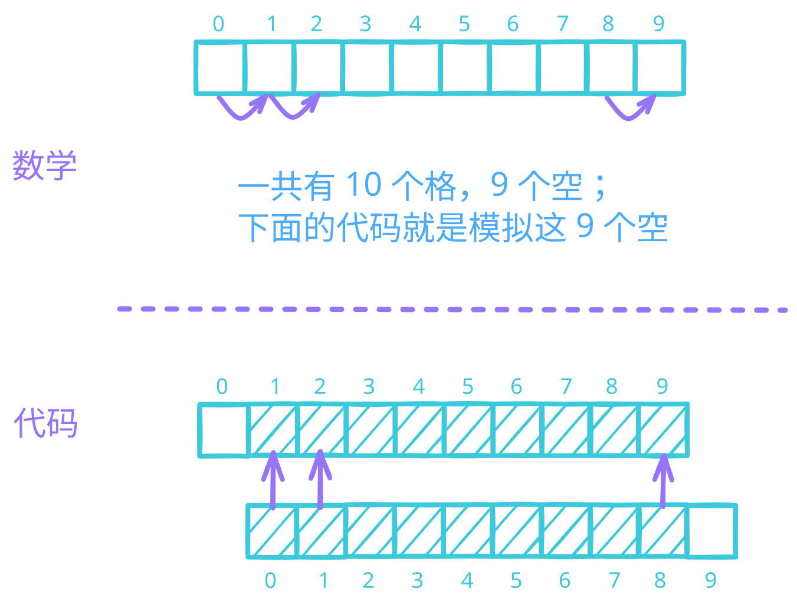

# Style Transfer | 样式迁移
## 一、概念讲解


1. 三个平行的神经网络（或者说复制出三个相同的），一个代表内容（原图），一个代表风格（拟合目标），一个是训练（把风格迁移到原图上）
2. 在训练时，使内容和风格训练出的特征在某些层上可以和迁移的训练特征相匹配，希望噪音足够低。
3. 训练目标不是卷积网络的权重，而是最终的风格图。
4. **注意**：整个训练过程中，
   1. 两张原始图片的特征是不变的，所以事先抽取出来，先在那放着，以备后续使用。（而不是每次需要的时候再重新计算）
   2. 模型（也就是 `VGG19`）的**参数**是不变的
   3. 训练的不是 **模型参数**，而是 **目标图片本身**！

### （一）、样式迁移 中的 3 个损失函数
#### 1、内容损失
- 内容损失使合成图像与内容图像在内容特征上接近；

#### 2、风格损失
- 风格损失使合成图像与风格图像在风格特征上接近；

1. 先把特征图“拉直”，风格层输出是一个四维特征：
   - 样本数：1
   - 通道数：c
   - 高：h
   - 宽：w
   1. 我们把它**reshape 成一个 2D 矩阵**：
       - 行数 = 通道数 c
       - 列数 = h × w（把高宽拉成一维）
   2. 每**一行**，就代表**一个通道的风格特征向量**。
2. 格拉姆矩阵：算“通道之间的相关性”
   1. 格拉姆矩阵 G = X · Xᵀ
   - 大小：c × c（和通道数一样大）
   - G 中第 i 行第 j 列的值 = 第 i 个通道向量 和 第 j 个通道向量 的**内积**
   - **内积越大，两个通道的风格越相关**。
   - 所以：
     - 格拉姆矩阵，就是用来**描述整张图里，各个风格通道之间的关联模式**，也就是这一层学到的**风格**。
3. 为什么要除以元素个数？
   - 通道数 c 越大、h×w 越大，格拉姆矩阵的值会**变得特别大**
   - 这会让风格损失**数值爆炸**，训练不稳定
     - 所以要做**归一化**：
     - 把格拉姆矩阵除以 **c × h × w**（总元素个数），让损失尺度稳定，不受图大小、通道数影响。
4. 总结
   1. 把风格层特征拉成矩阵 → 算格拉姆矩阵表示**通道间风格相关性** → 归一化避免数值过大 → 用来计算**风格损失**。
<br>

#### 3、全变分损失

```python
# 注意：切片包含起点，但是不包含终点！
def tv_loss(Y_hat):
    return 0.5 * (torch.abs(Y_hat[:, :, 1:, :] - Y_hat[:, :, :-1, :]).mean() +
                  torch.abs(Y_hat[:, :, :, 1:] - Y_hat[:, :, :, :-1]).mean())
```

- 全变分损失则有助于减少合成图像中的噪点。
- 全变分损失（TV 损失）的作用就是：**让相邻像素尽量接近，不要突然特别亮或特别暗，从而去掉颗粒状的高频噪点**。

##### (1)、简单拆解
1. **高频噪点**
   就是你看到的：
   - 有些像素**突然特别亮**
   - 有些**突然特别暗**
   - 像颗粒、麻点、杂色一样，很不自然
2. **全变分（Total Variation）在算什么**
   - 它计算的是：每个像素和**旁边像素**的**差值总和**
   - 公式你可以理解成： $TV = \sum |x_{i,j} - x_{i+1,j}| + |x_{i,j} - x_{i,j+1}|$
     - 横向：和右边像素差多少
     - 纵向：和下边像素差多少
     - 把所有差加起来，就是**全变分**
3. **为什么能去噪**
   - 我们在训练时**最小化这个 TV 损失**：
     - 差值越小 → 相邻像素越接近
     - 图像越平滑
     - 那些突兀的亮斑、暗斑就被 “抹平” 了

<br><br><br><br>

## 二、代码实现
### （一）、理解代码
```python
'''预处理'''
def preprocess(img, image_shape):
    '''预处理：将图片转化为可以训练的张量 (1, channel, h, w)'''
    return transforms(img).unsqueeze(0)

↓

'''初始化'''
def get_inits(X, device, lr, styles_Y):
    '''返回：3 样东西。
    初始化的目标图像（就是照抄原始内容图片中的数据），
    【原始风格图片对应的风格特征列表】对应的【格拉姆矩阵列表】，
    优化器'''
    # 把训练时要用的数据都搬到 GPU 上
    gen_img = SynthesizedImage(X.shape).to(device)
    gen_img.weight.data.copy_(X.data)
    # 在这里，优化器知道要对 gen_img.parameters() 进行优化；
    # 但是，损失函数是如何知道要对 gen_img.parameters() 进行求导的呢？
    # 又没有 requires_grad=True
    # 这是因为 gen_img.weight 是 nn.Parameter 类型，
    # 默认 requires_grad=True，无需手动设置就能被 Autograd 追踪！
    trainer = torch.optim.Adam(gen_img.parameters(), lr=lr)
    styles_Y_gram = [gram(Y) for Y in styles_Y]
    return gen_img(), styles_Y_gram, trainer

↓

'''以 content_X, contents_Y 为例，解释张量形状（style_X 和 styles_Y 和它的情况完全一致）'''
# 首先明确：content_X 只是一个张量；contents_Y 是一个张量列表（这个列表里面有很多张量）
# 1. content_X 是 4 维张量 (1, channel, h, w)（因为是从 preprocess 函数里面出来的！）
# 2. contents_Y 这个列表里面的张量也都是 4 维的（
# 因为列表里面每个张量都是 net[i](content_X) 产生的特征图，所以自然是四维的！）

def extract_features(X, content_layers, style_layers):
    '''定义一个从张量抽取特征的函数'''
    contents = []
    styles = []
    for i in range(len(net)):
        X = net[i](X)
        # net[i](X) 也是四维张量 (1, channnel, h, w)
        if i in style_layers:
            styles.append(X)
        if i in content_layers:
            contents.append(X)
    return contents, styles

def get_contents(image_shape, device):
    '''获取【内容特征】（整合转化张量+抽取特征这 2 步）'''
    content_X = preprocess(content_img, image_shape).to(device)
    contents_Y, _ = extract_features(content_X, content_layers, style_layers)
    return content_X, contents_Y

def get_styles(image_shape, device):
    '''获取【风格特征】（整合转化张量+抽取特征这 2 步）'''
    style_X = preprocess(style_img, image_shape).to(device)
    _, styles_Y = extract_features(style_X, content_layers, style_layers)
    return style_X, styles_Y

↓

'''解释损失函数'''
# 定义损失函数（内容损失，风格损失，全变分损失；然后这三者加权求和）
# 这里 Y.detach() 表示不算梯度（因为网络参数不更新）
def content_loss(Y_hat, Y):
    '''内容损失（均方误差损失）
    输入是 4 维张量，但是 mean() 直接把结果降为标量！'''
    # 我们从动态计算梯度的树中分离目标：
    # 这是一个规定的值，而不是一个变量。
    return torch.square(Y_hat - Y.detach()).mean()

def gram(X):
    '''输入张量就是一张图片的张量 (1, channel, h, w)；
    这里格式信息属于二阶统计信息（二阶矩？）！'''
    num_channels, n = X.shape[1], X.numel() // X.shape[1]
    X = X.reshape((num_channels, n))
    return torch.matmul(X, X.T) / (num_channels * n)

def style_loss(Y_hat, gram_Y):
    '''标签的 gram 矩阵是事先算好的，因为不会变嘛，算好放在那等着呗！
    输入是 4 维张量，但是 mean() 直接把结果降为标量！'''
    return torch.square(gram(Y_hat) - gram_Y.detach()).mean()

def tv_loss(Y_hat):
    '''全变分损失函数（用于去除噪点）；
    输入是 4 维张量，但是 mean() 直接把结果降为标量！'''
    return 0.5 * (torch.abs(Y_hat[:, :, 1:, :] - Y_hat[:, :, :-1, :]).mean() +
                  torch.abs(Y_hat[:, :, :, 1:] - Y_hat[:, :, :, :-1]).mean())

content_weight, style_weight, tv_weight = 1, 1e3, 10

def compute_loss(X, contents_Y_hat, styles_Y_hat, contents_Y, styles_Y_gram):
    '''内容损失、风格损失、均方误差损失，三者加权求和'''
    # 按传入顺序依次是：预测的图像，预测图像的内容特征列表，预测图像的风格特征列表，
    # 原始图像的内容特征列表，原始图像的格拉姆矩阵列表（不传【原始图像的风格特征列表】是因为计算 loss 不需要它，
    # 【只需要原始图像风格特征列表】对应的【格拉姆矩阵列表】）
    '''分别计算内容损失、风格损失和全变分损失'''
    '''一种思想：如果想对中间过程进行一些拟合的话，那么就要
    1. 对中间过程设置标签 2. 计算损失'''
    # 明确：compute_loss 中【所有 Y_hat】和【对应的 Y】形状都是一样的；并且都是 4 维张量（
    # 因为它们都是同一个网络的同一层出来的！）
    # 这里 content_loss, style_loss, tv_loss 都是【数学上的减法】，所以 Y_hat 和 Y 张量形状一致正好合适！
    # 不像分类问题中的交叉熵损失函数，Y_hat 和 Y 张量形状不一致！
    contents_l = [content_loss(Y_hat, Y) * content_weight for Y_hat, Y in zip(
        contents_Y_hat, contents_Y)]
    styles_l = [style_loss(Y_hat, Y) * style_weight for Y_hat, Y in zip(
        styles_Y_hat, styles_Y_gram)]
    tv_l = tv_loss(X) * tv_weight
    # 对所有损失求和
    # 含义：1. 用 + 拼接列表，形成一个新的列表（ + 不是数值相加！）；
    # 2. 然后 sum() 对这个新列表中所有元素再求和！
    l = sum(10 * styles_l + contents_l + [tv_l])
    return contents_l, styles_l, tv_l, l
    # contents_l, styles_l 都是列表，列表中的每个元素都是标量数值！
    # 另外，tv_l 本身就是一个标量数值！
```

#### 1、关于训练时，损失函数对谁求导的问题
在神经风格迁移中，我们**只优化合成图像（即目标图像）**，而固定预训练网络（VGG19）的参数。这意味着损失函数对合成图像的梯度应该被计算，但对网络参数的梯度不应该被计算（或者说应该被忽略），以避免不必要的计算和内存消耗。

##### (1)、代码中如何体现？
你提供的代码中，并没有显式地冻结网络参数，这会导致以下情况：
- 预训练网络 `net` 的参数默认 `requires_grad=True`（因为加载的模型通常保留梯度）。
- 在反向传播 `l.backward()` 时，PyTorch 会自动为所有 `requires_grad=True` 的参数计算梯度，**包括网络的所有层参数**。
- 但由于优化器 `trainer` 只包含了合成图像的参数（`gen_img.parameters()`），网络参数的梯度虽然被计算出来，却**不会被更新**，只是白白占用显存和计算资源。

##### (2)、如何正确实现“loss不能对模型参数求导”？
有两种常见做法：

1. **显式冻结网络参数**（推荐）：
   ```python
   net.requires_grad_(False)
   ```
   这样在反向传播时，梯度就不会流向网络参数，只有合成图像（`gen_img.weight`）会得到梯度。

2. **确保优化器只包含目标参数**（你已做到）：
   ```python
   trainer = torch.optim.Adam(gen_img.parameters(), lr=lr)
   ```
   但这只能防止参数被更新，无法阻止梯度的计算——网络参数仍会参与反向传播，浪费资源。

因此，最佳实践是在训练开始前冻结网络：
```python
net = net.to(device)
net.requires_grad_(False)  # 关键一行！
```

##### (3)、为什么不需要网络参数的梯度？
- 网络的作用是**提取特征**，它的权重已经通过 ImageNet 预训练固定，无需调整。
- 我们只关心输入图像（合成图像）如何变化才能使损失减小，因此只需要合成图像的梯度。

##### (4)、补充说明
在 `extract_features` 函数中，网络的前向传播依然会进行，但由于设置了 `requires_grad=False`，计算图不会为网络参数保留梯度信息，从而节省显存并加速训练。这正是“loss 不对模型参数求导”的具体体现。

- 经过验证，上述说明果然是正确的。
  - 加载的预训练模型中，**模型参数** 属性还是 `requries_grad=True`
  - 但是，**模型参数不会被更新**
  - 因为优化器没有拿到 **模型参数**，只拿到了 **目标图像的参数**。
  - 具体代码
    ```python
    for param in net.parameters():
        print('检验模型梯度的 requires_grad 属性', param.requires_grad)
        break

    # 输出如下
    检验模型梯度的 requires_grad 属性 True
    ```

    ```python
    for param in net.parameters():
        print('检验模型梯度的 requires_grad 属性')
        print(param)
        break

    # 输出如下
    检验模型梯度的 requires_grad 属性
    Parameter containing:
    tensor([[[[-5.3474e-02, -4.9257e-02, -6.7942e-02],
            [ 1.5314e-02,  4.5068e-02,  2.1444e-03],
            [ 3.6226e-02,  1.9999e-02,  1.9864e-02]],

            [[ 1.7015e-02,  5.5403e-02, -6.2293e-03],
            [ 1.4165e-01,  2.2705e-01,  1.3758e-01],
            [ 1.2000e-01,  2.0030e-01,  9.2114e-02]],

            [[-4.4885e-02,  1.2680e-02, -1.4497e-02],
            [ 5.9742e-02,  1.3955e-01,  5.4102e-02],
            [-9.6141e-04,  5.8304e-02, -2.9663e-02]]],


            ...,


            [[[ 2.5902e-02,  3.8224e-01,  2.9388e-01],
            [-4.7560e-01, -3.6006e-01,  2.3282e-01],
            [-2.2283e-01,  8.3313e-04,  1.5329e-01]],

            [[ 1.7674e-01,  3.8770e-01,  2.6036e-02],
            [-3.9036e-01, -5.0041e-01,  1.7150e-03],
            [ 6.1660e-02,  1.4792e-01,  5.1035e-02]],

            [[ 1.2967e-01,  7.5381e-02, -3.8851e-01],
            [ 5.0931e-02, -1.9381e-01, -1.7501e-01],
            [ 3.4483e-01,  2.1557e-01, -8.3478e-02]]],


            [[[-8.1056e-01, -7.4319e-01, -7.7885e-01],
            [-1.6934e-01,  3.4232e-01, -7.0197e-02],
            [ 5.2494e-01,  9.5989e-01,  7.6209e-01]],

            [[ 7.9164e-02,  2.4559e-01, -1.5317e-01],
            [-7.0860e-02,  4.4652e-01, -3.8074e-01],
            [-1.5309e-01,  1.2427e-01, -1.1070e-01]],

            [[ 5.2029e-01,  7.5736e-01,  6.2371e-01],
            [-1.0733e-01,  1.8762e-01, -1.2183e-01],
            [-6.6407e-01, -6.4891e-01, -5.5356e-01]]]], device='cuda:0',
        requires_grad=True)
    ```
- 损失函数是如何知道【要对目标图像参数进行求导的呢？】
  - `nn.Parameter` 与 `requires_grad`
  - 在代码中，合成图像被包装为 `SynthesizedImage` 类，其内部 `weight` 是一个 `nn.Parameter`，默认 `requires_grad=True`。
  - 这意味着 PyTorch 会将所有涉及该参数的运算记录到计算图中，并准备为它计算梯度。
  - 具体代码
    ```python
    for param in X.parameters():
        print('检验目标图像的参数', param)
        break

    # 输出如下
    AttributeError: 'Parameter' object has no attribute 'parameters'
    ```

    ```python
    print('检验目标图像的参数', X[0, 0, 0, 0])

    # 输出如下
    检验目标图像的参数 tensor(1.9235, device='cuda:0', grad_fn=<SelectBackward0>)
    ```

<br>

### （二）、`torch` API 介绍
#### 1、`torch.clamp` （限制数据在 `[min, max]` 范围中）
[官网 doc - torch.clamp](https://docs.pytorch.org/docs/stable/generated/torch.clamp.html#torch.clamp)
```python
torch.clamp(input, min=None, max=None, *, out=None)
```

- **功能概述**
  - Clamps all elements in `input` into the range $[ \text{ min, max }]$. （ 将 `input` 中的所有元素限制在 $[\text{ min, max }]$ 的范围内 ）
<br>

#### 2、`mean` 函数 | 会让张量退化
```python
>>> a = torch.tensor(range(16), dtype=torch.float32).reshape(2, 2, 4)
>>> a
tensor([[[ 0.,  1.,  2.,  3.],
         [ 4.,  5.,  6.,  7.]],

        [[ 8.,  9., 10., 11.],
         [12., 13., 14., 15.]]])
>>> a.mean()
tensor(7.5000)

# 直接把三维张量降为标量！
```
<br>

#### 3、`torch.optim.lr_scheduler.StepLR` | 学习率调度器（使得训练更加平滑）
[官网 doc - torch.optim.lr_scheduler.StepLR 学习率调度器](https://docs.pytorch.org/docs/stable/generated/torch.optim.lr_scheduler.StepLR.html#torch.optim.lr_scheduler.StepLR)

```python
class torch.optim.lr_scheduler.StepLR(
    optimizer, step_size, gamma=0.1, last_epoch=-1)
```
- **功能介绍**
1. Decays the learning rate of each parameter group by `gamma` every `step_size` epochs.
   1. `StepLR` 会每隔 `step_size` 个 epoch，将每个参数组的学习率乘以 `gamma` 进行衰减
2. Notice that such decay can happen simultaneously with other changes to the learning rate from outside this scheduler. When `last_epoch=-1`, sets initial `lr` as `lr`.
   1. 并且这种衰减可与外部对学习率的改变同时发生。
   2. 当 `last_epoch=-1` 时，初始学习率设为指定的 `lr`
<br>

- **该调度器的方法**
1. 该调度器有多个方法，
   1. `get_last_lr` 用于获取最近计算出的学习率列表，
   2. `get_lr` 计算下一个学习率列表，
   3. `load_state_dict` 用于加载调度器状态，
   4. `state_dict` 返回调度器状态字典，
   5. `step` 用于推进调度器，且建议不带参数调用