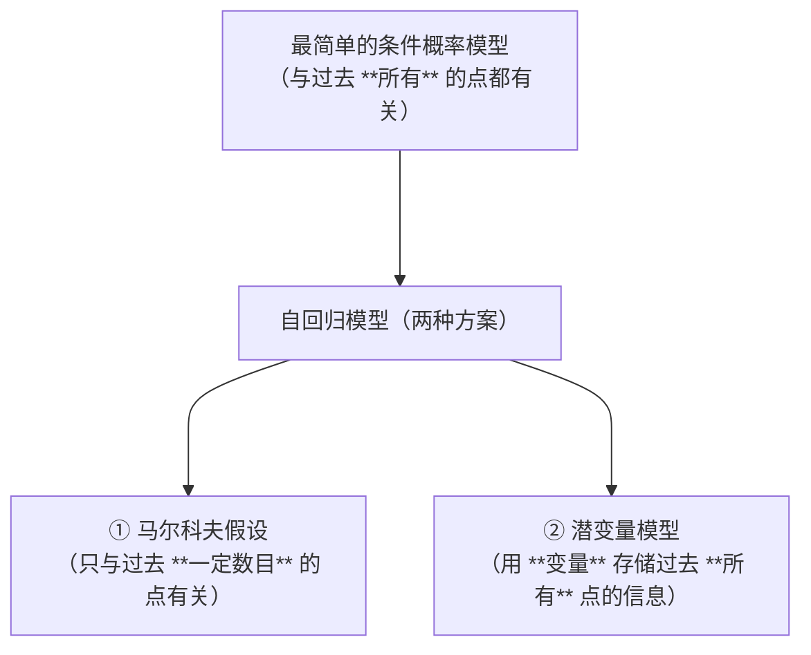
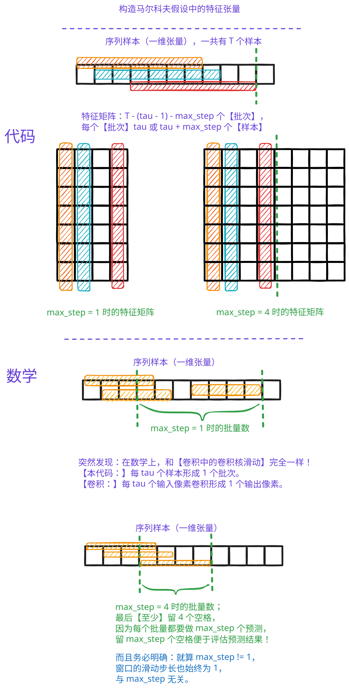

# Sequential Model | 序列模型
## 一、概念讲解


### （一）、统计工具
- 在时间 $t$ 观察到 $x_t$ ，那么得到 $T$ 个**不独立**的随机变量 $(x_1,...,x_T) \sim p({\bf x})$
  - 也就是说：我们认为这些 **不独立** 的随机变量服从一个分布 $p({\bf x})$
  - 注意：绝对不能写成 $X \sim p({\bf x})$ ，因为 $x_1, x_2, \cdots , x_t$ 之间 **不是相互独立的！**
  - 之前在 **CNN 以及 计算机视觉领域**，我们 **观察到的样本** 都是独立的！（注意：CNN 和 计算机视觉领域中，**样本** 是指 **图片**！）
- 使用条件概率展开（贝叶斯公式） $p(a,b) = p(a) ~ p(b|a) = p(b) ~ p(a|b)$

1. 推广到这一系列事件同时发生的概率，换言之，前 $T-1$ 个事件已经发生的条件下，第 $T$ 个事件发生的概率：
   1. 正向： $p({\bf x})=p(x_1)\cdot p(x_2|x_1)\cdot p(x_3|x_1,x_2)\cdot ...\cdot p(x_T|x_1,...,x_{T-1})$ 
   2. 反向： $p({\bf x})=p(x_T)\cdot p(x_{T-1}|x_T)\cdot p(x_{T-2}|x_{T-1},x_T)\cdot ...\cdot p(x_1|x_{T-1},...,x_2)$
   3. 反向从未来推广到过去，并不完全有物理意义
2. 对条件概率建模： $p(x_t|x_1,...,x_{T-1})=p(x_T|f(x_1,...,x_{T-1}))$
   1. 对见过的数据建模，也称自回归模型 (Autoregressive Model)。
   2. **`f`** 就是我们要求的 **模型**。而且 `f` 可以有很多形式
      1. 可以是 线性回归模型
      2. 可以是 多层感知机（MLP）
      3. 后面的代码就是用的多层感知机！
   3. **注意**：代码中并没有 **显式地利用条件概率公式**
      1. 而是：我将 $x_1, x_2, \cdots, x_{T-1}$ 输入到我的模型 `f` 中
      2. 然后，模型 `f` 输出需要预测的结果 $x_T$

### （二）、马尔科夫假设
假设当前数据只跟 $\tau$ 个过去数据点相关

$p(x_t|x_1,...,x_{t-1})=p(x_t|x_{t-\tau},...,x_{t-1})=p(x_t|f(x_{t-\tau},...,x_{t-1}))$

1. $\tau$ 不能太小（太小导致预测结果不好），也不能太大（太大导致计算量大；而且模型复杂但数据却少了！）

### （三）、潜变量自回归模型


引入潜变量 $h_t$ 来表示过去所有信息 $h_t=f(x_1,...,x_{t-1})$
- 一定不要忘记 $h_t$ 的含义：过去所有信息 $h_t=f(x_1,...,x_{t-1})$
- **2 个公式**
  - $x_t=p(x_t|h_t)$
  - $h_t = g(h_{t-1}, x_{t-1})$
- 保留一些对过去观测的总结 $h_t$， 并且同时更新预测 $x_t$ 和总结 $h_t$

1. 区分
   1. **隐变量** 暗含 **该变量真实存在**
   2. 但是 **潜变量** 表示：该变量可以真实存在，也可以是真实不存在的（比如，人造的就是真实不存在的！）

### （四）、总结
- 在时序模型中，当前数据跟之前观察到的数据相关
- 自回归模型使用自身过去数据来预测未来
- 马尔可夫模型假设当前只跟最近少数数据相关
- 潜变量模型使用潜变量来概括历史信息

<br><br><br><br>

## 二、代码讲解
### （一）、理解代码
1. 该代码中，`tau` 不必取很大
   1. 模型只需要知道 **局部** 的变化特征，就能预测出 **下一个点**！
   2. 之前分析代码的时候，没有从 **宏观序列模型** 上去理解
   3. 只是认为它是个 `MLP`！

#### 1、马尔科夫假设中的特征矩阵维度讲解
```python
'''第一步 step = 1，只有这一种情况'''
tau = 4
# 这里的二维张量 features 其实是有 T - tau 个【批次】，每个批次有 tau 的【样本】。
# 一个【批次】负责预测一个新的数据。正好符合马尔科夫假设！
features = torch.zeros((T - tau, tau))
for i in range(tau):
    # 明确：x 是一维数据；并且切片包含起点，不包含终点
    features[:, i] = x[i: T - tau + i]
labels = x[tau:].reshape((-1, 1))


'''第四步 steps = [1, 4, 16, 64] 时的 4 种情况'''
max_steps = 64
features = torch.zeros((T - tau - max_steps + 1, tau + max_steps))
# 列 i（i < tau）是来自 x 的观测，其时间步从（i）到（i+T-tau-max_steps+1）
for i in range(tau):
    features[:, i] = x[i: i + T - tau - max_steps + 1]

# 列 i（i >= tau）是来自（i-tau+1）步的预测，其时间步从（i）到（i+T-tau-max_steps+1）
for i in range(tau, tau + max_steps):
    features[:, i] = net(features[:, i - tau:i]).reshape(-1)
# 一共有 T-(tau-1)-max_step 个批次；
# 每个批次有 tau+max_step 个样本（tau 个观测值 + max_step 个预测结果）。
# 关于维度的讲解可以看我的图片！
# 每个批次前 tau 个样本都是观测数值；从 tau+1 个样本开始，都是预测的数值
'''【总结】：每个批次都是提供 tau 个样本，预测 max_step 个数据！
疑问：这样的话，那是如何做到提供 tau 个样本分别预测 1 个、4 个、16 个、64 个的呢？
【答】：这是通过【展示】来实现的！每个批次只取 1 个预测值，也就是说，
每个批次确实都是有 max_step 个预测结果，但是我每次只取对应 step 的一个预测结果！''' 
```



#### 2、损失函数
```python
# 平方损失。注意：MSELoss 计算平方误差时不带系数 1/2
# 因为这是回归问题、不是分类问题，所以采用这个损失函数
loss = nn.MSELoss(reduction='none')
```

<br><br>

### （二）、关于 `d2l.load_array()` 函数的讲解
- 李沐老师提到：`d2l.load_array` 就是将一个 **数组** 转化为可以训练的 **张量**
  - 而且之前已经讲过（指的就是 [08-LinearRegression.md](08-LinearRegression.md) 这里的内容。下面已经抄过来了，不必再去搜索！）

#### 1、来自 [32-CV-ObjectDetect.md](32-CV-ObjectDetect.md) 中的内容
1. `DataLoader` 中的 **第一个参数 `dataset`** 要求的是：**数据集类型的对象（ `class` ）**
   1. 而且，我目前知道**数据集类型的对象**有 2 种
      1. 一种是 `class torch.utils.data.TensorDataset(*Tensor)`
         1. `TensorDataset` 详情见 [08-LinearRegression.md](08-LinearRegression.md)
         2. 将多个张量 `*Tensor` 转化为 **数据集对象**
         3. 不过以后应该比较少见！
      2. 一种就是**继承并重写** `class torch.utils.data.Dataset` **基类**
         1. 也就是本节的内容
        ```python
        #@save
        class BananasDataset(torch.utils.data.Dataset):
            """一个用于加载香蕉检测数据集的自定义数据集"""
            def __init__(self, is_train):
                self.features, self.labels = read_data_bananas(is_train)
                print('read ' + str(len(self.features)) + (f' training examples' if
                    is_train else f' validation examples'))

            def __getitem__(self, idx):
                return (self.features[idx].float(), self.labels[idx])

            def __len__(self):
                return len(self.features)
        ```

```
最开始，定义 read_data_bananas 函数，
读取原始数据集，返回列表（列表包含【所有】样本）
↓
class BananaDataset 利用 read_data_bananas 函数返回的列表进行索引，
构造数据集对象（数据集对象的索引方法每次返回【一个】样本）
↓
DataLoader 利用数据集对象 class BananaDataset，
构造迭代器（迭代器每次返回【一小批】样本）
```

#### 2、来自 [38-FCN.md](38-FCN.md) 中的内容
1. 使用一个数据集还真是 **三件套**
   1. 读取数据集 `read`
   2. 构造 `Dataset` class
   3. 构造 `train_iter` 和 `test_iter`
   - 但是在构造这三者的过程中，可能会用到很多很多辅助函数！