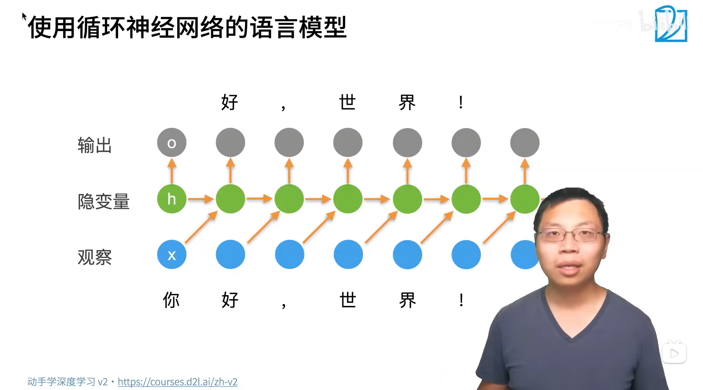
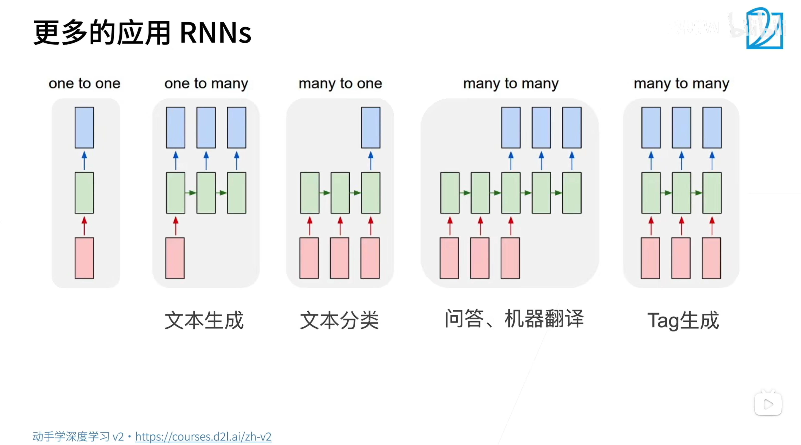

# 第一个序列模型的神经网络 | RNN（循环神经网络）
- 之前（[40-seq-model.md](40-seq-model.md) ~ [42-language-model.md](42-language-model.md)）讲的都不是 **神经网络算法**。它们讲的是
  - 数学上的推理过程
  - 和数据处理方式
- 某种发展脉络
  - `CNN`：pretrained model ⇒ 应用
  - `transformer`：pretrained model ⇒ 应用（没错，发展脉络好像还是这样！）
- 另外，`RNN` 不能处理很长的序列（`35` 左右就很长了）
  - 因为 `RNN` 有点像 `MLP`！

<br><br>

## 一、概念讲解
### （一）、从潜变量模型到 RNN（这二者不完全一样！）
#### 1、潜变量自回归模型
- 照抄 [40-seq-model.md](40-seq-model.md) 中的内容！
- 好像 **马尔科夫假设** 和 **潜变量自回归模型** 是同时使用的
  - [42-language-model.md](42-language-model.md) 处理数据时使用 **马尔科夫假设**（通过 **N 元语法** 将 N 个**原始 token** 联系在一起后，你甚至可以把把 **这 N 个原始 token** 看作 **1 个新的 token**！）
  - 然后 **神经网络** 这里又使用 **潜变量自回归模型**


引入潜变量 $h_t$ 来表示过去所有信息 $h_t=f(x_1,...,x_{t-1})$
- 一定不要忘记 $h_t$ 的含义：过去所有信息 $h_t=f(x_1,...,x_{t-1})$
- **2 个公式**
  - $x_t=p(x_t|h_t)$
  - $h_t = g(h_{t-1}, x_{t-1})$
- 保留一些对过去观测的总结 $h_t$， 并且同时更新预测 $x_t$ 和总结 $h_t$

1. 区分
   1. **隐变量** 暗含 **该变量真实存在**
   2. 但是 **潜变量** 表示：该变量可以真实存在，也可以是真实不存在的（比如，人造的 `类别` 就是真实不存在的！）

#### 2、RNN
- 更新隐藏状态： $\bf h_t=\phi(W_{hh}h_{t-1}+W_{hx}x_{t-1}+b_h)$
  - 去掉了 $\bf W_{hh}h_{t-1}$ 就是 MLP
  - $\bf W_{hh}$ 就用来存储时序信息
- 输出： $\bf o_t=W_{ho}h_t+b_o$
- 激活函数为 $\phi$
  - 更新 **隐藏状态** 需要用非线性激活函数
  - 但是获取 **输出** 不需要非线性激活函数（详见代码 [43-1st-seq-model-RNN.py](43-1st-seq-model-RNN-01.py)）
  - 一种理解是：你获取的 **输出** 不需要 **再进入神经网络**，所以自然没必要再增添一个非线性激活函数！

#### 3、过一遍 `RNN` 是如何预测的




1. 【**本层输入 $x_{t-1}$**】和【**上一层的隐变量 $h_{t-1}$**】**处理后相加**，得到【**本层的隐变量 $h_t$**】
2. 然后，【**本层的隐变量 $h_t$**】得到【**本层的输出 $o_t$**】
3. **总结**：循环神经网络的 **输出** 取决于 **① 当下的输入** 和 **② 前一时间的隐变量**

<br>

### （二）、困惑度（评价函数）
1. 因为这本质是一个 **分类问题**，所以用 **平均交叉熵**
2. 计算困惑度的时候，还要用到 `softmax` 操作！

- 衡量一个语言模型的好坏可以用平均交叉熵 $\pi = {1\over n}\sum_{i=1}^n-\log p(x_t|x_{t-1},...)$
  - $-\log p(x_t|x_{t-1},...)$  是真实值预测概率的`softmax` 输出。 $p$ 是语言模型的预测概率， $x_t$ 是真实词
  - 一个长度为 $n$ 的序列，做分类，平均的交叉熵
  - 从 **代码** 上来讲，这里的 $n$ 应该是 **预测的 token 总数**？
- 历史原因 NLP 使用困惑度 $exp(\pi)$ 来衡量，是平均每次可能选项
  - 1 表示完美，无穷大师最差情况（有真实含义的：表示预测出 $exp(\pi)$ 个可供选择的 token）
  - 做指数使数值变大（分散）
<br>

### （三）、梯度剪裁
1. 为什么这里着重强调 **梯度剪裁** 呢？之前的神经网络都没有专门强调 **梯度剪裁**。
   1. 我的理解是：在序列模型神经网络 `RNN` 中，**模型深度** 与 **文本长度** 强烈正相关，而文本长度往往可以很长，所以模型深度一般很深 ⇒ 就导致你必须考虑梯度剪裁！（李沐老师说，这种理解也有一定道理！）
   2. 也不知道我的理解对不对？后面可以看看 **代码是怎么进行梯度剪裁** 的，进而思考 **着重强调梯度剪裁的原因**。

- RNN 通过时间反向传播（BPTT）计算梯度，这涉及将损失函数对每个时间步的梯度沿着时间维度反向传播。在反向传播过程中，梯度需要乘以循环权重矩阵多次，形成一个长度为 $O(T)$ 的矩阵乘法链（$T$ 为时间步数）。如果权重矩阵的谱半径大于 1，梯度的范数会随着时间步数指数级增长，导致梯度爆炸。梯度爆炸会使参数更新过大，导致模型发散或产生 NaN 值。
- 梯度剪裁能有效预防梯度爆炸
  - 首先，把所有梯度拼成一个向量 ${\bf g}$
  - 当梯度的范数超过某个预设阈值时，对梯度进行缩放，使其范数限制在阈值内，从而防止参数更新步长过大。具体做法如下：
    1. **计算所有参数的梯度**：将模型所有参数的梯度拼接成一个向量 $\mathbf{g}$。
    2. **计算梯度的范数**：通常使用L2范数 $\|\mathbf{g}\|$（即所有梯度平方和的平方根）。
    3. **判断是否超过阈值**：设定一个阈值 $\theta$（例如1或5）。如果 $\|\mathbf{g}\| > \theta$，则对梯度进行缩放： $$\mathbf{g} \leftarrow \frac{\theta}{\|\mathbf{g}\|} \cdot \mathbf{g}$$
    - 这等价于将梯度向量缩放到长度为 $\theta$，同时保持方向不变。如果 $\|\mathbf{g}\| \leq \theta$，则梯度保持不变。上述操作可以统一写成： $$\mathbf{g} \leftarrow \min\left(1, \frac{\theta}{\|\mathbf{g}\|}\right) \mathbf{g}$$

<br>

### （四）、更多的应用 `RNN`s


<br><br>

## 二、代码讲解 | 从零实现
- 
  - 具体**定义 `load` 函数**的代码见 [42-language-model.py](42-language-model.py) `seq_data_iter_random` 和 `seq_data_iter_sequential`！
  - 代码确实就是和上图一样，针对每个隐藏层，给一个输入，预测一个输出。正好就是**输入 `X`** 往右移一位 就是**标签 `Y`**
  - 有个【**问题**】：代码是如何体现 **马尔科夫假设** 的？
    - ~~现在好像还没有体现 **马尔科夫假设**~~，因为现在代码中隐藏层是一直 **从【子序列】的开头** 传递下来的
    - 等等，我明白了！代码就是通过 **控制子序列的长度** 来实现 **马尔科夫假设**！
    - 代码中 **子序列的长度 `num_steps`** 就是 **马尔科夫假设** 中的 $\tau$ ！

```powershell
# 下面是代码运行结果！

F.one_hot(torch.tensor([0, 2]), len(vocab)): 
tensor([[1, 0, 0, 0, 0, 0, 0, 0, 0, 0, 0, 0, 0, 0, 0, 0, 0, 0, 0, 0, 0, 0, 0, 0,
         0, 0, 0, 0],
        [0, 0, 1, 0, 0, 0, 0, 0, 0, 0, 0, 0, 0, 0, 0, 0, 0, 0, 0, 0, 0, 0, 0, 0,
         0, 0, 0, 0]])

F.one_hot(X.T, 28).shape: 
torch.Size([5, 2, 28])

Y.shape, len(new_state), new_state[0].shape: 
(torch.Size([10, 28]), 1, torch.Size([2, 512]))

# 这是未训练前，随机初始化的模型预测结果
predict_ch8('time traveller ', 10, net, vocab, d2l.try_gpu()): 
time traveller qe<unk>furvzbq


# 这是顺序采样训练后的模型预测结果
time travellere andithe andithe andithe andithe andithe andithe 
time traveller and the the the the the the the the the the the t
time traveller the shis the this thes it the the this thes it th
time traveller trecedifections if theted of reat dimensions af i
time travellerit s again thingse a diden you hime time vere il a
time travellerit s against reason said filby an argumentative pe
time travelleryou can show black is white by argument said filby
time travelleryou can show black is white by argument said filby
time traveller with a slight accession ofcheerfulness really thi
time travelleryou can show black is white by argument said filby
困惑度 1.0, 73006.9 词元/秒 cuda:0
time travelleryou can show black is white by argument said filby
travelleryou can show black is white by argument said filby

# 这是随机采样训练后的模型预测结果
time traveller the the the the the the the the the the the the t
time traveller and the the the the the the the the the the the t
time traveller the thimens of the sthe thimens of the sthe thime
time traveller thre in the sion the sion or the who ghas so ex a
time traveller but coveriment and why ourd betree pline an stine
time travellerit s agathed his seitenty three and samon time tha
time travellerit s against reason said filbycan a cube that does
time travellerit s against reason said filby of course that a ma
time travellerit s against reasonestigs an frlenther at sightyea
time travellerit s against reason said filby an argumentative pe
困惑度 1.4, 81452.3 词元/秒 cuda:0
time travellerit s against reason said filby an argumentative pe
travellerit s against reason said filby an argumentative pe
```

### （一）、理解代码
1. 为什么采用 **顺序抽样** 训练比 **随机抽样** 效果好呢？
   1. 因为查看 [42-language-model.py](42-language-model.py) `seq_data_iter_random` 和 `seq_data_iter_sequential` 函数的定义
   2. 在随机抽样中，`seq_data_iter_random` 把每个小序列随机打乱（每个小序列长度为 `num_steps`），返回 `(batch_size, num_steps)` 张量。⇒ **这就导致，每个 `batch` 【之间】的小序列也是随机打乱的**
   3. 而在顺序采样中，`seq_data_iter_sequential`，虽然 **每个 `batch` 【内部】 的小序列前后不是连续的（因为每个 `batch` 内部的小序列是在同一个时间步上的）**，但是 **每个 `batch` 【之间】，对应位置上的小序列是前后连续的**
   4. ⇒ 这就导致
      1. 顺序采样训练完一个 `batch` 后，生成的隐藏层还可以继续进入 **下一个 `batch`** 的训练
      2. 但是随机采样训练完一个 `batch` 后，生成的隐藏层对 **下一个 `batch`** 的训练没有任何作用
      3. 所以，和随机采样相比，顺序采样确实可以捕捉更长序列中的关系！
      4. 但是，无论从原理上看，还是结果上看，顺序采样不会比随机采样好很多
         1. 原理上，……（说不出来，好像还确实可以有较好的优化，好像还确实是那么回事）
         2. 结果上，一个困惑度 `1.0`，一个困惑度 `1.4`

#### 1、关于损失函数的问题
```python
'''在 train_ch8 函数中，有如下定义损失函数的代码'''
loss = nn.CrossEntropyLoss()

'''在 train_epoch_ch8 函数中，有如下使用损失函数的代码'''
# 根据 rnn 前向计算函数得知：
# y_hat (num_steps * batch_size, 词表大小) y.long (batch_size, num_steps)
l = loss(y_hat, y.long()).mean()

'''有个【疑问】：查看 nn.CrossEntropyLoss() class 原型得知，reduction 的默认值是 'mean'。
既然这样的话，loss(y_hat, y.long()) 不就已经退化为标量了吗？
那为什么还要在后面加上个 .mean() 呢？'''
```
1. 核心结论：代码中 `loss(y_hat, y.long()).mean()` 的 `.mean()` 是冗余但无害的，因为 `nn.CrossEntropyLoss` 默认 `reduction='mean'`，已经返回标量，额外的 `.mean()` 不改变结果。
2. 冗余原因：为了代码的通用性（兼容 `reduction='none'`）和教学上的清晰性，作者保留了显式的 `.mean()`

<br>

#### 2、关于 转置 的问题
```python
'''这是 X.T 的位置'''
# 定义了所有需要的函数之后，接下来我们创建一个类来包装这些函数，
# 并存储从零开始实现的循环神经网络模型的参数。
class RNNModelScratch: #@save
    """从零开始实现的循环神经网络模型"""
    def __init__(self, vocab_size, num_hiddens, device,
                 get_params, init_state, forward_fn):
        self.vocab_size, self.num_hiddens = vocab_size, num_hiddens
        self.params = get_params(vocab_size, num_hiddens, device)
        self.init_state, self.forward_fn = init_state, forward_fn

    # 可以定义 forward() 函数，也可以定义 __call__() 函数
    def __call__(self, X, state):
        '''独热编码的位置：① 在数据预处理阶段 (train_iter 迭代器中)，是没有进行独热编码的；
        ② 而是在网络中，先对 train_iter 迭代器出来的数据做独热编码，然后再进行前向计算'''
        X = F.one_hot(X.T, self.vocab_size).type(torch.float32)
        return self.forward_fn(X, state, self.params)

    def begin_state(self, batch_size, device):
        return self.init_state(batch_size, self.num_hiddens, device)


'''这是 Y.T 的位置'''
# 训练
#@save
def train_epoch_ch8(net, train_iter, loss, updater, device, use_random_iter):
    """训练网络一个迭代周期（ 定义见第 8 章 ）"""
    state, timer = None, d2l.Timer()
    metric = d2l.Accumulator(2)  # 训练损失之和,词元数量
    for X, Y in train_iter:
        '''【张量形状】X, Y 都是 (batch_size, num_steps)'''
        if state is None or use_random_iter:
            # 在第一次迭代或使用随机抽样时初始化 state（隐藏层状态）
            state = net.begin_state(batch_size=X.shape[0], device=device)

        '''独热编码的位置：① 在数据预处理阶段 (train_iter 迭代器中)，是没有进行独热编码的；
        ② 而是在网络中，先对 train_iter 迭代器出来的数据 (batch_size, num_steps)
        做独热编码 (num_steps * batch_size, 词表大小)，
        然后再进行前向计算'''
        y = Y.T.reshape(-1)
        # Y.T 转置是二维张量 (num_steps, batch_size)
        # y 是一维张量，形状 (num_steps * batch_size)
        X, y = X.to(device), y.to(device)
        y_hat, state = net(X, state)
        # 根据 rnn 前向计算函数得知：
        # y_hat (num_steps * batch_size, 词表大小) state (batch_size, num_hiddens)
        l = loss(y_hat, y.long()).mean()
```
1. `Y.T` 是必须的，因为 `net` 输出的 `y_hat` 就是经过转置的，如果你 `Y` 不转置，那么计算损失函数的时候，数值就无法一一对应！
   1. 这样要出大问题的
   2. 也就是说：**标签** 和 **输出** 必须对应好！
2. 但是，如果你网络输出不是经过转置的话，那么 `Y` 也不必转置
   1. 这样的话，那就只考虑神经网络的输入是否可以不转置！
   2. 发现：神经网络的输入其实不转置也可以！
3. 总结关于转置的态度：
   1. 如果你**输入**转置，那么**标签**就必须转置
   2. ~~但是，你**输入**可以不转置！~~ 不对！你**输入**最好是要转置！
4. 为什么你 **输入** 最好是要转置

```python
def rnn(inputs, state, params):
    '''RNN 前向计算函数'''
    # inputs 的形状：(时间步数量，批量大小，词表大小)
    '''产生 inputs 的过程：① train_iter 返回 (batch_size, num_steps)
    ② 转置后，再进行独热编码 (num_steps, batch_size, 词表大小)'''

    '''还记得 42-language-model.py 中，采样函数 seq_data_iter_random 和 seq_data_iter_sequential 采的
    【样本】是【子序列】，而【子序列】的长度就是【时间步数量】，
    这两个采样函数返回的张量形状都是 (batch_size, num_steps)。
    将这【采样函数】返回的矩阵转置后进行独热编码，就得到 (num_steps, batch_size, 词表大小)!'''

    '''等一下，如果词表大小 = 28 的话，那就意味着这里是基于 char 的分词，
    而不是基于 word 的分词！真奇怪，基于 char 居然也能训练出不错的效果！'''

    '''还有一个【疑问】：【样本子序列】中的 token 不是已经有数值了吗，为什么还要进行独热编码呢？
    【答】：这是为了 predict_ch8 函数中便于通过 argmax 直接获得【最有可能的字符的数值索引】！'''
    # state 是为 RNN 初始化的隐藏层
    W_xh, W_hh, b_h, W_hq, b_q = params
    H, = state
    outputs = []
    # X 的形状：(批量大小，词表大小)。也就是说：X 的所有子序列都是在【同一个时间步上】的
    for X in inputs:
        '''更新隐藏层需要用非线性激活函数；获取输出值则不需要非线性激活函数！'''
        H = torch.tanh(torch.mm(X, W_xh) + torch.mm(H, W_hh) + b_h)
        Y = torch.mm(H, W_hq) + b_q
        outputs.append(Y)
        # Y 的张量形状是 (batch_size, num_outputs) = (batch_size, 词表大小)
        '''在转置以后，整个前向计算过程中， inputs 张量形状始终都是 (num_steps, batch_size, 词表大小)。
        只有在输出前向计算结果的时候，才把所有结果给拼接起来！成为 (num_steps * batch_size, 词表大小)'''
    return torch.cat(outputs, dim=0), (H,)
    # 返回的两个张量是：基于每个【子序列】的每个【token】的预测输出, 最终的隐藏状态
    # 张量形状分别是 (num_steps * batch_size, 词表大小), (batch_size, num_hiddens)
```
- 因为你 `RNN` 每一个时间结点都要更新一次隐藏层（一共有 `num_steps` 个时间结点）
  - 也就是说，一个 `batch` 内，要更新 `num_steps` 次隐藏层
- 为了方便更新隐藏层，所以把 `(batch_size, num_steps)` 转置成 `(num_steps, batch_size)`
  - 这样，**每次按第一个维度** 取出所有内容就行了
  - 你如果不转置，那么 `num_steps` 就要在中间层 ⇒ 每次取相同 `num_steps` 时，取的内容不连续 ⇒ 进而导致性能问题！

<br>

### （二）、`torch` API
#### 1、分清 `torch.stack` 和 `torch.concat`
- 照搬 [35-CV-SSD.md](35-CV-SSD.md) 中的内容！
- 在哪个维度 `concat`，**哪个维度的维数** 就增加，其他维度的维数都保持不变！
  - 其实想一想，这样也十分合理！

```python
# torch.concat() 函数；concat 接收的张量形状不必一致！
>>> a = torch.rand(13, 6)
>>> b = torch.rand(20, 6)
>>> c = torch.concat((a, b), dim=0)
>>> c.size()
torch.Size([33, 6])

# torch.stack() 函数；stack 接收的张量形状应当是一致的！
>>> c = torch.stack((a, b), dim=0)
Traceback (most recent call last):
  File "<pyshell#7>", line 1, in <module>
    c = torch.stack((a, b), dim=0)
RuntimeError: stack expects each tensor to be equal 
size, but got [13, 6] at entry 0 and [20, 6] at entry 1

>>> b = torch.rand(13, 6)
>>> c = torch.stack((a, b), dim=0)
>>> c.size()
torch.Size([2, 13, 6])
```

<br>

#### 2、`torch.argmax` 函数（有 3 种形式，返回最大值的索引）
- 照抄 [33-CV-AnchorBox.md](33-CV-AnchorBox.md) 中的内容
- [官网 doc - torch.argmax 函数](https://docs.pytorch.org/docs/stable/generated/torch.argmax.html#torch-argmax)

##### (1)、第一种形式（不指定维度，一律展平）
```python
torch.argmax(input) → LongTensor
```

1. Note
   1. If there are multiple maximal values then the indices of the **first maximal value** are returned.
2. 例子代码
    ```python
    >>> a = torch.randn(4, 4)
    >>> a
    tensor([[ 1.3398,  0.2663, -0.2686,  0.2450],
            [-0.7401, -0.8805, -0.3402, -1.1936],
            [ 0.4907, -1.3948, -1.0691, -0.3132],
            [-1.6092,  0.5419, -0.2993,  0.3195]])
    >>> torch.argmax(a)
    tensor(0)

    >>> b = torch.tensor(range(1, 17)).reshape(4, 4)
    >>> b
    tensor([[ 1,  2,  3,  4],
            [ 5,  6,  7,  8],
            [ 9, 10, 11, 12],
            [13, 14, 15, 16]])
    >>> torch.argmax(b)
    tensor(15)

    # ⇒ 也就是说：把所有维度都展品，然后求最大值的索引！
    ```
<br>

##### (2)、第二种形式（指定维度，不展平！）
```python
torch.argmax(input, dim, keepdim=False) → LongTensor
```

- 返回 **第二种形式的 `torch.max()` 函数** 的 **第二个值**
1. 例子代码
    ```python
    >>> a = torch.randn(4, 4)
    >>> a
    tensor([[ 1.3398,  0.2663, -0.2686,  0.2450],
            [-0.7401, -0.8805, -0.3402, -1.1936],
            [ 0.4907, -1.3948, -1.0691, -0.3132],
            [-1.6092,  0.5419, -0.2993,  0.3195]])
    >>> torch.argmax(a, dim=1)
    tensor([ 0,  2,  0,  1])
    ```
<br>

#### 3、`torch.concat` 和 `torch.argmax` 中指定维度的逻辑其实是一致的！
1. `(3, 5)` 和 `(3, 2)` 经过 `torch.concat((a, b), dim=1)` 得到 `(3, 7)`
2. `(3, 5).argmax(dim=1, keepdim=True)` 得到 `(3, 1)`
3. 它们都是改变 **第二个维度的维数**！

<br><br>

## 三、代码讲解 | 简洁实现
```powershell
# 下面是代码运行结果！

state.shape: 
torch.Size([1, 32, 256])

Y.shape, state_new.shape: 
(  torch.Size([35, 32, 256]), torch.Size([1, 32, 256])  )

time traveller and and the medice sime tre the and an an and the
time traveller three dimensions and this sime sime sime sime sim
time travellerecoft mainee mant seot ail thereediend for the hea
time travellerit s against reason bat four dimention or aves the
time traveller but now you began got mesthe other psmed the time
time travellerit s against reason said fileywo lascenttind for t
time traveller frlledist sceredired ancherenat leagrimunseons mo
time travellerit s aglins of spatiobuthe woouthe ovempsans for a
time travellerit s against reason said filbywist verf wure bring
time traveller proceeded anyreal body must have extension in fou
困惑度 1.3, 455764.4 词元/秒 cuda:0
time traveller proceeded anyreal body must have extension in fou
traveller cit enof hri go in and so dee man have tarke whic
```

### （一）、理解代码
1. PyTorch 框架下的 `torch.nn.RNN` 没有输出层，需要自己定义！

<br><br>

### （二）、`class torch.nn.RNN` API
#### 1、`class torch.nn.RNN` | RNN 类
[官网 doc - class torch.nn.RNN](https://docs.pytorch.org/docs/stable/generated/torch.nn.RNN.html#torch.nn.RNN)

```python
class torch.nn.RNN(
    input_size, hidden_size, num_layers=1, nonlinearity='tanh', 
    bias=True, batch_first=False, dropout=0.0, bidirectional=False, device=None, 
    dtype=None)
```

- PyTorch RNN 的输入输出形状：

##### (1)、输入 Inputs: input, hx
1. `input`（序列输入）
   1. 形状分三种：
      - 无批次：`(L, H_in)`
      - 有批次、默认 `batch_first=False`：`(L, N, H_in)`（**本代码**中的 `(num_steps, batch_size, 词表大小)` 就是这种情况）
      - 有批次、`batch_first=True`：`(N, L, H_in)`
   2. 含义：
      - **L**：序列长度（一句话有几个词）
      - **N**：批次大小（一次传多少条句子）
      - **H_in**：每个词/步的特征维度（input_size）
   3. 一句话记：默认：序列在前，批次在中；batch_first 就把批次放最前。
2. hx（初始隐藏状态）
   1. 形状：
      - 无批次：`(D * num_layers, H_out)`
      - 有批次：`(D * num_layers, N, H_out)`（**本代码**中是**单向**且 `num_layers = 1`，故隐藏状态是 `(1, batch_size, num_hiddens)`，辅助理解：**潜变量模型**中的潜变量。）
   2. 含义：
      - **D**：方向数，双向=2，单向=1
      - **num_layers**：RNN 层数
      - **H_out**：隐藏层维度（hidden_size）
      - 不传 hx 时，默认全 0
   3. 一句话记：hx = [层数×方向, 批次, 隐藏维度]
<br>

##### (2)、输出 Outputs: output, h_n
```python
'''参考代码'''

batch_size, num_steps = 32, 35
train_iter, vocab = nlp.load_data_time_machine(batch_size, num_steps)
# 定义模型
num_hiddens = 256
# PyTorch 框架中的 nn.RNN 没有输出层！
rnn_layer = nn.RNN(len(vocab), num_hiddens)
# (输入/输出通道数, 隐变量长度)

state = torch.zeros((1, batch_size, num_hiddens))
print('state.shape:',f'\n{state.shape}')
# 输出 torch.Size([1, 32, 256])

X = torch.rand(size=(num_steps, batch_size, len(vocab)))
Y, state_new = rnn_layer(X, state)
print(f'\nY.shape, state_new.shape: {Y.shape, state_new.shape}')
# 输出 (  torch.Size([35, 32, 256]), torch.Size([1, 32, 256])  )
```

1. output（每一步的输出）
   1. 形状和 input 完全对应：
      - 无批次：`(L, D*H_out)`
      - 默认：`(L, N, D*H_out)`。
        - **本代码简洁实现**中：很明显，隐藏层张量 `(num_steps, batch_size, num_hiddens)` ；在**添加输出层**后，输出张量 `(num_steps, batch_size, 词表大小)`
        - ~~在 `从零实现` 的版本中，也可以看出来！<br>从 **最后一个隐变量** 到 **输出** 也就是简单的矩阵乘法 `最后一个隐变量 @ W_hq = Y`~~
        - ~~又因为 `Y.shape = (num_steps * batch_size, 词表长度)`，`W_hq.shape = (num_hiddens, num_outputs) = (num_hiddens, 词表长度)`~~
        - ~~⇒ 所以，**从零实现**的版本中，`最后一个隐变量的维度是 (num_steps * batch_size, num_hiddens)`~~
        - **简洁实现**中，【最后一层网络中所有时间步上的隐变量】的维度确实是 `(num_steps, batch_size, num_hiddens)`；但是**从零实现**中，每个时间步上隐变量的维度都是 `(batch_size, num_hiddens)`，和 `num_steps` 无关！
          - 这是因为 **从零实现中**【每个时间步上的隐变量】只负责产生【该时间步上的输出 `(batch_size, 词表长度)`】，也就是 `隐变量 @ W_hq = (batch_size, 词表长度)`。
          - 将【所有时间步上的输出】拼接起来，才得到【最终的输出 `(num_steps * batch_size, 词表长度)`】
          - ⇒ **简洁实现** 不是 **从零实现** 的简单封装！至于 `nn.RNN` 源码是怎么写的，就先别深究了！
        - **本代码简洁实现**的版本中，`最后一个隐变量的维度是 (num_steps, batch_size, num_hiddens)`
          - 之前没有注意到 **隐变量张量** 的维度这个细节，是因为之前主要关注 **输入张量 `(num_steps, batch_size, 词表长度)`、输出张量 `(num_steps * batch_size, 词表长度)`** 本身了，把输入 → 输出**这个过程**当作黑盒看待了，直接从宏观上理解【输入 `(num_steps, batch_size, 词表长度)` 到 输出 `(num_steps * batch_size, 词表长度)`】的过程 ……
          - 归根结底，还是对 **感知机** 的理解没那么深（有点怵感知机，但是一定克服发怵心理）！
            - 感知机就是把**矩阵乘法**抽象为**全连接层**
            - 我好像也明白：为什么深度学习这么**复杂**的东西，却强调线性代数这种**线性**变换了（线性变换不要紧，因为你还有**非线性函数**让模型获得非线性能力）
      - batch_first：`(N, L, D*H_out)`
   2. 含义：
      - 是**最后一层 RNN 每个时间步的隐藏状态**（也就是说：**高层 API `nn.RNN` 没有输出层**，需要自己添加输出层，也就是 `nn.Linear`！）
      - 双向时会把前向+后向拼接，所以是 `D*H_out`
   3. 一句话记：output 形状跟输入一样，只是特征维度变成 隐藏维度×方向数。
2. h_n（**最后一个时间步的所有层隐藏状态**）
   1. 形状和 hx 完全一样：
      - 无批次：`(D * num_layers, H_out)`
      - 有批次：`(D * num_layers, N, H_out)`
   2. 含义：
      - 保存**所有层、所有方向**的最终隐藏状态
      - 常用于做分类、做下一序列的初始状态
   3. 一句话记：h_n 形状 = 初始隐藏状态 hx 的形状。

|       |高级 API 输出的 `output`|高级 API 输出的 `h_n`|
|:------|:----------------------|:-------------------|
|张量形状|`(num_steps, batch_size, num_hiddens)`|`(1, batch_size, num_hiddens)`|
|含义|既然是 `output` 了，<br>自然是 **最后一层神经网络**<br>（的所有时间步）。|既然 `output` 是最后一层神经网络了，<br>那么 `h_n` 自然是 **最后一个时间步**<br>（的所有层神经网络）|

- 由于 **从零实现** 的神经网络只有 **1 层 `RNN`**，所以我并不能理解 **多层 `RNN`** 堆叠起来到底有什么意义！
  - 以后遇到的时候再说吧！

<br>

##### (3)、最简总结（背这个就行）
- **input**：`(L, N, C)` 或 `(N, L, C)`
- **hx / h_n**：`(层*方向, N, 隐藏维度)`
- **output**：和 input 同形状，通道变成 `隐藏维度×方向`

