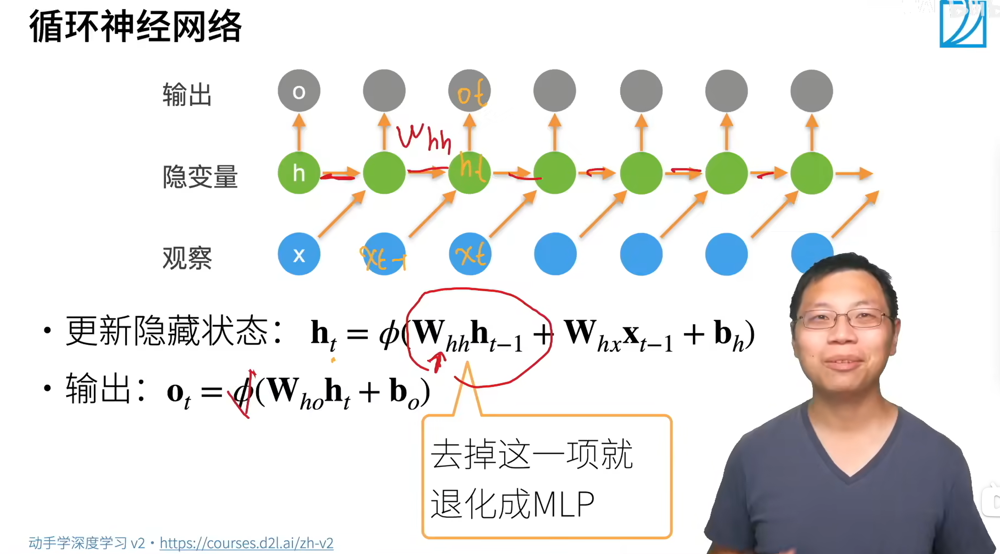

# GRU (Gated Recurrent Unit) | 门控循环单元
## 一、概念讲解
关注一个序列

- 不是每个观察值都同等重要
- 想只记住相关的观察需要，通过一些控制单元：
  - 能关注的机制（更新门）
  - 能遗忘的机制（重置门）

### （一）、门


- $$\bf R_t=\sigma(X_tW_{xr}+H_{t-1}W_{hr}+b_r)$$
- $$\bf Z_t=\sigma(X_tW_{xz}+H_{t-1}W_{hz}+b_z)$$

1. 经过 $\sigma()$， $\bf R_t$ 和 $\bf Z_t$ 的值都在 $0-1$ 之间。
2. $\bf R_t$， $\bf Z_t$ 和 $\bf H_t$ 形状相同。
3. $\bf{R}$ 是重置门， $\bf Z$ 是更新门， $\bf H$ 是隐藏状态
#### 1、和 `RNN` 做个比较（下面公式是 `RNN` 的内容）
- 更新隐藏状态： $\bf h_t=\phi(W_{hh}h_{t-1}+W_{hx}x_{t-1}+b_h)$
  - 去掉了 $\bf W_{hh}h_{t-1}$ 就是 MLP
  - $\bf W_{hh}$ 就用来存储时序信息
- 输出： $\bf o_t=W_{ho}h_t+b_o$
- 激活函数为 $\phi$
  - 更新 **隐藏状态** 需要用非线性激活函数
  - 但是获取 **输出** 不需要非线性激活函数（详见代码 [43-1st-seq-model-RNN.py](43-1st-seq-model-RNN-01.py)）
  - 一种理解是：你获取的 **输出** 不需要 **再进入神经网络**，所以自然没必要再增添一个非线性激活函数！

|`RNN` 图解|`GRU` 图解|
|:--------|:---------|
|||

1. $\bf H_{t-1}$ 和 $\bf X_t$ 共同作用
   1. `RNN` 得到 $\bf H_t$ （该时间步的隐藏状态）
   2. `GRU` 得到 $\bf R_t$ 和 $\bf Z_t$ （该时间步的重置门和更新门）
   3. 由于 `GRU` 产生 $\bf R_t, Z_t$ 和 `RNN` 产生 $\bf H_t$ 的运算方式 **完全一样**
      1. 因此，$\bf R_t, Z_t$ 张量形状 `(num_steps * batch_size, num_hiddens)`（从零实现） **或** `(num_steps, batch_size, num_hiddens)`（简洁实现）
      2. 另外，从 **候选隐藏状态** 这个名字也可以看出来： $\bf\~H_t$ 和 $\bf H_t$ 形状应该一致！都是  `(num_steps * batch_size, num_hiddens)`（从零实现） **或** `(num_steps, batch_size, num_hiddens)`（简洁实现）
2. `GRU` 新增的内容
   1. $\bf R_t \text{（重置门）} ~ ~ H_{t-1} ~ \text{和} ~ X_t$ 共同作用，得到 $\bf \~H_t$ （候选隐藏状态）
   2. 由 $\bf Z_t \text{（更新门）}$ 选择 $\bf H_{t-1}$ 和 $\bf \~H_t$ ，得到最终的输出 $\bf H_t$



<br>

### （二）、候选隐状态
$${\bf \~H_t}=tanh(\bf X_tW_{xh}+(R_t⊙ H_{t-1})W_{hh}+b_h)$$

1. 符号 ⊙ 是 Hadamard 积运算符（即**按元素乘法**）
2. 如果 $R_t$ 里的元素
   1. 接近 0，那么 $R_t ⊙ H_{t-1}$ 也接近 0， 就是遗忘上一个时间的隐藏状态；
   2. 相反，如果全为 1，就是上一刻状态的复现。
3. $\bf R_t$ 可以学习

<br>

### （三）、隐状态（真正的隐状态，不是候选隐状态）


$$\bf H_t=Z_t ⊙ H_{t-1}+(1-\bf Z_t)⊙\~H_t$$

- $\bf Z_t = 1$ 时，直接用前一时刻状态，舍弃当前状态
- $\bf Z_t = 0$ 时，不起作用；如果配合 $\bf R_t = 1$，就是 RNN。
  - 当 **更新门** $\bf Z_t= 0$，**遗忘门** $\bf R_t= 1$ 时，还真就是 `RNN`！ $\bf H_t = \tanh(X_{t-1} W_{xh} + H_{t-1} W_{hh} + b_h)$
- **注意**：
  - 由于 $\bf R_t, Z_t$ 都是从 $\sigma$ 出来的，所以这两个张量内部的数值都是在 `0-1` 区间上！
  - 生成 **候选隐状态** 需要 非线性激活函数；但是更新 **真正的隐状态** 的时候不需要 非线性激活函数！
- **直观理解（但不知道对不对！）**
  - `GRU` 中的候选隐状态 $\bf \~H_t$ 是 在 `RNN` 中 隐状态 $\bf H_t$ 的基础上修改的！
    - 如果 **遗忘门** $\bf R_t = 1$ ，那么 `GRU` 中的 $\bf \~H_t$ 就等于 `RNN` 中的 $\bf H_t$
  - `GRU` 中 **更新门** $\bf Z_t$​ 的作用：
    - 决定「保留多少旧的，写入多少新的」
    - 让 `GRU` 的隐藏层更新时，可以绕过输入 $\bf X_{t-1}$ （通过 $\bf Z_t = 1$ 来实现！）
- 李沐老师的直观理解：
  - `Reset` 是 我要不要**忘掉**之前的隐状态（信息）。
  - `Update` 是 我要不要根据之前的隐状态（信息）来**更新**下一个隐状态（信息）。

<br><br>

## 二、代码讲解 | 从零实现
```powershell
# 下面是代码运行结果
time travellere the the the the the the the the the the the the 
time traveller and the the the the the the the the the the the t
time traveller the the the the the the the the the the the the t
time traveller the the the the the the the the the the the the t
time traveller the time traveller the time traveller the time tr
time traveller thing the medical man staring the time traveller 
time traveller for so it will be convenient to speal to stemtinc
time travellerit s against reason said filby who was getting bra
time travellerit wou thing seei think so murmured the provincial
time travelleryou can show black is white by argument said filby
困惑度 1.1, 31158.3 词元/秒 cuda:0
time travelleryou can show black is white by argument said filby
travelleryou can show black is white by argument said filby
```

- 代码其实跟 **`RNN` 的从零实现**，也就是 [43-1st-seq-model-RNN-01.py](43-1st-seq-model-RNN-01.py) **非常非常像**！
- 可以总结一下 `GRU` 和 `RNN` 代码的区别！

### （一）、理解代码

<br>

### （二）、`torch` API
#### 1、`torch.randn()` API
```python
torch.randn(size=shape, device=device) * 0.01
# 原本 torch.randn() 均值为 0，方差为 1
# 现在 * 0.01 后，均值为 0，方差为 0.01 ** 2
```


<br><br>

## 三、代码讲解 | 简洁实现
```powershell
# 下面是代码运行结果
time travellerererererererererererererererererererererererererer
time traveller the the the the the the the the the the the the t
time traveller the thing the thing the thing the thing the thing
time traveller this this is al will this is al wish a coutter th
time traveller fur expstani dorngrs exprace there is how have ex
time travelleryou can show black is white by argument said filby
time travelleryou can show black is white by argument said filby
time traveller for so it will be convenient to speak of himwas e
time travelleryou can show black is white by argument said filby
time travelleryou can show black is white by argument said filby
困惑度 1.0, 277452.7 词元/秒 cuda:0
time travelleryou can show black is white by argument said filby
travelleryou can show black is white by argument said filby
```

### （一）、理解代码
1. 比较 **从零实现** 和 **简洁实现**，发现 **框架的简洁实现** 比 **从零实现** 快多了！（因为框架优化了张量计算！）

<br>

### （二）、`nn.GRU` API
1. 和 `nn.RNN` API 一样，没有输出层，使用的时候需要自己添加输出层，也就是 `nn.Linear`
2. 张量形状也都和 `nn.RNN` 一样！
   1. 输入 $\bf X_{t-1}$ `(num_steps, batch_size, 词表大小)`
   2. 权重矩阵 
      1. $\bf W_{xr}, W_{xz}, W_{xh}$ `(num_inputs, num_hiddens)`
      2. $\bf W_{hr}, W_{hz}, W_{hh}$ `(num_hiddens, num_hiddens)`
   3. 偏置矩阵 $\bf b_{h}$ `(num_hiddens)`

