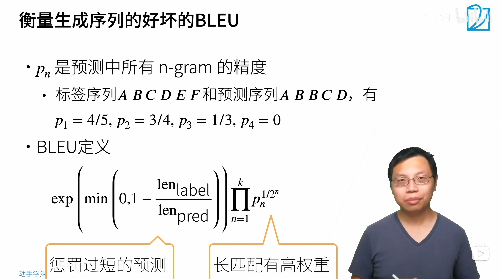
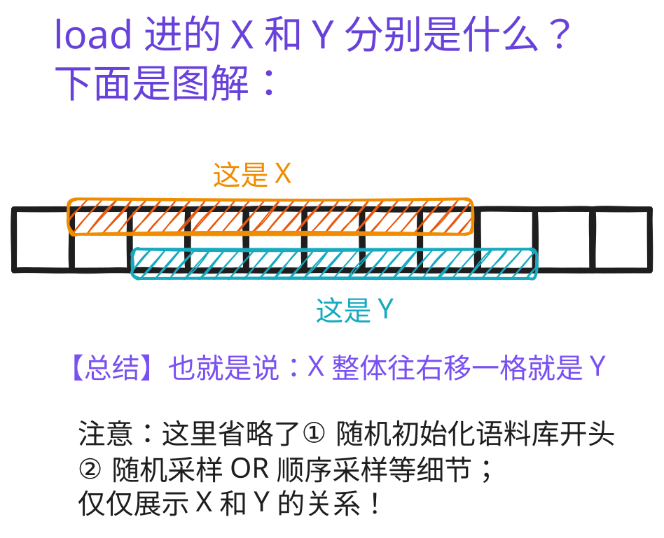
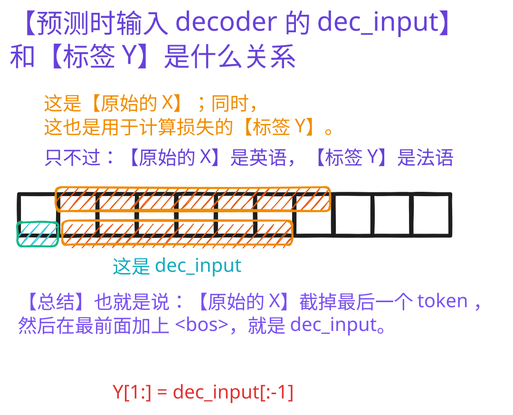

# seq2seq | 序列到序列学习
## 一、概念讲解
- 和 `RNN` 一样，这里的 **一个样本** 是 **一个句子**

### （一）、复习：[49-encoder-decoder.md](49-encoder-decoder.md) 中的 `Encoder-Decoder` 架构


- 一个模型被分为两块
  - 编码器处理输入
  - 解码器生成输出
    - 解码器可以有额外的输入

```python
from torch import nn

'''编码器接口'''
#@save
class Encoder(nn.Module):
    """编码器-解码器架构的基本编码器接口"""
    def __init__(self, **kwargs):
        super(Encoder, self).__init__(**kwargs)

    def forward(self, X, *args):
        raise NotImplementedError
```

```python
'''解码器接口'''
#@save
class Decoder(nn.Module):
    """编码器-解码器架构的基本解码器接口"""
    def __init__(self, **kwargs):
        super(Decoder, self).__init__(**kwargs)

    def init_state(self, enc_outputs, *args):
        raise NotImplementedError

    def forward(self, X, state):
        raise NotImplementedError
```

```python
'''编码器-解码器接口'''
#@save
class EncoderDecoder(nn.Module):
    """编码器-解码器架构的基类"""
    def __init__(self, encoder, decoder, **kwargs):
        super(EncoderDecoder, self).__init__(**kwargs)
        self.encoder = encoder
        self.decoder = decoder

    def forward(self, enc_X, dec_X, *args):
        # 从编码器的【输入】得到编码器的【输出】
        enc_outputs = self.encoder(enc_X, *args)
        # 从编码器的【输出】得到解码器的【状态】
        dec_state = self.decoder.init_state(enc_outputs, *args)
        # 从解码器的【状态】和解码器的【输入】得到解码器的【输出】
        return self.decoder(dec_X, dec_state)
```
<br>

### （二）、本循环神经网络中的编码器-解码器


<br>

### （三）、预测


<br>

### （四）、评估预测序列

- 关于 BLEU 输出
  - 最大是 1
  - 越大越好！

<br><br>

## 二、代码讲解
```powershell
# 下面是代码运行结果

output.shape:
torch.Size([7, 4, 16])

state.shape:
torch.Size([2, 4, 16])

output.shape, state.shape:
(torch.Size([4, 7, 10]), torch.Size([2, 4, 16]))

sequence_mask(X, torch.tensor([1, 2])):
tensor([[1, 0, 0],
        [4, 5, 0]])

sequence_mask(X, torch.tensor([1, 2]), value=-1):
tensor([[[ 1.,  1.,  1.,  1.],
         [-1., -1., -1., -1.],
         [-1., -1., -1., -1.]],

        [[ 1.,  1.,  1.,  1.],
         [ 1.,  1.,  1.,  1.],
         [-1., -1., -1., -1.]]])

loss(torch.ones(3, 4, 10), torch.ones((3, 4), dtype=torch.long), torch.tensor([4, 2, 0])):
tensor([2.3026, 1.1513, 0.0000])

loss 0.019, 24169.4 tokens/sec on cuda:0
go . => va !, bleu 1.000
i lost . => j'ai perdu ., bleu 1.000
he's calm . => il est riche tomber ., bleu 0.548
i'm home . => je suis chez moi retard foutre, bleu 0.719
```

- 这里好像是基于 `word` 的机器翻译，不是基于 `char` 的机器翻译！
- **损失函数** 和 **评估函数** 是两个东西
  - **损失函数** 是在 **训练模型** 时使用
  - **评估函数** 是在 **使用模型** 时使用

### （一）、理解代码
#### 1、`train_seq2seq` 函数
```python
# 训练
#@save
def train_seq2seq(net, data_iter, lr, num_epochs, tgt_vocab, device):
    """训练序列到序列模型"""
    def xavier_init_weights(m):
        if type(m) == nn.Linear:
            nn.init.xavier_uniform_(m.weight)
        if type(m) == nn.GRU:
            for param in m._flat_weights_names:
                '''m._flat_weights_names: GRU 模块内部存储的所有权重 / 偏置参数的名称列表
                （比如 weight_ih_l0、weight_hh_l0 等，分别对应输入到隐藏层、隐藏到隐藏层的权重）；
                遍历参数名，筛选出名称包含 "weight" 的参数（排除偏置 bias ）'''
                if "weight" in param:
                    nn.init.xavier_uniform_(m._parameters[param])

    net.apply(xavier_init_weights)
    net.to(device)
    optimizer = torch.optim.Adam(net.parameters(), lr=lr)
    loss = MaskedSoftmaxCELoss()
    net.train()
    animator = Animator(xlabel='epoch', ylabel='loss',
                     xlim=[10, num_epochs])
    for epoch in range(num_epochs):
        timer = d2l.Timer()
        metric = d2l.Accumulator(2)  # 训练损失总和，词元数量
        for batch in data_iter:
            optimizer.zero_grad()
            # data_iter 每次返回【batch_size 行文本】和【对应文本行的有效长度】
            X, X_valid_len, Y, Y_valid_len = [x.to(device) for x in batch]
            # 先把 dec_input 每行末尾阶段，然后在最前面拼接 <bos> ⇒ 得到 Y
            bos = torch.tensor([tgt_vocab['<bos>']] * Y.shape[0],
                          device=device).reshape(-1, 1)
            dec_input = torch.cat([bos, Y[:, :-1]], 1)  # 强制教学
            Y_hat, _ = net(X, dec_input, X_valid_len)
            '''注意： loss 中使用的是 Y_valid_len ，不是 X_valid_len!'''
            l = loss(Y_hat, Y, Y_valid_len)
            l.sum().backward()      # 损失函数的标量进行 “反向传播”
            nlp.grad_clipping(net, 1)
            num_tokens = Y_valid_len.sum()
            optimizer.step()
            with torch.no_grad():
                metric.add(l.sum(), num_tokens)
        if (epoch + 1) % 10 == 0:
            animator.add(epoch + 1, (metric[0] / metric[1],))
    print(f'loss {metric[0] / metric[1]:.3f}, {metric[1] / timer.stop():.1f} '
        f'tokens/sec on {str(device)}')
```

先明确变量定义（结合你的代码）：
| 变量  | 含义 | 维度示例（假设 batch_size=2，<br>目标序列长度=4） |
|:------|:----|:---------------------------------------------|
| `Y`        | 真实目标序列（完整标签），包含 `<eos>`（结束符）等完整token          | `[2,4]`（2行，每行4个token）                 |
| `dec_input`| 解码器的输入序列（强制教学的输入），是 `Y` 右移一位并补 `<bos>` 开头 | `[2,4]`（和Y长度一致）                       |
| `Y_hat`    | 解码器的输出序列（预测结果），每个位置预测下一个token的概率分布      | `[2,4, vocab_size]`<br>（vocab_size是目标词表大小） |

这样设计的关键：**解码器输入长度和真实标签长度一致**，且每一步输入都是“正确的前序token”（强制教学），避免训练时用预测的错误token累积误差，加速收敛。

<br>

##### (1)、和 [43-1st-seq-model-RNN.md](43-1st-seq-model-RNN.md) 中【纯右移】还不一样
- 下面是 `X`【纯右移】变成 `Y`，自然 `Y` **对应位置** 的 token 就是 `X` **对应位置** 的 **后序 `token`**
- 而【先截断再拼接】后，那么 `Y` **对应位置** 的 token 就是 `X` **对应位置** 的 **前序 `token`**
  - 而且，这样做可以保证 **训练时** `预测出的序列长度 = 标签中的序列长度`（因为给定一个时间步的输入，模型就只预测一个时间步的输出） 

|移动方式|图片|
|:---|:---|
|【纯右移】方式。<br>见 [43.md](43-1st-seq-model-RNN.md)||
|【先截断，再拼接】。<br>见 [50.md](50-seq2seq.md)||

- 这是针对 [43.md](43-1st-seq-model-RNN.md) 的注释
  - 具体**定义 `load` 函数**的代码见 [42-language-model.py](42-language-model.py) `seq_data_iter_random` 和 `seq_data_iter_sequential`！
  - 代码确实就是和上图一样，针对每个隐藏层，给一个输入，预测一个输出。正好就是**输入 `X`** 往右移一位 就是**标签 `Y`**
<br>

##### (2)、有个问题：这明明不是机器翻译吗？怎么就成预测了？？？
1. 换个视角看：给出 **定长的英语文本**，预测 **定长的法语文本**
   1. 这不就是 **机器翻译** 嘛！
```python
Y_hat, _ = net(X, dec_input, X_valid_len)
'''注意： loss 中使用的是 Y_valid_len ，不是 X_valid_len!'''
l = loss(Y_hat, Y, Y_valid_len)
# 输入网络的 X（编码器输入）和 dec_input（解码器输入）是英语文本
# 而计算损失时，使用的 Y 是法语文本
```

<br>

### （二）、`torch` API
#### 1、`class nn.Embedding` API
[官网 doc - class torch.nn.Embedding](https://docs.pytorch.org/docs/stable/generated/torch.nn.Embedding.html#torch.nn.Embedding)

```python
class torch.nn.Embedding(
    num_embeddings, embedding_dim, padding_idx=None, 
    max_norm=None, norm_type=2.0, scale_grad_by_freq=False, 
    sparse=False, _weight=None, _freeze=False, device=None, dtype=None)
```

##### (1)、Input：`(*)`, IntTensor / LongTensor
- `(*)` 代表**任意形状**，可以是：
  - 一维：`[1,2,3]`
  - 二维：`[[1,2],[3,4]]`
  - 三维、四维……都行
- 里面必须是**整数索引**，类型是 `int64`（LongTensor）。

##### (2)、Output：`(*, H)`，H = embedding_dim
- 输出形状 = **输入形状后面多一维**
- 多出来的那一维长度 = 你设置的 `embedding_dim`

##### (3)、一句话总结
**输入是任意形状的索引，输出就是在每个索引位置，多嵌一个长度为 `embedding_dim` 的向量。**

举个最简例子：
- 输入形状：`(2, 4)`
- embedding_dim = 3
- 输出形状：`(2, 4, 3)`

<br>

#### 2、`torch.Tensor.repeat()` VS `torch.Tensor.repeat_interleave`
- **`torch.Tensor.repeat()`** [官网 doc - torch.Tensor.repeat](https://docs.pytorch.org/docs/stable/generated/torch.Tensor.repeat.html#torch.Tensor.repeat)

```python
Tensor.repeat(*repeats)
```

```python
# 下面是 repeat 的结果
>>> x = torch.tensor([1, 2, 3])
>>> x.size()
torch.Size([3])

>>> x.repeat(4, 2)
tensor([[ 1,  2,  3,  1,  2,  3],
        [ 1,  2,  3,  1,  2,  3],
        [ 1,  2,  3,  1,  2,  3],
        [ 1,  2,  3,  1,  2,  3]])
# ⇒ 如果要新增维度，那就要从最里面开始复制
# 最里面的维度复制为 2 倍；往外走一层，复制为 4 倍

>>> x.repeat(4, 2, 1).size()
torch.Size([4, 2, 3])
# 最里面的维度复制为 1 倍；往外走，复制为 2 倍；再往外走，复制为 4 倍
```
<br><br>

- **`torch.Tensor.repeat_interleave`** [官网 doc - torch.Tensor.repeat_interleave]()

##### (1)、第一种形式（指定维度的复制）
```python
torch.repeat_interleave(input, repeats, dim=None, *, output_size=None)
```
1. Warning
   1. This is different from `torch.Tensor.repeat()` but similar to `numpy.repeat`
2. Returns
   1. Repeated tensor which has the same shape as input, except along the given axis.
3. 参数
   1. `repeats` (Tensor or int) – 
      1. The number of repetitions for each element. `repeats` is broadcasted to fit the shape of the given axis.
      2. 重复次数（张量 或 整数（int））—— 每个元素的重复次数。重复次数会被广播以适配给定轴的形状。
   2. `dim` (int, optional) – 
      1. The dimension along which to repeat values. By default, use the flattened input array, and return a flat output array.
      2. 沿着其重复值的维度。默认情况下，使用扁平化的输入数组，并返回一个扁平化的输出数组。
   3. `output_size` (int, optional) – 
      1. Total output size for the given axis ( e.g. sum of repeats). 
      2. If given, it will avoid stream synchronization needed to calculate output shape of the tensor.
      3. 给定轴的总输出大小（例如重复次数的总和）。如果提供该参数，将避免计算张量输出形状所需的流同步。
4. 例子代码
    ```python
    >>> x = torch.tensor([1, 2, 3])
    >>> x.repeat_interleave(2)
    tensor([1, 1, 2, 2, 3, 3])

    >>> y = torch.tensor([[1, 2], [3, 4]])
    >>> torch.repeat_interleave(y, 2)
    tensor([1, 1, 2, 2, 3, 3, 4, 4])

    >>> torch.repeat_interleave(y, 3, dim=1)
    tensor([[1, 1, 1, 2, 2, 2],
            [3, 3, 3, 4, 4, 4]])

    >>> torch.repeat_interleave(y, torch.tensor([1, 2]), dim=0)
    tensor([[1, 2],
            [3, 4],
            [3, 4]])

    >>> torch.repeat_interleave(y, torch.tensor([1, 2]), dim=0, output_size=3)
    tensor([[1, 2],
            [3, 4],
            [3, 4]])
    ```

<br>

##### (2)、第二种形式（这个就非常简单了！不过也许用不到？）
```python
torch.repeat_interleave(repeats, *)
```
1. Repeats 
   1. `0` `repeats[0]` times, 
   2. `1` `repeats[1]` times, 
   3. `2` `repeats[2]` times, etc.
2. 例子代码
    ```python
    >>> torch.repeat_interleave(torch.tensor([1, 2, 3]))
    tensor([0, 1, 1, 2, 2, 2])
    ```

<br>

#### 3、布尔张量索引的例子代码
```python
>>> a = torch.tensor(range(12), dtype=torch.float32)
>>> a = a.reshape(3, 4)
>>> a == 1
tensor([[False,  True, False, False],
        [False, False, False, False],
        [False, False, False, False]])

>>> a
tensor([[ 0.,  1.,  2.,  3.],
        [ 4.,  5.,  6.,  7.],
        [ 8.,  9., 10., 11.]])

>>> a[a == 1] = 666
>>> a
tensor([[  0., 666.,   2.,   3.],
        [  4.,   5.,   6.,   7.],
        [  8.,   9.,  10.,  11.]])
```
<br>

#### 4、`torch.nn.functional.cross_entropy` | 原生基础的交叉熵损失函数
直接照搬 [38-FCN.md](38-FCN.md) 中的内容

- [官网 doc - torch.nn.functional.cross_entropy](https://docs.pytorch.org/docs/stable/generated/torch.nn.functional.cross_entropy.html#torch.nn.functional.cross_entropy)

```python
torch.nn.functional.cross_entropy(
    input, target, weight=None, size_average=None, 
    ignore_index=-100, reduce=None, reduction='mean', 
    label_smoothing=0.0)
```

1. 张量形状
   1. `input`: Shape $(C)$ $(N,C)$ or $(N,C,d_1,d_2,...,d_K)$ with $K≥1$ in the case of K-dimensional loss.
   2. `Target`: If containing class indices, shape $()$, $(N)$ or $(N,d_1,d_2,...,d_K)$ with $K≥1$ in the case of K-dimensional loss where each value should be between $[0,C)$. 
      1. If containing class probabilities, same shape as the input and each value should be between $[0,1]$.
   3. where: 
      1. $C = \text{number of classes}$
      2. $N = \text{batch size}$
      3. **正是因为这里要求 $C$ `类别维度` 要在第二维度，所以 [50-seq2seq.py](50-seq2seq.py) 中 `MaskedSoftmaxCELoss` 才需要对 `preds` 的维度进行变换！**
      4. **从 `(batch_size, num_steps, vocab_size)` 到 `batch_size, vocab_size, num_steps`**
      5. **这同时印证了：`nlp` 中【样本】其实是【小序列】，而不是【文本 token】！**
2. 例子代码
    ```python
    # Example of target with class indices
    # input (3, 5) 生成 3 个样本，每个样本 5 个类别
    # target (3,) 生成 3 个取值在 [0,4] 之间的整数（对应 5 个类别），形状为 (3,)
    input = torch.randn(3, 5, requires_grad=True)
    target = torch.randint(5, (3,), dtype=torch.int64)
    loss = F.cross_entropy(input, target)
    loss.backward()

    # Example of target with class probabilities
    # input (3, 5) 生成 3 个样本，每个样本 5 个类别
    # taget 和 input 张量形状一致，都是 (3, 5)
    input = torch.randn(3, 5, requires_grad=True)
    target = torch.randn(3, 5).softmax(dim=1)
    loss = F.cross_entropy(input, target)
    loss.backward()
    ```

<br>

#### 5、为了和 `torch.nn.functional.cross_entropy` 对比，给出封装后的 `torch.nn.CrossEntropyLoss`
`torch.nn.CrossEntropyLoss(reduction='none')` 多分类问题中的交叉熵损失函数
- 直接抄 [29-CV-Data-Augment.md](29-CV-Data-Augment.md) 中的内容
- [官网 doc - torch.nn.CrossEntropyLoss](https://docs.pytorch.org/docs/stable/generated/torch.nn.CrossEntropyLoss.html)

```python
'''
这段例子代码又刷新了我对梯度计算的认识！
原来 sum() 也是独立的 x1**2 + x2**2 + x3**2
⇒ 那看来，以后可以广泛地应用 l.sum().backward() 了！
'''
>>> import torch
>>> x=torch.tensor([1.0, 2.0, 3.0], requires_grad=True)
>>> y = x**2
>>> y.sum().backward(retain_graph=True)
# 如果不指定 retain_graph 参数的话，
# 那么调用一次 backward()，计算图就会自动销毁
>>> x.grad
tensor([2., 4., 6.])
>>> y.mean().backward(retain_graph=True)
>>> x.grad
tensor([0.6667, 1.3333, 2.0000])
```

```python
'''class CrossEntropyLoss 原型'''
class torch.nn.CrossEntropyLoss(
    weight=None, size_average=None, ignore_index=-100, 
    reduce=None, reduction='mean', 
    label_smoothing=0.0
)
```

##### (1)、功能详解
1. This criterion computes the cross entropy loss between input logits and target. （用于计算对数输入和目标之间的交叉熵损失）
2. It is useful when training a classification problem with **C classes**. （**交叉熵损失函数** 在 **C 分类** 问题中很有用）
   1. If provided, the optional argument **`weight`** should be a **1D Tensor** assigning weight to **each of the classes**.
   2. This is particularly useful when you have an unbalanced training set.（什么叫不平衡的训练集，起码现在还没接触到，以后再说）
3. 对于输入的两个要求
   1. 数据要求
      1. The input is expected to contain the unnormalized logits for each class (which do not need to be positive or sum to 1, in general). 
   2. 张量形状
      1. **非批量输入（单样本）** : Input has to be a Tensor of $size (C)$ for unbatched input, 
      2. **批量输入（多样本，但样本本身无空间维度）** : $(minibatch, C)$ 
      3. **高维批量输入（样本本身含空间维度）** : or $(minibatch, C, d_1, d_2 , ..., d_K)$ with $K ≥ 1$ for the K-dimensional case. 
      4. The last being useful for higher dimension inputs, such as computing cross entropy loss per-pixel for 2D images
4. 这段话核心是明确 PyTorch 中 `CrossEntropyLoss` 对 **输入（input）** 的两点关键要求：**数据含义** 与 **张量形状**，具体解析如下：
   1. **输入数据含义：未归一化的 logits**  
      - 输入需是每个类别的“logits”（即模型最后一层未经过softmax等归一化操作的原始输出），其无需满足“值为正”或“所有类别之和为1”——因为 `CrossEntropyLoss` 内部会自动对logits做softmax，将其转化为概率分布后再计算损失。**输入张量形状：适配不同场景**  
   2. 输入需符合特定维度要求，具体分三类场景：
      - **非批量输入（单样本）** : 形状为 `(C)`，其中 `C` 是类别数量（如3分类任务，输入为1个长度为3的张量）；
      - **批量输入（多样本，无空间维度）** : 形状为 `(minibatch, C)`，`minibatch` 是批量大小（如一次输入 10 个 3 分类样本，输入形状为 $(10, 3)$ ）；
      - **高维批量输入（含空间维度）** : 形状为 `(minibatch, C, d₁, d₂, ..., d_K)`（`K≥1`，`d₁, d₂, …, d_K` 等是空间维度尺寸），
        - 典型场景是 **图像逐像素分类** （如输入 10 张 3 通道、224 × 224 的图像做语义分割，输入形状为(10, C, 224, 224)，`C` 是分割类别数，损失会逐像素计算）。
        - 这个例子是 AI 生成的，不一定对。存疑！（因为我感觉不对）

##### (2)、参数详解
1. **`reduction`** (`str`, optional) – Specifies the reduction to apply to the output: 'none' | 'mean' | 'sum'. 
   1. 三种参数讲解
      1. `'none'`: no reduction will be applied, 
      2. `'mean'`: the weighted mean of the output is taken, 
      3. `'sum'`: the output will be summed. 
   2. Note: 
      1. `size_average` and `reduce` are in the process of being deprecated, and in the meantime, specifying either of those two args will override `reduction`.
      2. 指定 `size_average` 和 `reduce` 种任何一个参数，那么都会覆盖 `reduction`
   3. Default: `'mean'`
2. **`reduction`** 方式一共有 3 种
   1. `none`：就是原始的 交叉熵损失函数（ **不做 reduction** ）
      1. 返回的还是 `n` 维张量
   2. `mean`：直接对损失函数做 **平均**
      1. 返回的是标量（直接压缩为 `标量` ）
   3. `sum`：对损失函数做 **加和**
      1. 返回的是标量（直接压缩为 `标量` ）
3. **`C` 分类问题中的 `CrossEntropyLoss` 交叉熵损失函数** （ **根据 Pytorch 官网来的**！ ）
   - Class indices in the range $[0,C)$ where $C$ is the number of classes; 
   - if `ignore_index` is specified, this loss also accepts this class index (this index may not necessarily be in the class range).
   - **字母讲解**
     - 这里的 `w` 是**权重** （现在还没用到过！）
     - `n` 是这一批里面的第 `n` 个 （ **`n` 行** ）
     - `C` 是一共有 `C` 类 （ **`C` 列** ）
   1. The **unreduced** (i.e. with `reduction` set to **`'none'`**) loss for this case can be described as:
      1. `loss` 仍然是 **`n` 维张量**
      2. $$ℓ(x,y)=L=\{l_1,…,l_N\}^{T}, ~ ~ l_n=−w_{y_n}log {exp(x_{n,y_n}) \over \sum_{c=1}^{C}exp(x_{n,c})​}$$
         1. 分母是**按行求和**
         2. 分子是按 `(行, 列)` 索引**单个元素**
   2. `mean` 和 `sum` 下的损失函数
      1. $$ℓ(x,y) = \sum_{n=1}^{N}{1 \over \sum_{n=1}^{N} w_n } ℓ_n ~ ~ ~ ~ ~ \text{if reduction=\sf{'mean'}}$$ 
      2. $$ℓ(x,y) = \sum_{n=1}^{N} ℓ_n ~ ~ ~ ~ ~ \text{if reduction=\sf{'sum'}}$$
      3. `loss` 被压缩为标量（**一个实数**）

##### (3)、CELoss 就学到这里吧，再高深的东西，以后遇到再学！

<br>

#### 6、`predict_seq2seq` 函数中的 `.argmax(dim)` 和 `.item()`
```python
'''完全模拟 predict_seq2seq 函数中 argmax 和 item 操作！'''
>>> c = torch.tensor((1, 6, 2))
>>> c = c.reshape((1, 1, 3))
>>> c
tensor([[[1, 6, 2]]])

>>> d = c.argmax(dim=2)
>>> d
tensor([[1]])
>>> d.shape
torch.Size([1, 1])
# 之前又忘了！
# max, sum, mean 这些东西会使得张量退化标量
# 如果指定维度的话，那不会直接退化为标量，但会使该维度张量退化为标量！

>>> e = d.squeeze(dim=0).type(torch.int32)
>>> e
tensor([1], dtype=torch.int32)
>>> e.item()
1
```