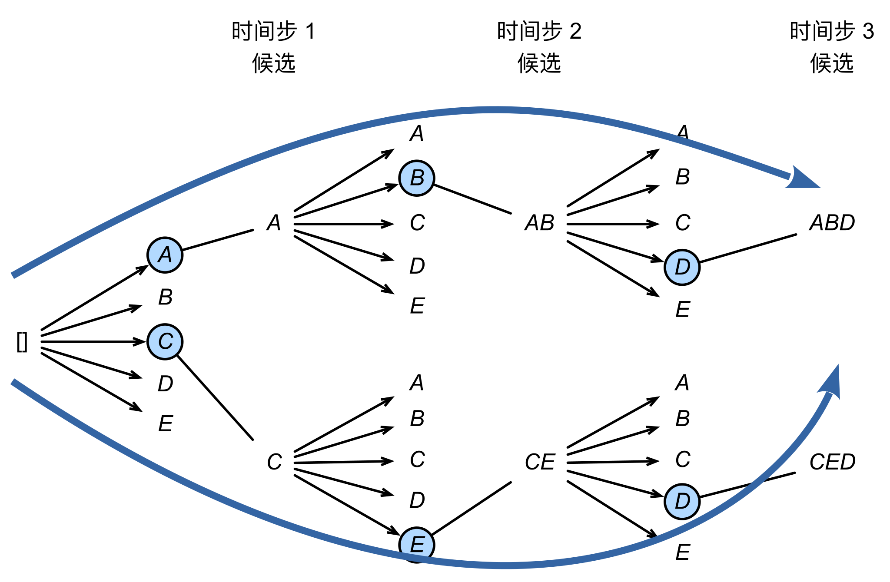

# Beam Search | 束搜索
## 一、概念讲解
```python
'''预测函数的代码！'''

#@save
def predict_seq2seq(net, src_sentence, src_vocab, tgt_vocab, num_steps,
                    device, save_attention_weights=False):
    """序列到序列模型的预测（输入： 
    ① src_sentence 是一维 token 列表；
    ② src_vocab 和 tgt_vocab 是存储的【token-数值】映射关系）"""
    # 在预测时将 net 设置为评估模式（防止使用 dropout）
    net.eval()
    # 一维 token 列表变成 一维数值列表
    src_tokens = src_vocab[src_sentence.lower().split(' ')] + [
        src_vocab['<eos>']]
    enc_valid_len = torch.tensor([len(src_tokens)], device=device)
    # 将一维数值列表砍成定长
    src_tokens = nlp.truncate_pad(src_tokens, num_steps, src_vocab['<pad>'])
    '''
    添加批量轴 (num_steps) -> (1, num_steps);
    而且由于嵌入层 Embedding 封装在 encoder / decoder 里面，
    所以 encoder / decoder 的输入不需要做词嵌入！
    '''
    
    '''
    【疑问】：这里预测的时候为什么不直接用训练好的 net？反而一步一步地调用 encoder, decoder？
    【答】：训练时它接收的是完整的输入序列 + 完整的目标序列（用于 teacher forcing），
    但预测时我们需要逐词生成目标序列（无法提前知道完整的目标序列），
    因此必须拆解调用 encoder 和 decoder，而不能直接用 net 的前向传播！
    '''
    enc_X = torch.unsqueeze(
        torch.tensor(src_tokens, dtype=torch.long, device=device), dim=0)
    enc_outputs = net.encoder(enc_X, enc_valid_len)
    dec_state = net.decoder.init_state(enc_outputs, enc_valid_len)
    
    # 添加批量轴
    '''训练时， dec_X 是一个序列 (batch_size, num_steps); 
    但是预测时不一样， dec_X 只是一个 <bos> (batch_size, 1)。

    也正是因为 dec_X 只有一个时间步，所以预测时 decoder 每次只返回一个 token!

    细节：预测时也要有批次维度，因为训练时 net 就要处理批次维度！
    这里 dec_X 张量形状 (1, 1)'''
    dec_X = torch.unsqueeze(torch.tensor(
        [tgt_vocab['<bos>']], dtype=torch.long, device=device), dim=0)
    output_seq, attention_weight_seq = [], []
    for _ in range(num_steps):
        '''由于训练时，每个时间步只生成一个词；所以预测时，每个时间步也只生成一个词！
        也就是：在这 num_steps 次循环中， dec_X 张量形状始终是 (batch_size, 1) = (1, 1)
        
        这里的 dec_X 张量是没有 vocab_size 的，因为 Embedding 是内置在 net.decoder 中的！'''

        Y, dec_state = net.decoder(dec_X, dec_state)
        # Y 张量形状 (batch_size, num_steps, vocab_size) = (1, 1, vocab_size)
        # 我们使用具有预测最高可能性的词元，作为解码器在下一时间步的输入
        dec_X = Y.argmax(dim=2)
        # item() 将张量转化为标量！
        pred = dec_X.squeeze(dim=0).type(torch.int32).item()
        # 保存注意力权重（稍后讨论）
        if save_attention_weights:
            attention_weight_seq.append(net.decoder.attention_weights)
        # 一旦序列结束词元被预测，输出序列的生成就完成了
        if pred == tgt_vocab['<eos>']:
            break
        output_seq.append(pred)
    return ' '.join(tgt_vocab.to_tokens(output_seq)), attention_weight_seq
```
<br>

### （一）、贪心搜索（greedy search）
- 在 seq2seq 中我们使用了贪心搜索来**预测**序列
  - 将当前时刻预测概率最大的词输出
- 但贪心很可能不是最优的：
<br>

### （二）、穷举搜索（exhausitive search）
- 最优算法：对所有可能的序列，计它的概率，然后选最好的那个
- 如果输出字典大小为 $n$， 序列最长为 $T$，那么我们需要遍历 $n^T$ 个序列
  - $n=10000,\ T=10:\quad n^T=10^{40}$
  - 计算上不可行

|算法|图解|
|:--|:---|
|贪心算法||
|贪心算法的反例||

<br>

### （三）、束搜索（beam search）


- 贪心最快最劣，穷举最好最慢，所以走中见道
- 保存最好的 **$k$ 个候选**
- 在每个时刻，对每个候选新加一项 ( **$n$ 种可能** )，在 $kn$ 个选项中选出最好的 $k$ 个


- 时间复杂度 $O(knT)$
  - $k=5,\ n=10000,\ T=10:\quad knT=5\times10^{5}$
- 每个候选的最终分数是：
  $${1\over L^\alpha}\log p(y_1,...,y_L)={1\over L^\alpha}\sum_{t'=1}^L\log p(y_{t'}|y_1,...,y_{t'-1})$$
  - 通常 $\alpha=0.75$
  - 对长句子的加权，因为长句子与短句子相比没有竞争优势
  - 短句子遇到 `<eos>` 就会停止
<br>

### （四）、总结
- 束搜索在每次搜索时保存 $k$ 个最好的候选
  - $k=1$ 时是贪心搜索
  - **注意：** $k=n$ 时**不是**穷举算法！
    - **数学理解（ $k=n$ 时）**
      - 因为不管是哪一轮预测，最后都是**只保留** $k$ 个！
      - 因此，即便是在多轮预测后，仍然是从 $kn$ 个选项中选择最好的！
    - **画图理解（ $k=n$ 时）**
      - 在多轮预测后，所有候选序列都像 **线束** 一样 **线性穿过**，多个 **线束** 之间不会有 **逻辑上的相交**（也就是说：不同线束之间不会穿过相同的结点）
      - 


<br><br>

## 二、代码讲解
