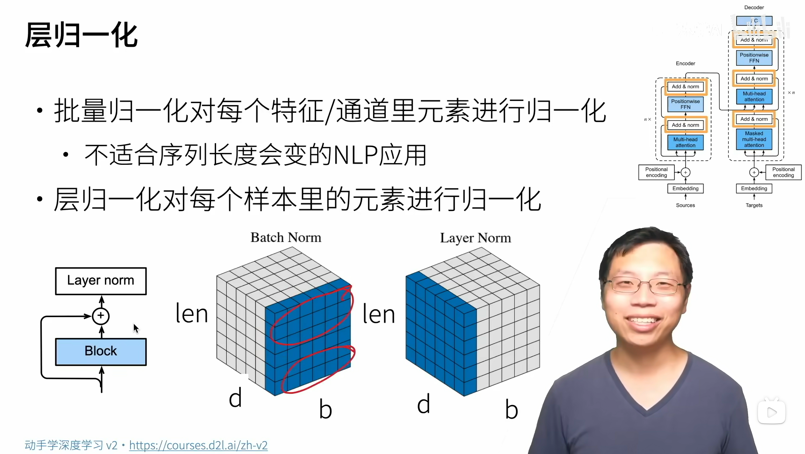

# Transformer | Transformer
## 一、概念讲解
|架构|图解|
|:---|:--|
|Transformer||
|seq2seq with<br>attention||

- 基于编码器-解码器架构来处理序列对
- 跟使用注意力的 seq2seq 不同，Transformer 是纯基于注意力

### （一）、多头注意力

- 对**同一 key, value, query**, 希望**抽取不同的信息**
  - 例如短距离关系和长距离关系
    - 通过全连接层变成长度小的 $d$
    - 分别进入各自的注意力机制头
- 多头注意力使用 $h$ 个独立的注意力池化
  - 合并 (Concat) 各个头 (head) 输出得到最终输出
  - 最后经过一个全连接层获得输出的维度

- `query` ${\bf q}\in\mathbb R^{d_q}$ ，`key` ${\bf k}\in \mathbb R^{d_k}$ ，`value` ${\bf v}\in\mathbb R^{d_v}$
- 头 $i$ 的可学习参数 ${\bf W}_i^{(q)}\in\mathbb R^{p_q\times d_q}$ ， ${\bf W}_i^{(k)}\in\mathbb R^{p_k\times d_k}$ ， ${\bf W}_i^{(v)}\in\mathbb R^{p_v\times d_v}$
- 头 $i$ 的输出 ${\bf h}_i=f({\bf W}_i^{(q)}{\bf q},{\bf W}_i^{(k)}{\bf k},{\bf W}_i^{(v)}{\bf v})$
- 输出的可学习参数 ${\bf W}_o\in\mathbb R^{p_o\times hp_v}$
- 多头注意力的输出
  $$
  {\bf W_o}
  \begin{bmatrix}
  {\bf h}_1 \\ 
  \vdots \\ 
  {\bf h}_h
  \end{bmatrix}\in\mathbb R^{p_o}
  $$

```python
# 定义 2 个转置函数
#@save
def transpose_qkv(X, num_heads):
    """为了多注意力头的并行计算而变换形状（把 num_heads 纳入张量形状！）"""
    
    '''输入 X 的形状: (batch_size, 查询或者“键－值”对的个数, num_hiddens)
    输出 X 的形状: 
    (batch_size, 查询或者“键－值”对的个数, num_heads, num_hiddens / num_heads)'''
    X = X.reshape(X.shape[0], X.shape[1], num_heads, -1)

    # 输出 X 的形状: (batch_size, num_heads, 查询或者“键－值”对的个数, num_hiddens / num_heads)
    X = X.permute(0, 2, 1, 3)

    # 最终输出的形状: (batch_size * num_heads, 查询或者“键－值”对的个数, num_hiddens / num_heads)
    return X.reshape(-1, X.shape[2], X.shape[3])

#@save
def transpose_output(X, num_heads):
    """逆转 transpose_qkv 函数的操作
    
    输入 X 的张量形状 (batch_size * num_heads, 查询或者“键－值”对的个数, num_hiddens / num_heads)"""
    X = X.reshape(-1, num_heads, X.shape[1], X.shape[2])
    X = X.permute(0, 2, 1, 3)
    return X.reshape(X.shape[0], X.shape[1], -1)

#@save
class MultiHeadAttention(nn.Module):
    """多头注意力"""
    def __init__(self, key_size, query_size, value_size, num_hiddens,
                 num_heads, dropout, bias=False, **kwargs):
        super(MultiHeadAttention, self).__init__(**kwargs)
        self.num_heads = num_heads
        self.attention = attn.DotProductAttention(dropout)
        self.W_q = nn.Linear(query_size, num_hiddens, bias=bias)
        self.W_k = nn.Linear(key_size, num_hiddens, bias=bias)
        self.W_v = nn.Linear(value_size, num_hiddens, bias=bias)
        self.W_o = nn.Linear(num_hiddens, num_hiddens, bias=bias)

    def forward(self, queries, keys, values, valid_lens):
        # queries，keys，values 的形状:
        # (batch_size，查询或者“键－值”对的个数，num_hiddens)
        # valid_lens 的形状:
        # (batch_size，) 或 (batch_size，查询的个数)
        # 经过变换后，输出的 queries，keys，values　的形状:
        # (batch_size * num_heads, 查询或者“键－值”对的个数, num_hiddens / num_heads)
        '''因为不想使用 for loop 遍历 num_heads 次循环，所以要在原来张量的基础上把 num_heads 考虑张量！
        （也就是需要进行转置！）
        
        通过转置 ① 隐含地实现了拼接操作 ② 便于 Q K 进行点积注意力运算
        
        务必明确 2 个原则：① 多头注意力中 num_heads 是和 batch_size 平行的级别！
        ② 所有头的 num_queries 是相同的，同时所有头的 query_size 也都是相同的！'''
        queries = transpose_qkv(self.W_q(queries), self.num_heads)
        keys = transpose_qkv(self.W_k(keys), self.num_heads)
        values = transpose_qkv(self.W_v(values), self.num_heads)

        if valid_lens is not None:
            # 在轴 0，将第一项（标量或者矢量）复制 num_heads 次，
            # 然后如此复制第二项，然后诸如此类。
            valid_lens = torch.repeat_interleave(
                valid_lens, repeats=self.num_heads, dim=0)

        # output 的形状: (batch_size * num_heads, 查询的个数, num_hiddens / num_heads)
        output = self.attention(queries, keys, values, valid_lens)

        # output_concat 的形状: (batch_size, 查询的个数, num_hiddens)
        output_concat = transpose_output(output, self.num_heads)
        return self.W_o(output_concat)
```

#### 1、`transpose_qkv` 中，不能拆成 `(batch_size * num_heads, num_queries / num_heads, num_hiddens)`，只能拆成 `(batch_size * num_heads, num_queries, num_hiddens / num_heads)`
1. 序列长度无法被头数整除
   1. `num_queries / num_heads` 是序列长度维度拆分，但序列长度（比如 10）是「实际的文本 / 序列长度」，通常是任意整数（比如 7、10、15），几乎不可能被头数（8/16/32）整除
2. 注意力计算的维度完全错位
   1. 注意力的核心是「每个头对**完整的序列**计算注意力」，而不是把序列拆分给不同的头。
   2. 正确逻辑（拆分隐藏层）：
      1. 每个注意力头看到的是完整的序列（10 个查询），但只用「低维的特征（16 维）」计算
   3. 如果（拆分序列长度）：
      1. 每个注意力头只能看到序列的一部分，完全违背多头注意力的设计初衷：
      2. 头 1：只计算 1 个查询 × 2 个键 的注意力（序列被拆分）；
      3. 头 2：只计算 1 个查询 × 2 个键 的注意力；
      4. ...（每个头只能看到序列的碎片，无法捕捉完整的序列依赖）


### （二）、有掩码的多头注意力
- 解码器对序列中一个元素输出时，不应该考虑该元素之后的元素
  - Attention 的视野可以看到全部的元素
  - 编码器可以，解码器不行
- 可以通过掩码来实现
  - 也就是计算 ${\bf x_i}$ 输出时，假装当前序列长度为 ${\bf i}$
    - 在实现上做 softmax 时不给后面的元素权重

### （三）、基于位置的前馈网络
- 将输入形状由 $(b,n,d)$ 变换成 $(bn,d)$
  - $n$ 是序列长度，与模型无关，会发生改变
  - 所以对序列里每个元素做全连接
- 作用两个全连接层
- 输出形状由 $(bn,d)$ 变化回 $(b,n,d)$
- 等价于两层核窗口为 $1$ 的一维卷积层

### （四）、层归一化
- **层归一化本身是十分灵活的，不必钻牛角尖！**
- 批量归一化对每个特征/通道里元素进行归一化
  - 不适合序列长度会变的NLP应用
  - 也就是 $d$ 对 $b \times n$ 做归一化
- 层归一化对每个样本里的元素进行归一化



### （五）、ResNet
- 每一模块会用ResNet合并模块输出一同做归一化
- 因此输出的自注意力模块的输出 dim 与输入相同 

### （六）、信息传递
- 编码器中的输出 ${\bf y_1},...,{\bf y_n}$
- 将其作为解码中第 $i$ 个 Transformer 块中多头注意力的 key 和 value
  - 它的 query 来自目标序列
  - 解码器的每一层（除了第一层SelfAttention以外）都加
- 意味着编码器和解码器中块的个数和输出维度都是一样的
  - 简单对称
  - 也就是贯穿始终的 $d$ 不变性了，非常优秀

### （七）、预测
- 预测第 $t+1$ 个输出时
- 解码器中输入前 $t$ 个预测值
  - 在子注意力中，前 $t$ 个预测值作为 key 和 value，第 t 个预测值还作为 query
  - 还是顺序进行的

### （八）、总结
- Transformer是一个纯使用注意力的编码-解码器
- 编码器和解码器都有 $n$ 个transformer块
- 每个块里使用多头（自）注意力，基于位置的前馈网络，和层归一化

### （九）、看看 Tranformer 的上下文是多长？

<br><br>

## 二、代码讲解
```powershell
# 这是代码运行结果

ffn(torch.ones((2, 3, 4)))[0]: 
tensor([[ 0.0687, -0.0535,  0.0893,  0.3891,  0.1254,  0.1270,  0.3443,  0.2855],
        [ 0.0687, -0.0535,  0.0893,  0.3891,  0.1254,  0.1270,  0.3443,  0.2855],
        [ 0.0687, -0.0535,  0.0893,  0.3891,  0.1254,  0.1270,  0.3443,  0.2855]],
       grad_fn=<SelectBackward0>)

layer norm: 
tensor([[-1.0000,  1.0000],
        [-1.0000,  1.0000]], grad_fn=<NativeLayerNormBackward0>)
 
batch norm: 
tensor([[-1.0000, -1.0000],
        [ 1.0000,  1.0000]], grad_fn=<NativeBatchNormBackward0>)

add_norm(torch.ones((2, 3, 4)), torch.ones((2, 3, 4))).shape
torch.Size([2, 3, 4])

encoder_blk(X, valid_lens).shape
torch.Size([2, 100, 24])

encoder(torch.ones((2, 100), dtype=torch.long), valid_lens).shape
torch.Size([2, 100, 24])

decoder_blk(X, state)[0].shape
torch.Size([2, 100, 24])

loss 0.031, 7991.5 tokens/sec on cuda:0
go . => va !,  bleu 1.000
i lost . => j'ai perdu .,  bleu 1.000
he's calm . => il est calme .,  bleu 1.000
i'm home . => je suis chez moi .,  bleu 1.000

enc_attention_weights.shape
torch.Size([2, 4, 10, 10])

dec_self_attention_weights.shape 
torch.Size([2, 4, 6, 10])

dec_inter_attention_weights.shape
torch.Size([2, 4, 6, 10])
```