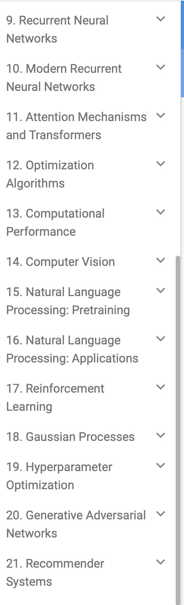

## 一、README
### （一）、代码
[d2l - 普通 .py 版本的代码（非 Jupyter）](https://github.com/Miraclelucy/dive_into_deep_learning)

#### 1、训练 `AlexNet` 的时候，改了两处 `d2l` 包中的内容
```python
from d2l import torch as d2l
# 正是由于上面的代码，所以打开 d2l 文件后，实际上是 d2l 文件夹中的 torch
```

##### (1)、多线程
1. 因为 Windows 不能跑 Pytorch 的多线程，所以 class DataLoader 不能使用多线程
   1. 其他没有修改
2. 下面是修改后的代码

```python
# Defined in file: ./chapter_linear-networks/image-classification-dataset.md
def get_dataloader_workers():
    """Use 4 processes to read the data."""
    # return 4
    return 0 if sys.platform.startswith('win') else 4
```

##### (2)、加载数据集
1. **紧跟在 `dataloader` 后面的 `load_data_fashion_mnist` 函数**
   1. 修改了储存数据集的文件夹
   2. 而且，由于网络状态，也修改了 download 的 default value
   3. 其他没有修改
2. 下面是修改后的代码

```python
# Defined in file: ./chapter_linear-networks/image-classification-dataset.md
def load_data_fashion_mnist(batch_size, resize=None):
    """Download the Fashion-MNIST dataset and then load it into memory."""
    trans = [transforms.ToTensor()]
    if resize:
        trans.insert(0, transforms.Resize(resize))
    trans = transforms.Compose(trans)
    mnist_train = torchvision.datasets.FashionMNIST(root="data",
                                                    train=True,
                                                    transform=trans,
                                                    download=False)
    mnist_test = torchvision.datasets.FashionMNIST(root="data",
                                                   train=False,
                                                   transform=trans,
                                                   download=False)
    return (data.DataLoader(mnist_train, batch_size, shuffle=True,
                            num_workers=get_dataloader_workers()),
            data.DataLoader(mnist_test, batch_size, shuffle=False,
                            num_workers=get_dataloader_workers()))
```

<br><br>

### （二）、`limu` 环境
#### 1、VS code 编辑器
1. color theme
   1. 原本是 Dark Modern (Default Dark Modern)
   2. 现在是 Light Modern (Default Light Modern) / Quiet Light

#### 2、PyCharm 编辑器
1. Theme
   1. 原本是 `4 dark`
   2. 现在是 Islands Light
2. Comment color （注释的颜色）
   1. 在 color-language default 中
      1. 00AA00（Python IDLE 默认的绿色，感觉比较好看）
      2. 6AAB73（绿色）
      3. 取消斜体（Italic）

#### 3、IDEA 编辑器
1. Theme
   1. 原本是 `1 Dark`
   2. 现在是 Light with Light Header

#### 4、系统终端 （ `Win + R` 呼出的终端 ）
1. 配色方案
   1. 原来是 One Half Dark
   2. 现在是 Solarized Light（过度曝光，便于在阳光下使用）
2. 字号
   1. 原来是 12
3. 背景图像不透明度
   1. 原来是 30%
4. 背景不透明度
   1. 原来是 100%


#### 5、Pytorch 包
```powershell
conda create -n limu python=3.10 -c https://mirrors.tuna.tsinghua.edu.cn/anaconda/pkgs/main/ -y

pip3 install torch torchvision torchaudio --index-url https://mirrors.nju.edu.cn/pytorch/whl/cu126

# d2l 不需要镜像源就能直接下载
# 另外，高版本的 d2l 会与 Pytorch 产生冲突，必须安装低版本的 d2l
pip install d2l==0.17.0
```

<br><br>

### （三）、快速上手 Jupyter
[同济子豪兄 - 快速上手 Jupyter Notebook](https://www.bilibili.com/video/BV1Q4411H7fJ/?spm_id_from=333.337.search-card.all.click&vd_source=774b39ad34e11aca38975d06f9a32cdb)

<br><br>

### （四）、一些重要的章节

- `9-12` 以及 `19、21` 比较重要
- 和中文版对标一下
  - `19` 超参数优化的课程在 [实用机器学习](https://www.bilibili.com/video/BV1FM4y1c7yG/?spm_id_from=333.1387.list.card_archive.click&vd_source=774b39ad34e11aca38975d06f9a32cdb) 里面！
  - `21` 推荐系统的课程在 哪里？（没找到，到时候就看看网页版的讲解和 `mxnet` 代码吧！）

|序号|名称|
|:--|:---|
|**9** | **循环神经网络**|
|**10**| **现代循环神经网络**|
|**11**| **注意力机制与 Transformer**|
|**12**| **优化算法**|
|13| 计算性能|
|14| 计算机视觉|
|15| 自然语言处理：预训练|
|16| 自然语言处理：应用|
|17| 强化学习|
|18| 高斯过程|
|**19**| **超参数优化**|
|20| 生成对抗网络|
|**21**| **推荐系统**|


<br><br><br>

## 二、关于 `./data` 文件夹中文件的说明
1. 因为数据集太大，上传不方便，所以就没上传。
2. 而且只要愿意找，总能找到的
   1. 不过方便起见，这里还是贴出下载链接

```
data
├── 15-01-house-prices-advanced-regression-techniques
|   （ 通过 https://pan.baidu.com/s/1Byx4c1PCYKsuIRpYkEFn1g?pwd=x0j9 下载 ）
├── 15-02-california-house-prices
|   （ 通过 https://pan.baidu.com/s/12aRIWIGSCHJd_IJvFRtD9A?pwd=6666 下载 ）
├── banana-detection （ 通过 32-ObjectDetect-data.py 代码下载 ）
├── cifar-10-batches-py （ 通过 https://zhuanlan.zhihu.com/p/129078357 下载 ）
├── FashionMNIST（ 没招了，只能通过官网下载 ）
├── hotdog （ 通过 30-fine-tune.py 代码下载 ）
├── img
|   ├── autumn-oak.jpg（通过 https://github.com/d2l-ai/d2l-zh/blob/master/img/autumn-oak.jpg 下载）
|   ├── banana.jpg（通过 https://github.com/d2l-ai/d2l-en/blob/master/img/banana.jpg 下载）
|   ├── catdog.jpg（通过 https://raw.githubusercontent.com/d2l-ai/d2l-en/master/img/catdog.jpg）
|   ├── cat1.jpg（通过 https://github.com/d2l-ai/d2l-zh/blob/master/img/cat1.jpg 下载）
|   └── rainer.jpg（通过 https://github.com/d2l-ai/d2l-zh/blob/master/img/rainier.jpg 下载）
├── VOCtrainval_11-May-2012 （通过 36-SegmentData.py 代码下载）
├── kaggle_house_pred_test.csv （ 通过 15-combine-01.py 代码下载 ）
└── kaggle_house_pred_train.csv （ 通过 15-combine-01.py 代码下载 ）
```